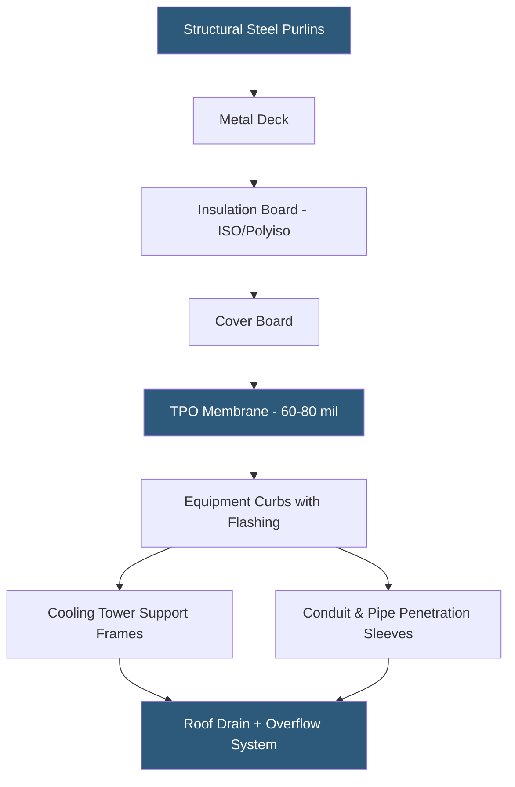

**Category:** Gigawatt Building & Structural
**Difficulty:** Intermediate
**Reading time:** 5 min read

---

Roofing systems at gigawatt-scale datacenters must simultaneously provide weatherproofing reliability, support heavy rooftop mechanical equipment, manage complex penetration schedules, and increasingly contribute to energy performance through reflectivity. Roof failures are among the highest-consequence building defects because water ingress directly threatens live electrical and IT systems.

- **TPO (Thermoplastic Polyolefin)** — white single-ply membrane with high solar reflectance (SRI > 100), dominant for new hyperscale construction
- **EPDM (Ethylene Propylene Diene Monomer)** — black rubber membrane with excellent long-term durability, lower reflectance
- **Standing Seam Metal Roof** — interlocking metal panels on structural purlins; durable but complex penetration detailing
- **Built-Up Roofing (BUR)** — multi-layer asphalt and aggregate system; legacy type being replaced in new construction
- **Solar Reflectance Index (SRI)** — measure of roof surface reflectance and thermal emittance; white membranes achieve SRI 100–110
- **Rooftop Equipment Load** — structural load from cooling towers, exhaust fans, and air handling units on roof structure
- **Drain and Overflow System** — primary and secondary drainage ensuring ponded water does not exceed structural design
- **Roof Penetration Sleeve** — prefabricated flashing assembly for pipes, conduit, and mechanical equipment curbs

Modern hyperscale datacenter roofing uses 60–80 mil TPO membranes over polyisocyanurate insulation boards achieving R-25 to R-38 total assembly values. The white TPO surface reflects 80–85% of solar radiation, reducing roof surface temperature by 50–80°F compared to dark membranes, which translates to 10–20% reduction in cooling load on hot sunny days.

The structural roof deck — typically 22-gauge steel deck over structural purlins at 5–8 ft spacing — must support not only the roofing membrane and insulation but also significant live loads from rooftop mechanical equipment. Cooling towers weighing 10,000–50,000 lbs each, exhaust fans, and air handling units require dedicated structural frames that transfer loads to primary roof framing members rather than the deck panels.

Penetration management is the most labor-intensive aspect of datacenter roofing because each building has hundreds of pipe and conduit penetrations. Industry best practice is to consolidate penetrations into dedicated penetration corridors — bands of roof area where all MEP passes through — using prefabricated sleeves with factory-tested weatherproofing details. This concentrates waterproofing risk to manageable zones that can be inspected and remediated efficiently.

Drainage design for large-format roofs (500 ft × 300 ft is typical) must handle 100-year storm rainfall plus roof system deflection. Primary drains are sized for normal precipitation; overflow drains (scuppers or emergency drains) handle events exceeding primary drain capacity and prevent catastrophic ponding loads. Ponded water at 5.2 lbs/sq ft per inch of depth can rapidly overload structures designed for 25 psf roof loads.

- 500,000 sq ft single-story hyperscale building with 200 rooftop cooling tower units
- LEED certification requiring TPO with SRI > 78 for cool roof credits
- Roof replacement on 15-year-old facility transitioning from BUR to TPO
- Solar PV integration on datacenter roof requiring ballasted racking design
- High-wind zone facility requiring enhanced membrane attachment every 6 inches at perimeter

| Advantage | Disadvantage |
|-----------|--------------|
| TPO reflectance reduces cooling energy cost and carbon footprint | White membranes show soiling more visibly, requiring periodic cleaning |
| Single-ply membranes install faster than BUR systems | Thin membranes puncture more easily during maintenance activity |
| Metal roofing provides longest service life (40–60 years) | Standing seam metal roofs complicate penetration flashing details |
| Prefabricated penetration sleeves reduce field defects | High penetration density requires dedicated roof traffic management |

- [Building Envelope Design](building-envelope-design.md)
- [Waterproofing Strategies](waterproofing-strategies.md)
- [Thermal Envelope Optimization](thermal-envelope-optimization.md)

---
*Part of the [Gigawatt Building & Structural](index.md) category · [Back to Master Index](../../index.md)*
