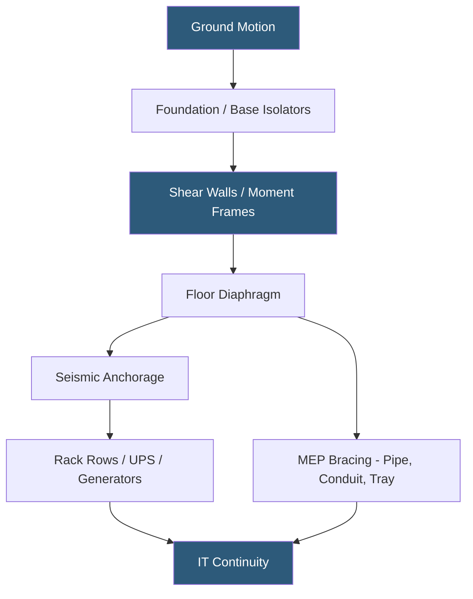

**Category:** Gigawatt Building & Structural
**Difficulty:** Advanced
**Reading time:** 6 min read

---

Seismic design for gigawatt-scale datacenters goes beyond standard building code compliance, requiring that both the structure and its critical mechanical, electrical, and plumbing systems survive ground motion with minimal downtime. In high-seismic zones, seismic design can increase construction costs by 10–25% but is essential for facilities targeting Tier IV uptime.

- **Seismic Design Category (SDC)** — ASCE 7 classification A–F based on site hazard and occupancy; datacenters often classify as SDC D or E
- **Importance Factor (Ie)** — multiplier applied to seismic forces for essential facilities; datacenters may be designated Ie = 1.25–1.5
- **Moment-Resisting Frame** — structural system where columns and beams resist lateral loads through rigid connections
- **Shear Wall** — concrete or steel wall element designed to absorb in-plane lateral forces
- **Base Isolation** — seismic isolators placed between foundation and structure to decouple building motion from ground motion
- **Seismic Anchorage** — attachment hardware securing racks, UPS systems, and mechanical equipment to floor/wall structure
- **Non-Structural Component (NSC) Bracing** — seismic restraints for piping, conduit, cable tray, and ceiling systems
- **Peak Ground Acceleration (PGA)** — maximum ground acceleration used to size structural and anchorage systems

Seismic design for datacenters follows ASCE 7 and local building codes, but critical infrastructure facilities often exceed minimum code requirements. The structural system must resist lateral forces from earthquakes without yielding — for gigawatt facilities in SDC D, this typically means special moment-resisting steel frames or special reinforced concrete shear walls. Column-to-beam connections are designed with controlled ductility to absorb energy without brittle fracture.

Base isolation, while expensive ($5–15M for a 100,000 sq ft building), is increasingly used at Tier IV facilities in very high seismic zones (PGA > 0.5g). Isolators reduce transmitted accelerations from 0.5–1.0g down to 0.1–0.2g, dramatically reducing internal equipment damage and post-event recovery time. The isolation plane requires a moat around the building perimeter to allow 12–18 inches of lateral movement.

Non-structural seismic design is often more operationally critical than structural design — a building can survive intact while failing overhead equipment destroys IT hardware. Cable tray, conduit runs, and cooling piping must be braced with lateral and longitudinal sway braces at 12-ft intervals per SMACNA seismic guidelines. Heavy equipment such as UPS systems, transformers, and CRAH units requires four-point floor anchorage with anchor bolt embedment designed for both uplift and shear.

Rack row seismic anchorage is mandatory in SDC C and above: anti-tip brackets, top-of-rack cable management frames, and row-end stabilizer posts prevent rack tipping under a 0.3g lateral event. Server equipment within racks must be secured with cage nuts and retention hardware to prevent sliding out of rack mount rails.

- Silicon Valley hyperscale campus in SDC D requiring special moment frames
- Tokyo colocation facility with base-isolated computer room above parking structure
- Pacific Northwest AI training facility requiring 1.0g PGA anchorage design
- Post-earthquake rapid recovery plan requiring 24-hour RTOs
- Retrofit seismic upgrade of legacy facility to meet current code for heavy GPU racks

| Advantage | Disadvantage |
|-----------|--------------|
| Base isolation reduces post-earthquake downtime to hours vs weeks | Base isolation adds $5–15M to construction cost |
| Proper anchorage prevents IT equipment loss in seismic events | Seismic bracing of MEP systems increases installation labor 15–20% |
| Exceeding code improves insurance ratings and lowers premiums | Moment frames require larger column sections, reducing floor plan flexibility |
| SDC compliance enables operation in the highest-risk growth markets | Seismic-compliant facilities require specialized structural engineering teams |

- [Foundation Design for Heavy Equipment](foundation-design-for-heavy-equipment.md)
- [Structural Load Capacity Requirements](structural-load-capacity-requirements.md)
- [Building Envelope Design](building-envelope-design.md)

---
*Part of the [Gigawatt Building & Structural](index.md) category · [Back to Master Index](../../index.md)*
