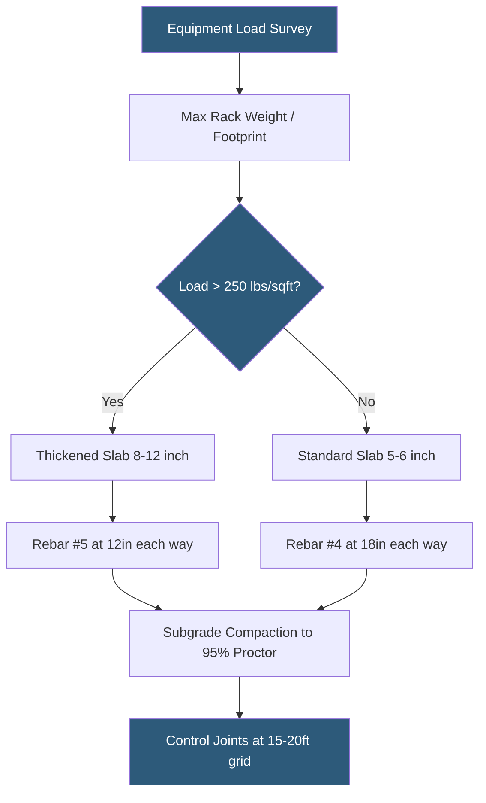

**Category:** Gigawatt Building & Structural
**Difficulty:** Intermediate
**Reading time:** 5 min read

---

Concrete slab design for datacenter equipment loads requires careful coordination between structural engineers, MEP designers, and operations teams to ensure floor systems support current and future equipment weights without cracking, deflecting excessively, or failing under concentrated point loads from racks, UPS systems, and liquid cooling infrastructure.

- **Slab-on-Grade (SOG)** — ground-floor concrete slab cast directly on engineered fill or compacted subgrade
- **Control Joint** — planned crack location that prevents random cracking while allowing thermal expansion
- **Reinforcement Ratio** — percentage of steel rebar cross-section relative to concrete area; higher ratios resist greater loads
- **Housekeeping Pad** — raised concrete curb base for mechanical or electrical equipment, providing anchor points and clearance
- **Point Load Capacity** — maximum concentrated force from a single rack foot or equipment leg, governed by punching shear
- **Modulus of Subgrade Reaction** — stiffness of soil support under a slab, affecting slab deflection under load
- **Polished Concrete** — hardened finish treatment improving durability and cleanroom compliance at high-traffic zones
- **Epoxy Coating** — protective surface treatment controlling concrete dust and improving chemical resistance

Datacenter SOG slabs are typically 5–8 inches thick for standard IT loads and 8–12 inches thick in electrical and mechanical rooms where transformers, switchgear, and UPS systems are concentrated. Reinforcement with #4 or #5 deformed rebar at 12–18 inch centers in both directions provides the combination of distributed load capacity and crack control needed for long-term performance.

Subgrade preparation is as important as concrete design: engineered fill must be compacted to 95% standard Proctor density with a minimum 6-inch crushed stone base course, topped by a 10-mil vapor barrier to prevent moisture migration that weakens the slab-subgrade bond and causes corrosion of embedded metals. The modulus of subgrade reaction (k-value) is verified by plate load tests; a minimum k of 200 pci is typically specified under heavy equipment areas.

Point load concentrations at rack feet are managed by ensuring four-point rack contact on level slabs — racks with uneven feet concentrate loads onto fewer contact points, creating localized stresses that can exceed 1,000 lbs/sq ft under 5,000 lb GPU racks. Anti-vibration pads or precision leveling feet distribute loads across the full rack footprint.

Control joints are saw-cut within 24 hours of placement at 15–20 ft spacing to guide shrinkage cracking to planned locations. In large format data halls exceeding 50,000 sq ft, construction joints divide the pour sequence; these joints are designed with load transfer devices (dowels) to prevent differential movement that would create trip hazards and damage rolling equipment.

- 120 kW liquid-cooled GPU rack requiring point load analysis at each rack foot
- Electrical room housing 2,000 kVA transformer bank on thickened slab
- Battery room floor design accounting for acid spill resistance requirements
- Retrofit slab assessment for legacy facility adding high-density AI equipment
- Clean room compliant slab with epoxy coating for ESD-sensitive environments

| Advantage | Disadvantage |
|-----------|--------------|
| Properly designed slabs support unlimited equipment reconfiguration | Thicker slabs increase concrete cost and pour cycle time |
| Control joints prevent uncontrolled cracking and surface damage | Joint locations must be coordinated with rack row layouts |
| Housekeeping pads provide positive equipment anchorage | Pads must be pre-planned; field additions are disruptive |
| Vapor barriers prevent long-term moisture damage | Barrier placement errors cause delamination and slab heave |

- [Raised Floor vs Slab-on-Grade](raised-floor-vs-slab-on-grade.md)
- [Foundation Design for Heavy Equipment](foundation-design-for-heavy-equipment.md)
- [Floor Loading Capacity (lbs/sqft)](floor-loading-capacity-lbs-sqft.md)

---
*Part of the [Gigawatt Building & Structural](index.md) category · [Back to Master Index](../../index.md)*
