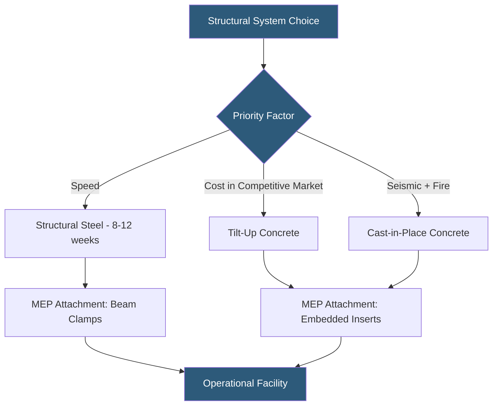

**Category:** Gigawatt Building & Structural
**Difficulty:** Intermediate
**Reading time:** 6 min read

---

The choice between structural steel framing and reinforced concrete construction is one of the highest-impact early design decisions for a gigawatt-scale datacenter, affecting construction schedule, cost, structural performance, fire resistance, and long-term modification capability. Both systems are widely used; the optimal choice depends on site-specific conditions, local contractor availability, and operational priorities.

- **Structural Steel** — hot-rolled wide flange sections (W-shapes) forming columns, beams, and trusses
- **Reinforced Concrete** — cast-in-place or precast concrete with embedded rebar resisting tension
- **Pre-Engineered Metal Building (PEMB)** — factory-designed steel system with lighter sections than conventional steel
- **Tilt-Up Concrete** — wall panels cast flat on-site then tilted to vertical, common in Western US
- **Fire Rating** — structural system's ability to retain load capacity under fire conditions; concrete is inherently fire-rated
- **Fireproofing** — intumescent coating or spray-applied cementitious material added to steel to achieve fire ratings
- **Erection Speed** — time from foundation complete to structure ready for MEP installation
- **Long-Term Modification** — ease of cutting openings, adding attachments, or changing structural configuration

Structural steel is the dominant framing system for hyperscale datacenters in the US and Europe, chosen primarily for erection speed. A steel structure for a 100,000 sq ft building can be fully erected in 6–10 weeks once foundation is complete; equivalent concrete construction takes 16–24 weeks. This schedule advantage is decisive when cloud providers race to meet customer commitments with 12–18 month delivery targets.

Steel provides excellent flexibility for future modifications: openings can be cut through beams with field welding of reinforcement headers, and beam clamps allow MEP attachments anywhere on lower flanges without drilling or embedment. However, structural steel requires fireproofing to achieve 1–2 hour fire ratings mandated by building codes. Intumescent paint is preferred for exposed steel in data halls for aesthetic reasons; spray-applied fireproofing (SFRM) is used in concealed areas and is 30–50% less costly.

Reinforced concrete offers inherent fire resistance (3–4 hour ratings without added protection), superior mass for vibration isolation, and greater resistance to wind and blast loading. Cast-in-place concrete post-tensioned slabs dominate multi-story datacenter construction where floor loading requirements and long spans would require very heavy steel sections. In seismic zones, special reinforced concrete shear walls are cost-competitive with steel moment frames for lateral force resistance.

Tilt-up concrete walls — popular in California hyperscale campuses — combine rapid erection with concrete's security and thermal properties. A 300,000 sq ft tilt-up building can have all wall panels cast and tilted in 4–6 weeks, with panels forming both structure and architectural finish. The approach eliminates steel fireproofing requirements for exterior walls and provides superior blast resistance.

- 400 MW campus standardizing on PEMB steel for all Phase 1–3 buildings
- Tokyo multi-story building using post-tensioned concrete floors for 300 psf capacity
- California seismic zone using tilt-up walls with steel roof structure
- Retrofit facility adding structural steel mezzanine for additional MEP equipment
- Budget-constrained build using commodity structural steel to reduce material cost

| Advantage | Disadvantage |
|-----------|--------------|
| Steel erects 40–60% faster than concrete construction | Steel requires applied fireproofing adding cost and schedule |
| Concrete provides inherent fire resistance and mass | Concrete construction is weather-sensitive (cold weather protection required) |
| Steel allows future openings and modifications without major demolition | Concrete modifications require diamond sawing and structural analysis |
| Concrete tilt-up provides excellent security barrier | Tilt-up requires large casting area on-site, impractical on tight sites |

- [Structural Load Capacity Requirements](structural-load-capacity-requirements.md)
- [Seismic Design Considerations](seismic-design-considerations.md)
- [Modular Building Construction](modular-building-construction.md)

---
*Part of the [Gigawatt Building & Structural](index.md) category · [Back to Master Index](../../index.md)*
