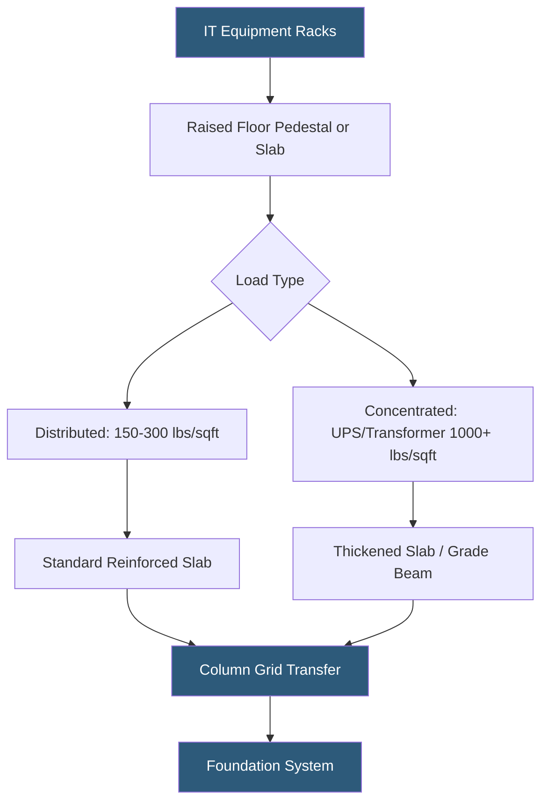

**Category:** Gigawatt Building & Structural
**Difficulty:** Advanced
**Reading time:** 6 min read

---

Structural load capacity is a foundational design constraint at gigawatt-scale datacenters, where IT equipment, power infrastructure, and cooling systems impose dead and live loads far exceeding conventional commercial construction. Undersized slabs create costly retrofit problems, while over-engineering adds unnecessary CapEx; accurate load modeling is essential from day one.

- **Dead Load** — permanent weight of building structure, raised floor, and fixed equipment
- **Live Load** — variable weight from IT racks, people, and movable equipment, per IBC/ASCE 7
- **Concentrated Load** — point load from individual rack feet or transformer pads, requiring local slab reinforcement
- **Post-Tensioned Slab** — concrete floor with pre-stressed cables allowing longer spans at higher loads
- **UDL (Uniformly Distributed Load)** — load spread across the entire floor area, expressed in lbs/sq ft or kN/m²
- **Load Path** — the route forces travel from equipment through slab, beams, columns, and foundations
- **Vibration Criterion** — structural frequency limits to prevent equipment resonance, especially for HDDs and precision instruments
- **Punching Shear** — localized failure mode at column-slab connections under high concentrated loads

Datacenter floor loading requirements are substantially higher than standard office construction (40–80 lbs/sq ft) and approach or exceed industrial warehouse standards. A standard 42U server rack fully loaded with blade servers and power supplies weighs 2,000–3,000 lbs; high-density AI accelerator racks routinely reach 5,000–8,000 lbs. With rack footprints of 2×3 ft, this produces localized concentrated loads of 800–1,300 lbs/sq ft.

Structural engineers size slabs for UDL of 150–250 lbs/sq ft across general data hall floor plates, with punching shear reinforcement at locations where UPS systems, switchgear, or battery cabinets create point loads exceeding 500 lbs/sq ft. Battery rooms for large UPS strings require specialized slab design: a 1 MW UPS with 10-minute runtime battery string can impose 30,000–50,000 lbs on a 400 sq ft footprint.

Raised floor pedestals — typically 6–18 inch heights at gigawatt facilities — transmit concentrated rack loads through pedestals to the structural slab below. Pedestal grid spacing (typically 24-inch modules) must align with rack footprints, and pedestal head plates must be rated for the point load. Where raised floors are absent (slab-on-grade with overhead cable tray), loads transfer directly; slab thickness of 8–12 inches with #5 or #6 rebar at 12-inch centers is common.

In multi-story buildings, interstitial MEP floors bearing chiller and transformer weights require independent structural bays with post-tensioned beams spanning 40–60 ft. Seismic zones add lateral load requirements that increase column sizes and foundation depths significantly.

- 100 kW liquid-cooled AI rack cluster requiring 1,200 lbs/sq ft slab design
- Battery room for 10 MW UPS system with concentrated cell cabinet loads
- Multi-story building with transformer vaults on interstitial floors
- Seismic Zone D facility requiring moment-frame structural system
- Raised floor retrofit where legacy slab must be evaluated for higher-density equipment

| Advantage | Disadvantage |
|-----------|--------------|
| Properly designed slabs enable any future density increase | Over-engineered structure adds $5–15/sq ft to construction cost |
| Concentrated load zones can be pre-identified and locally reinforced | Retroactive slab upgrades require shutdowns and significant rework |
| Post-tensioned slabs achieve longer column-free spans | PT slabs require specialized contractors and post-construction cable access |
| Comprehensive load modeling prevents structural failures | Early design load assumptions may not match actual equipment weights |

- [Foundation Design for Heavy Equipment](foundation-design-for-heavy-equipment.md)
- [Slab Design for Equipment Loads](slab-design-for-equipment-loads.md)
- [Raised Floor vs Slab-on-Grade](raised-floor-vs-slab-on-grade.md)

---
*Part of the [Gigawatt Building & Structural](index.md) category · [Back to Master Index](../../index.md)*
