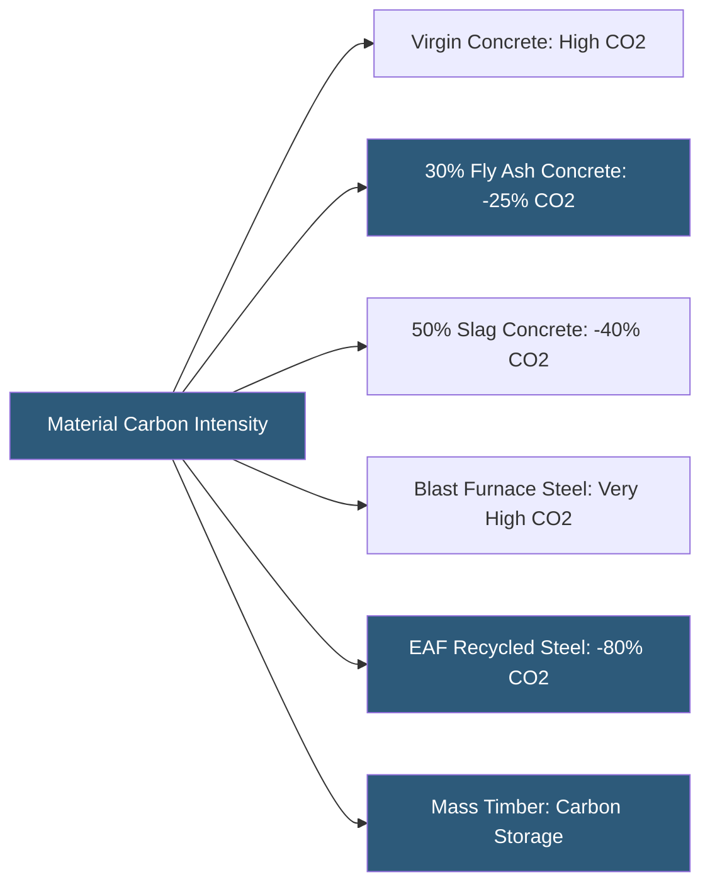

**Category:** Gigawatt Building & Structural
**Difficulty:** Beginner
**Reading time:** 5 min read

---

Sustainable building materials reduce the embodied carbon and environmental impact of constructing gigawatt-scale datacenter facilities. With hundreds of thousands of tons of concrete, steel, and other materials in a single campus, even modest material choices can represent millions of tons of CO2 avoided over a construction program. Hyperscalers increasingly track and report embodied carbon alongside operational carbon in their sustainability disclosures.

- **Embodied Carbon** — CO2 emissions from material extraction, manufacturing, transport, and installation (Scope 3 upstream)
- **Global Warming Potential (GWP)** — a measure of a material's climate impact relative to CO2 over 100 years
- **Environmental Product Declaration (EPD)** — a third-party verified report of a product's environmental impacts
- **Supplementary Cementitious Materials (SCM)** — fly ash, slag, and silica fume replacing Portland cement in concrete, reducing CO2 by 30–50%
- **Low-carbon Steel** — steel manufactured in electric arc furnaces (EAF) using scrap, with 75–85% lower carbon than virgin blast furnace steel
- **Mass Timber** — engineered wood products (CLT, glulam) that store biogenic carbon and can replace steel or concrete in some applications
- **Regional Materials** — materials sourced within 500 miles of the project site, reducing transportation emissions
- **Biogenic Carbon** — carbon stored in organic materials like wood, which is released at end of life but temporarily sequestered

The structural frame of a gigawatt datacenter campus—foundations, slabs, columns, and roof structure—is the largest source of embodied carbon. Concrete production contributes approximately 8% of global CO2 emissions; Portland cement clinker is the dominant contributor. By replacing 30–50% of cement with supplementary cementitious materials (SCMs) like fly ash (a byproduct of coal combustion) or ground granulated blast-furnace slag (GGBS), the carbon intensity of concrete can be reduced by 25–45% with minimal performance trade-offs. Higher SCM content affects concrete set time and early strength, requiring schedule adjustments during cold weather pours.

Structural steel sourced from electric arc furnace (EAF) mills—which melt recycled scrap—carries approximately 0.5–0.8 kg CO2/kg versus 2.0–2.5 kg CO2/kg for integrated blast furnace production. In the US, most structural steel already comes from EAF mills. Specifying certified low-carbon steel and requesting EPDs from fabricators allows project teams to document the actual carbon intensity of the delivered material.

Mass timber is gaining traction for administrative and office buildings within datacenter campuses, though its application in data halls is limited by fire resistance and humidity concerns. For campus support buildings, cross-laminated timber (CLT) panels can replace concrete floors and provide a carbon-storing structural system.

Beyond structure, material choices in insulation, ceiling systems, and finishes accumulate meaningful carbon savings at campus scale. Mineral wool insulation has lower embodied carbon than rigid polyurethane. Polished concrete floors eliminate carpet or tile layers entirely. Procurement programs specifying EPDs from all major material suppliers enable project teams to track and report total embodied carbon against targets.

- Hyperscaler campuses with Science Based Targets requiring Scope 3 emissions reductions
- Projects seeking LEED v4.1 credits for low-carbon materials and EPDs
- EU facilities subject to Carbon Border Adjustment Mechanism (CBAM) considerations
- Investor-grade sustainability reporting requiring material carbon accounting
- Campus support buildings where mass timber is structurally and architecturally appropriate

| Advantage | Disadvantage |
|-----------|--------------|
| SCM concrete reduces embodied carbon 25–45% with minimal cost premium | High SCM concrete has slower early strength gain, impacting schedule |
| Low-carbon EAF steel often cost-competitive with blast furnace steel | EPD documentation requires supplier engagement and procurement effort |
| Mass timber stores biogenic carbon and has architectural appeal | Mass timber has fire resistance limitations for data hall applications |
| Regional material sourcing reduces transport emissions | Regional sourcing constraints can limit supplier competition and increase cost |

- [Green Building Certifications (LEED)](green-building-certifications-leed.md)
- [Precast Concrete Structures](precast-concrete-structures.md)
- [Steel Structure vs Concrete](steel-structure-vs-concrete.md)

---
*Part of the [Gigawatt Building & Structural](index.md) category · [Back to Master Index](../../index.md)*
