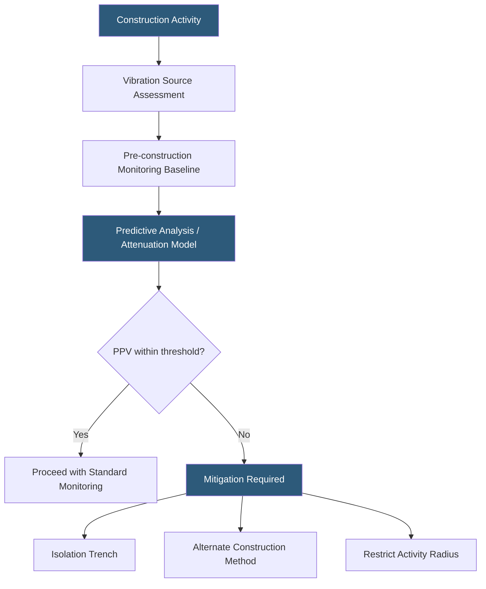

**Category:** Gigawatt Building & Structural
**Difficulty:** Intermediate
**Reading time:** 6 min read

---

Construction activities—pile driving, compaction equipment, heavy demolition, and blasting—generate ground vibrations that can damage sensitive IT equipment, disrupt hard drive reads, and in extreme cases crack building structures in adjacent live facilities. At gigawatt campuses where new phases are built immediately beside operating data halls, vibration control is an engineering discipline requiring pre-construction monitoring, predictive analysis, and activity-level controls.

- **Peak Particle Velocity (PPV)** — the standard metric for ground vibration intensity, measured in inches per second (in/s) or mm/s
- **Frequency** — vibration cycles per second (Hz); IT equipment is most sensitive to frequencies in the 5–50 Hz range
- **Attenuation** — the natural decrease in vibration amplitude with distance from the source
- **Isolation Trench** — a vertical gap cut in soil or concrete between a vibration source and a sensitive receiver
- **Vibration Monitoring Array** — a network of seismographs or accelerometers recording real-time vibration levels during construction
- **Threshold Limit** — the PPV above which equipment damage, occupant complaint, or structural damage is likely; data centers typically use 0.2 in/s
- **Vibratory Compaction** — compaction using vibratory rollers or plate compactors; one of the highest vibration-generating activities
- **Impact Pile Driving** — hammering piles into soil; can produce PPV > 1.0 in/s at 50 feet distance

The vibration control process begins before construction activity starts. A baseline vibration survey records ambient vibration levels at the active data hall using seismographs placed at the building foundation and at midpoints between the source and receiver. Baseline data establishes the pre-existing vibration environment and confirms monitoring equipment is functioning correctly.

Predictive analysis uses empirically derived attenuation equations—most commonly Dowding's scaled distance formula—to estimate PPV at the nearest sensitive receiver for each planned construction activity. For pile driving operations at 100 feet distance, predicted PPV commonly exceeds 0.5 in/s, well above the 0.2 in/s threshold used for data hall protection. Mitigation options include substituting augered displacement piles (which push soil rather than impact it), installing an isolation trench (a slot cut in the soil breaking the propagation path), or relocating pile lines beyond the attenuation distance.

During active construction, continuous vibration monitoring through a sensor array provides real-time PPV data streamed to site supervision. Threshold alarms alert the superintendent and trigger an immediate halt of the responsible activity. Post-halt assessment confirms PPV has returned to baseline before the activity resumes at reduced intensity or with modified methods.

Hard disk drives (HDDs) in enterprise storage arrays are particularly sensitive to vibrations in the 60–300 Hz range, which can cause head-tracking errors and read/write failures at PPV as low as 0.05 in/s. Modern SSDs are largely immune. Colocation providers often require tenants to document storage equipment sensitivity, and the facility team maintains vibration-free zones around HDD-dominant deployments.

- New building construction adjacent to live data halls on shared campuses
- Deep foundation installation in the vicinity of operating mechanical equipment
- Demolition of adjacent structures for site expansion
- Heavy-haul road traffic from construction equipment passing near vibration-sensitive zones
- Seismic upgrade work on existing buildings with operational equipment

| Advantage | Disadvantage |
|-----------|--------------|
| Real-time monitoring enables immediate response to threshold exceedances | Sensor array installation and continuous monitoring adds project cost |
| Isolation trenches are highly effective and relatively inexpensive | Trenches disrupt site drainage and require backfilling after construction |
| Predictive analysis reduces surprises during construction | Attenuation models have uncertainty; field conditions may differ from predictions |
| Substitute pile methods eliminate vibration risk entirely | Augered piles and other low-vibration methods cost more than impact-driven piles |

- [Construction Dust Control](construction-dust-control.md)
- [Foundation Design for Heavy Equipment](foundation-design-for-heavy-equipment.md)
- [Seismic Design Considerations](seismic-design-considerations.md)

---
*Part of the [Gigawatt Building & Structural](index.md) category · [Back to Master Index](../../index.md)*
