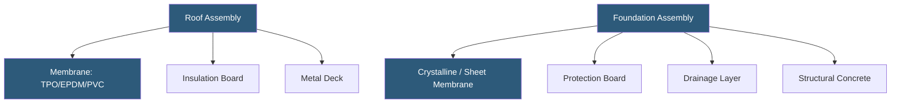

**Category:** Gigawatt Building & Structural
**Difficulty:** Intermediate
**Reading time:** 6 min read

---

Water intrusion is one of the most common causes of datacenter outages and equipment damage, making waterproofing a critical discipline in gigawatt-scale facility construction. Comprehensive waterproofing addresses roofing systems, below-grade structures, mechanical penetrations, and plumbing containment to prevent moisture from reaching sensitive electrical and IT equipment.

- **Single-ply Membrane** — a thin polymer sheet (TPO, EPDM, or PVC) bonded or mechanically fastened to the roof deck
- **Built-up Roof (BUR)** — multiple layers of bitumen-saturated felt topped with aggregate; highly durable
- **Below-grade Waterproofing** — membranes or crystalline coatings applied to foundation walls and below-slab areas
- **Positive-side Waterproofing** — applied on the side of the structure in contact with water (exterior face of foundation)
- **Negative-side Waterproofing** — applied on the interior face; stops water passage but does not remove hydrostatic pressure
- **Crystalline Waterproofing** — a cementitious admixture that forms crystals in concrete pores, self-sealing under moisture
- **Penetration Flashing** — specialized seal around pipe, conduit, and duct penetrations through the roof or wall membrane
- **Secondary Containment** — a waterproof liner below mechanical equipment trapping fluid in event of leaks

At the roof level, single-ply TPO (thermoplastic polyolefin) membranes dominate hyperscaler construction due to their energy-efficient white reflective surface, weldable seams, and compatibility with numerous penetrations. A 500,000 sq ft roof may have hundreds of roof curbs for cooling towers, CRAH units, and exhaust fans—each requiring a factory-fabricated flashing detail. All penetrations are heat-welded to the field membrane to form a continuous watertight surface.

Below-grade construction in basement electrical rooms or tunnel connections requires positive-side waterproofing applied before backfill. Sheet-applied membranes of 60–80 mil HDPE or self-adhering rubberized asphalt are bonded to the exterior of the foundation wall and slab. Where access after construction is impossible, crystalline admixtures blended into the concrete mix provide a self-healing backup: when cracks form and water contacts the admixture, new crystals grow to fill the void.

Inside the building, secondary containment is mandatory below all fluid-bearing mechanical systems. Chiller plant floors include integral concrete curbs and epoxy-coated floors that drain to oil-water separators. Battery rooms require acid-resistant liners to capture electrolyte spills. Generator day-tank enclosures must meet EPA secondary containment regulations of 110% of the largest tank volume.

Quality control during waterproofing installation uses electronic leak detection (ELD)—low-voltage field testing that locates pinhole breaches in the membrane before insulation and ballast cover the system. ELD testing on a 300,000 sq ft roof can locate defects within 12 inches of their actual position.

- Roofing waterproofing for large flat-roof datacenter buildings
- Below-grade electrical rooms and connecting tunnels between buildings
- Chemical and oil secondary containment for generators and transformers
- Battery room acid containment and neutralization
- Cooling plant areas with large volumes of process water

| Advantage | Disadvantage |
|-----------|--------------|
| Crystalline admixtures self-seal minor cracks over time | Cannot substitute for membrane systems at high hydrostatic pressure |
| ELD testing finds defects before they cause damage | ELD requires bare membrane surface; must be done before insulation |
| TPO single-ply offers fast installation and weldable seams | TPO can degrade in ponded chemical environments |
| Below-grade positive-side membranes provide lasting protection | Access for future repairs is impossible once backfilled |

- [Roofing Systems for Datacenters](roofing-systems-for-datacenters.md)
- [Foundation Design for Heavy Equipment](foundation-design-for-heavy-equipment.md)
- [Building Envelope Design](building-envelope-design.md)

---
*Part of the [Gigawatt Building & Structural](index.md) category · [Back to Master Index](../../index.md)*
