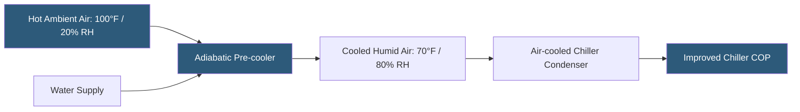

**Category:** Gigawatt Cooling Infrastructure
**Difficulty:** Intermediate
**Reading time:** 6 min read

---

Adiabatic cooling uses the evaporation of water to reduce the temperature of air or refrigerant condenser intake air before it enters mechanical cooling equipment, improving efficiency in hot-dry climates without the continuous water consumption of cooling towers. At gigawatt scale, adiabatic systems are deployed as pre-coolers on air-cooled chillers or as direct evaporative coolers for airside cooling, offering a middle path between pure air-cooling and full evaporative cooling tower systems.

- **Adiabatic** — a thermodynamic process with no heat exchange with surroundings; evaporation cools air using only the water's latent heat
- **Pre-cooler** — an evaporative media or misting system installed at the air intake of air-cooled equipment
- **Evaporative Media** — rigid cellulose or polymer pads through which water trickles; air passes through, picking up moisture and cooling
- **High-pressure Misting** — water pumped at 800–1200 PSI through fine nozzles to produce droplets that evaporate before striking equipment
- **Direct Evaporative Cooling (DEC)** — introducing humidified outdoor air directly into the data hall without mechanical refrigeration
- **Indirect Evaporative Cooling (IEC)** — using a heat exchanger to cool supply air via a wet secondary air circuit, without adding humidity to the primary stream
- **Effectiveness** — the fraction of theoretical maximum cooling achieved; high-quality evaporative pads reach 85–95% effectiveness
- **Seasonal Operation** — adiabatic systems are typically activated only during hot periods when ambient exceeds a threshold temperature

In hot-dry climates, the difference between dry bulb and wet bulb temperature—the depression—can be 20–30°F. This temperature depression represents the maximum cooling potential available from adiabatic evaporation. If ambient air is at 100°F and 15% relative humidity, evaporating water can cool the air to approximately 70°F before saturation—a 30°F reduction. This dramatically lowers the inlet conditions for air-cooled chiller condensers, improving COP by 20–40% during peak summer hours.

Adiabatic pre-coolers are installed as retrofits on existing air-cooled chillers or specified as integrated systems on new equipment. Cellulose evaporative media pads mounted in frames upstream of the condenser coils receive water from a distribution manifold. A sump collects drainage and recirculates it through the pads, with makeup water from the building domestic supply. Water consumption is 10–30% of a cooling tower serving equivalent load, making adiabatic systems practical in climates where water is available but scarce.

High-pressure misting systems (fog systems) achieve similar results with lower pressure drop across the media but require higher-quality water to avoid nozzle clogging. Nozzle maintenance is more intensive than pad systems but fog systems can be distributed over larger areas and retrofitted to equipment where pad installation is not practical.

Direct evaporative cooling used for airside economizer applications simply passes filtered outdoor air through evaporative pads before introduction to the data hall. This approach is effective in climates where WBT is below the facility's maximum allowable supply air temperature (typically 65–70°F), but requires careful humidity management to prevent condensation on equipment in the data hall.

- Air-cooled chiller capacity and efficiency enhancement in hot-dry climates
- Airside free cooling systems in arid regions where full DEC is climatically viable
- Retrofit performance improvements on existing air-cooled chiller plants
- Hybrid cooling approaches combining limited water use with reduced mechanical cooling
- Data halls targeting intermediate PUE improvement without full cooling tower systems

| Advantage | Disadvantage |
|-----------|--------------|
| 20–40% chiller efficiency improvement with modest water use | Only effective in hot-dry climates; humid climates have minimal temperature depression |
| 70–90% less water than cooling towers for equivalent cooling benefit | Evaporative media and nozzles require regular cleaning and replacement |
| No blowdown discharge, simplified water permits | Seasonal operation limits annual energy savings compared to year-round systems |
| Retrofit-friendly for existing air-cooled chiller installations | High-pressure misting requires water treatment to prevent nozzle clogging |

- [Air-cooled Chiller Farms](air-cooled-chiller-farms.md)
- [Climate Considerations for GW Cooling](climate-considerations-for-gw-cooling.md)
- [Free Cooling Hours Analysis](free-cooling-hours-analysis.md)

---
*Part of the [Gigawatt Cooling Infrastructure](index.md) category · [Back to Master Index](../../index.md)*
