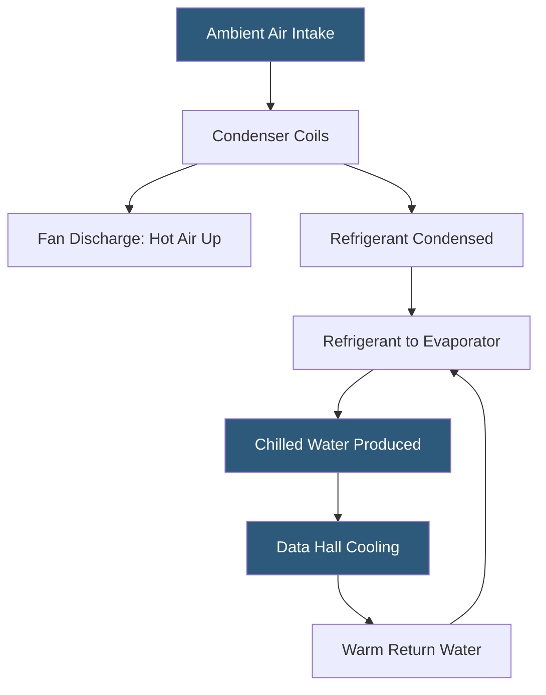

**Category:** Gigawatt Cooling Infrastructure
**Difficulty:** Intermediate
**Reading time:** 6 min read

---

Air-cooled chiller farms eliminate the need for cooling towers and their water consumption by rejecting heat directly to ambient air through large condenser coil arrays. At gigawatt scale, this approach sacrifices some energy efficiency compared to water-cooled systems but offers significant advantages in water-scarce environments, simplified chemical treatment, and reduced regulatory burden. Design of air-cooled chiller farms requires careful management of hot air recirculation and substantial mechanical yard area.

- **Air-cooled Chiller** — a refrigeration machine with compressor, evaporator, and air-cooled condenser; no cooling tower required
- **Condenser Coil** — finned copper or aluminum heat exchanger through which ambient air passes to reject heat
- **Fan Array** — the array of propeller fans pulling air through the condenser coils
- **Recirculation** — warm discharge air from the condenser fans that returns to the air inlet, degrading performance
- **Approach Temperature** — the difference between the chiller condensing temperature and the ambient dry bulb temperature
- **Integrated Part Load Value (IPLV)** — a weighted average efficiency rating across multiple part-load operating points
- **Variable Speed Drive (VSD)** — a motor controller varying fan speed to optimize performance at part load and reduce noise
- **Hot Aisle Exhaust Barrier** — a physical or wind-barrier system preventing condenser hot air recirculation

Air-cooled chillers reject all heat to ambient air using refrigerant-to-air condensers mounted on the chiller or in a separate remote condenser rack. Individual units range from 200 to 1,500 tons of refrigeration (TR) capacity. A 100 MW data hall with a PUE of 1.4 generates 40 MW of cooling load (approximately 114,000 TR), requiring 76–570 chiller units depending on unit size.

The primary limitation of air-cooled systems is their dependence on dry bulb temperature rather than wet bulb. While a cooling tower can provide 70°F chilled water supply at ambient WBT of 65°F, an air-cooled chiller requires condenser air temperatures well above its condensing temperature to drive heat transfer, limiting it to chilled water supply temperatures of 44–48°F when ambient is 95°F DBT. This higher condensing temperature means higher compressor lift and power consumption—typically 30–50% more kW/TR than water-cooled systems in hot weather.

Managing hot air recirculation is the critical challenge at scale. When many units are arranged in rows, their combined hot exhaust—typically 120–140°F discharge air—must be prevented from flowing back around to the inlet face. Designs use orientation relative to prevailing winds, raised unit mounting on 8–12 foot plinths to elevate discharge above the recirculation zone, and physical baffles or adiabatic pads at the inlet face.

In mild climates with design DBT below 85°F and annual average DBT below 60°F, air-cooled chillers can achieve whole-year average PUE values competitive with water-cooled systems while eliminating all water consumption. Several major hyperscalers have deployed air-cooled systems in Nordic climates for this reason.

- Water-scarce sites where cooling tower water consumption is prohibited or restricted
- Climates with design DBT below 85°F where air-cooling performance is acceptable
- Facilities seeking to eliminate Legionella risk and chemical treatment programs
- Sites where water utility connection is not available or is very expensive
- Emergency backup cooling for facilities where water supply disruption is a risk

| Advantage | Disadvantage |
|-----------|--------------|
| Zero water consumption; no cooling tower or treatment chemicals | 30–50% higher energy consumption than water-cooled systems in hot weather |
| No Legionella risk and simplified water management | Large land area required for condenser units; difficult to fit on constrained sites |
| No water permits, NPDES, or blowdown discharge regulations | Performance degrades significantly in hot weather when most needed |
| Simpler mechanical system reduces maintenance complexity | Hot air recirculation requires careful design and space management |

- [Water-cooled Chiller Installations](water-cooled-chiller-installations.md)
- [Climate Considerations for GW Cooling](climate-considerations-for-gw-cooling.md)
- [Cooling Tower Arrays](cooling-tower-arrays.md)

---
*Part of the [Gigawatt Cooling Infrastructure](index.md) category · [Back to Master Index](../../index.md)*
