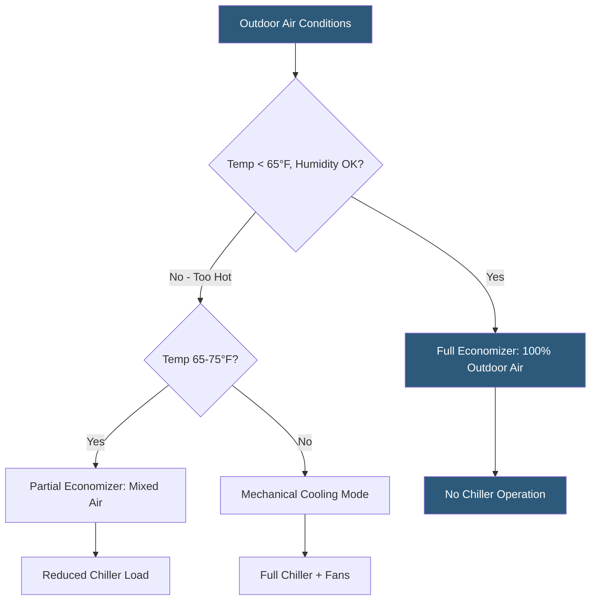

**Category:** Gigawatt Cooling Infrastructure
**Difficulty:** Advanced
**Reading time:** 7 min read

---

Airside economizers introduce filtered outdoor air directly into the data hall when ambient temperature and humidity conditions allow, bypassing mechanical cooling entirely and achieving near-zero cooling energy consumption. At gigawatt scale, airside economizers can provide free cooling for 60–95% of annual hours in favorable climates, reducing annual PUE to near 1.05–1.15 and delivering hundreds of millions of dollars in lifecycle energy savings.

- **Airside Economizer** — a cooling strategy directly admitting outdoor air to the data hall when conditions are acceptable
- **ASHRAE A2 / A4 Envelope** — equipment temperature and humidity specifications; A4 allows up to 45°C (113°F) inlet temperature, enabling more airside economizer hours
- **Enthalpy Wheel (Energy Recovery)** — a rotating heat exchanger that transfers sensible and latent heat between exhaust and supply air streams
- **Mixing Box** — a damper assembly blending outdoor and return air to achieve a target supply temperature
- **Inlet Air Treatment** — filtration, humidification, and evaporative cooling applied to outdoor air before data hall entry
- **Pressurization Control** — maintaining the data hall at slight positive pressure to prevent unfiltered air from infiltrating through gaps
- **Free Cooling Threshold** — the maximum outdoor temperature at which the economizer mode can provide adequate cooling; determined by IT equipment thermal ratings
- **Efficiency (CEF)** — Cooling Efficiency Factor for airside economizers; ratio of cooling output to fan power consumed

Airside economizer systems use large damper arrays in the building envelope to control outdoor air intake. When outdoor temperature is below the economizer setpoint (typically 60–70°F for servers rated to 80°F inlet), the mixing box opens to 100% outdoor air and the return air damper closes. The data hall air handlers become purely ventilation units, consuming only fan energy to move air.

Facebook's Lulea, Sweden facility pioneered the modern hyperscaler airside economizer design, operating above the Arctic Circle with cooling almost entirely from cold outdoor air, achieving annual PUE of 1.09. The facility uses direct outdoor air cooling (DOAC) with MERV-8 filtration and evaporative humidification to maintain minimum humidity when outdoor air is dry in winter. Heat recovery from server exhaust air warms the building in winter, eliminating separate space heating loads.

At scale, the main engineering challenges are filtration, humidity control, and corrosive gas management. Outdoor air carries pollutants—sulphur dioxide, hydrogen sulfide, nitrogen oxides—that corrode copper and silver contacts in servers at concentrations far below OSHA health limits. ASHRAE Standard 90.4 and server manufacturer guidelines specify maximum concentrations, requiring activated carbon or potassium permanganate filtration in regions with elevated industrial air quality concerns.

Humidity control requires evaporative humidification in winter (dry outdoor air) and may require chilled water cooling coils or DX systems for summer dehumidification in humid climates. In arid cold climates like Scandinavia and US inland mountain regions, natural humidity management is simpler: outdoor winter RH of 40–60% requires only minor humidification. In humid temperate climates (eastern US, central Europe), summer outdoor air has high dew points that limit economizer hours to cooler months.

- Hyperscaler campuses in cold dry climates: Nordic, Pacific Northwest, Canadian Prairie
- Government and corporate campuses with strict energy efficiency mandates
- Facilities pursuing sub-1.15 annual average PUE
- New constructions where airside economizer is integrated into the building architecture
- AI compute clusters operated at ASHRAE A3/A4 expanded temperature envelopes

| Advantage | Disadvantage |
|-----------|--------------|
| Near-zero cooling energy during economizer hours; dramatically reduces PUE | Only effective in cold-dry climates; hot-humid climates have very limited economizer hours |
| Eliminates chiller capital and operating costs for the majority of the year | Requires filtration systems for particulates, corrosive gases, and humidity control |
| Simple air system with minimal moving parts (dampers, fans) | Server equipment must be rated for expanded thermal envelope (ASHRAE A3/A4) |
| Enables heat recovery from exhaust to reduce building heating loads | Very large damper and ductwork required; significant building volume penalty |

- [Free Cooling Hours Analysis](free-cooling-hours-analysis.md)
- [Climate Considerations for GW Cooling](climate-considerations-for-gw-cooling.md)
- [PUE Optimization Strategies](pue-optimization-strategies.md)

---
*Part of the [Gigawatt Cooling Infrastructure](index.md) category · [Back to Master Index](../../index.md)*
