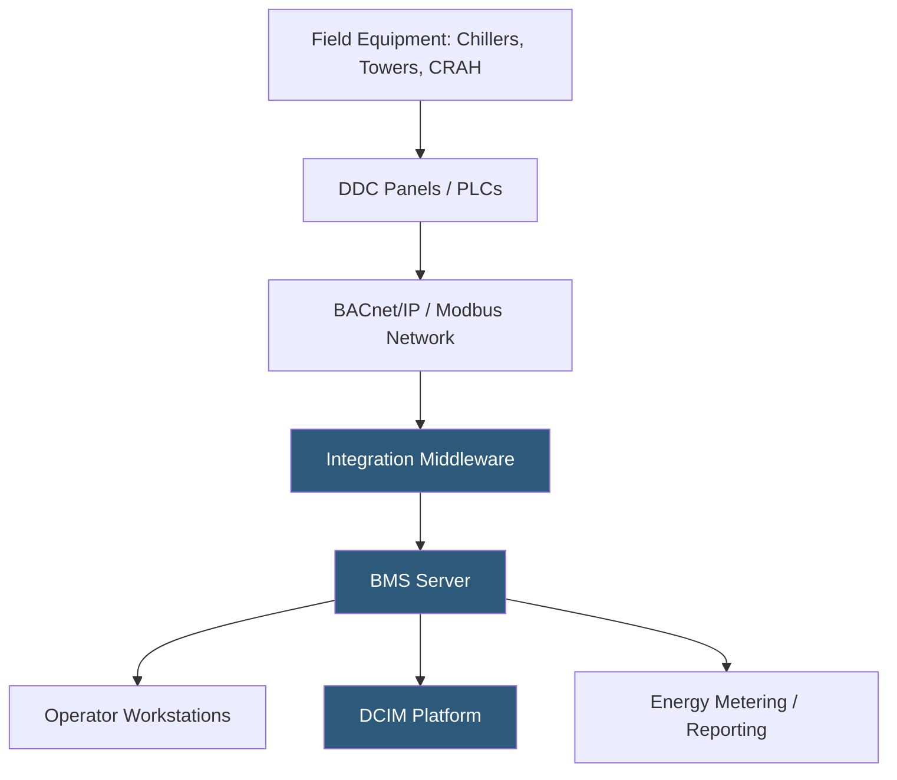

**Category:** Gigawatt Cooling Infrastructure
**Difficulty:** Intermediate
**Reading time:** 6 min read

---

A Building Management System (BMS) is the central control and monitoring platform that integrates all building mechanical, electrical, and environmental systems into a unified operational interface. At gigawatt datacenters, BMS integration connects cooling towers, chillers, pumps, CRAH units, power infrastructure, lighting, and fire systems into a coherent control architecture enabling automated optimization, alarm management, and energy reporting across a campus of unprecedented scale.

- **BMS** — a software platform collecting sensor data, executing control logic, and providing operator interfaces for building systems
- **DDC (Direct Digital Control)** — microcontroller-based field panels executing local control loops; the BMS nodes closest to equipment
- **BACnet/IP** — the dominant open communication protocol connecting DDC controllers to the BMS server
- **Modbus** — a widely used legacy protocol for energy meters, chillers, and industrial equipment integration
- **OPC-UA** — an industrial IoT protocol increasingly used for integration of modern chiller and cooling equipment APIs
- **Sequence of Operations** — the written description of how a system behaves under all conditions; the control logic specification engineers and BMS programmers implement
- **Alarm Management** — the framework categorizing, prioritizing, routing, and acknowledging alarms to ensure appropriate response
- **Integration Layer** — middleware software translating between different protocols (BACnet, Modbus, OPC-UA) to present a unified data model to the BMS

A gigawatt campus BMS may integrate 50,000–200,000 data points across dozens of mechanical rooms, cooling tower yards, and electrical substations. The system architecture is hierarchical: field instruments connect to DDC panels, which implement local control loops and communicate over BACnet/IP or Modbus networks to a building-level BMS server. Multiple buildings connect to a campus-level BMS providing a unified view across all facilities.

Integration of major equipment—centrifugal chillers, cooling towers, generators—uses equipment-specific protocols. Modern chillers expose a BACnet interface documenting all parameters in a standard object dictionary. Older legacy equipment uses Modbus registers requiring custom integration maps. Each equipment manufacturer provides protocol documentation; the BMS programmer maps these points into the campus data model.

Chiller plant optimization sequences are implemented as BMS programs controlling chiller staging, temperature setpoints, and economizer mode transitions. A well-programmed BMS integrates with weather data feeds to anticipate ambient temperature changes and pre-position cooling plant equipment ahead of load changes, reducing thermal transient responses.

Alarm management is a critical BMS function at gigawatt scale. A poorly configured alarm system can generate thousands of notifications per day, overwhelming operators and causing critical alarms to be missed in the noise. Alarm rationalization—systematically reviewing and classifying every alarm point—is typically performed during commissioning to establish appropriate priorities, deadbands, and time delays that produce only actionable notifications.

Integration with DCIM platforms provides the operational overlay: correlating IT power data from PDUs and UPS units with cooling measurements allows real-time PUE calculation by zone, rack-level thermal mapping, and automated cooling response to IT workload changes.

- Central control and monitoring for all mechanical and electrical systems on a campus
- Automated cooling optimization sequences (economizer mode, chiller staging, setpoint reset)
- Regulatory and ESG reporting requiring verified energy and water consumption data
- Commissioning and fault diagnosis using BMS trending and alarm history
- Integration of new construction phases with existing campus BMS infrastructure

| Advantage | Disadvantage |
|-----------|--------------|
| Unified platform simplifies operations and reduces staffing requirements | Large BMS implementations are complex and require specialist programmers and engineers |
| Open protocols (BACnet) reduce vendor lock-in and enable competitive procurement | Legacy equipment with proprietary protocols requires custom integration development |
| Automated optimization sequences improve PUE without continuous manual intervention | BMS software failures can disable automated control, reverting to manual or fail-safe modes |
| Centralized data repository enables historical analysis and compliance reporting | Network security of BMS is critical; OT/IT convergence creates cybersecurity exposure |

- [Cooling System Monitoring](cooling-system-monitoring.md)
- [Predictive Cooling Optimization](predictive-cooling-optimization.md)
- [Economizer Mode Optimization](economizer-mode-optimization.md)

---
*Part of the [Gigawatt Cooling Infrastructure](index.md) category · [Back to Master Index](../../index.md)*
