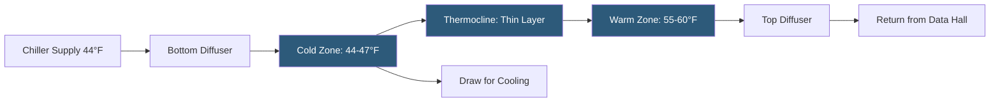

**Category:** Gigawatt Cooling Infrastructure
**Difficulty:** Intermediate
**Reading time:** 6 min read

---

Chilled water storage tanks are large, insulated vessels holding pre-cooled water for use during peak demand periods or emergency cooling events. They are the simplest and most common form of thermal energy storage at gigawatt-scale datacenters, offering proven reliability, straightforward maintenance, and operational flexibility that ice storage and other TES technologies cannot match at the largest scales.

- **Stratified Tank** — a tank where cold water (denser) settles to the bottom and warm return water remains at the top, separated by a thin thermocline
- **Diffuser** — a slotted or porous pipe at the tank inlet distributing water at very low velocity to preserve stratification
- **Tank Aspect Ratio** — the height-to-diameter ratio; taller, narrower tanks maintain better stratification than shallow wide tanks
- **Figure of Merit (FOM)** — a measure of stratification quality: ratio of usable stored energy to theoretical maximum; well-designed tanks achieve >90% FOM
- **Standby Heat Gain** — heat absorbed from the environment through tank insulation; reduces effective storage; typically 0.5–2% per day
- **Cathodic Protection** — an electrochemical method preventing corrosion of steel tank interiors using sacrificial anodes or impressed current
- **Tank Inspection** — periodic draining and inspection of tank interior for corrosion, coating condition, and structural integrity
- **Emergency Backup Capacity** — the number of minutes a full CHW tank can sustain cooling loads without chiller operation

A chilled water storage tank in a datacenter context typically holds 500,000 to 5,000,000 gallons of water stratified at 44°F at the bottom and 56–60°F at the top. The temperature differential (ΔT) between stored cold water and return warm water determines storage capacity: at 16°F ΔT, 1 million gallons stores approximately 11,100 ton-hours of cooling energy. For a 100 MW cooling load, this represents approximately 4 hours of full-load cooling.

Stratification is maintained through careful diffuser design. Bottom diffusers introduce cold chilled water from chillers at flow velocities below 0.3 ft/sec—slow enough to prevent turbulence that would mix cold and warm layers. Froude numbers (dimensionless flow parameter) below 1.0 at the diffuser ensure laminar flow conditions. Top diffusers similarly distribute warm return water across the upper layer without disturbing the thermocline below.

Tanks are constructed from welded carbon steel with interior epoxy or glass-flake coating to prevent corrosion from dissolved oxygen in the chilled water. Cathodic protection systems (impressed current or sacrificial zinc anodes) provide additional corrosion resistance, especially important when the tank serves as a grounded point in the electrical system. Exterior insulation (polyurethane or polystyrene foam, 4–6 inch) with weatherproof jacketing reduces standby heat gain.

Tank volume sizing balances peak demand management objectives against capital cost. A rule of thumb for demand charge management is to size TES to eliminate mechanical cooling during the 4-hour daily peak pricing window. For emergency backup, sizing for 2–4 hours at full IT load provides meaningful resilience. Larger tanks serve both purposes but the marginal value of additional volume decreases as tank size grows.

- Demand charge management at facilities on time-of-use or demand-charge utility rates
- Emergency cooling buffer during brief generator start-up and transfer intervals
- Chiller plant right-sizing using storage to serve peaks above installed chiller capacity
- Load shifting to utilize overnight renewable energy generation
- Providing cooling inertia during scheduled maintenance of chiller plant equipment

| Advantage | Disadvantage |
|-----------|--------------|
| Simple, proven technology with low maintenance requirements | Low energy density requires large tank volume and significant civil infrastructure |
| Stratified tanks achieve 90%+ efficiency with minimal moving parts | Standby heat gain reduces stored energy over time if tank is not cycled daily |
| Easy to inspect and maintain compared to ice storage | Large tanks require ground-level placement; not suitable for rooftop or elevated locations |
| Tanks can be installed underground to save above-grade space | Below-grade installation increases civil cost and requires dewatering during construction |

- [Thermal Storage Systems](thermal-storage-systems.md)
- [Ice Storage for Peak Demand](ice-storage-for-peak-demand.md)
- [Primary-Secondary Pumping Systems](primary-secondary-pumping-systems.md)

---
*Part of the [Gigawatt Cooling Infrastructure](index.md) category · [Back to Master Index](../../index.md)*
