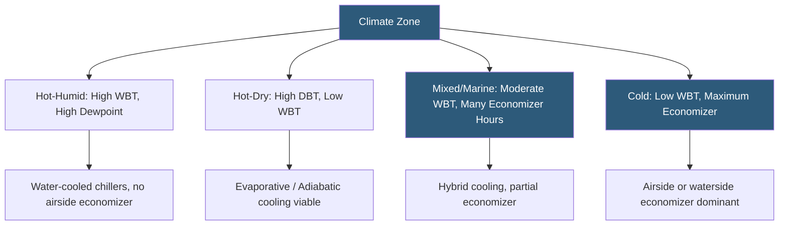

**Category:** Gigawatt Cooling Infrastructure
**Difficulty:** Intermediate
**Reading time:** 6 min read

---

Climate is a foundational determinant of cooling system architecture, capital cost, energy consumption, and water usage at gigawatt-scale datacenters. Selecting and designing a cooling strategy without rigorous climate analysis risks oversized or undersized systems, unexpectedly high operating costs, and regulatory non-compliance on water withdrawal. Climate data from ASHRAE, NOAA, and site-specific weather stations guide every major cooling engineering decision.

- **ASHRAE Climate Zones** — a geographic classification system (1A through 8) defining hot-humid, hot-dry, mixed, and cold climates
- **Cooling Degree Days (CDD)** — an annual sum of degrees above 65°F base temperature; higher CDD means more cooling demand
- **Design Dry Bulb Temperature** — the outdoor temperature exceeded only 0.4% of annual hours; used for worst-case sizing
- **Annual Exceedance Hours** — the number of hours per year that a given temperature or humidity threshold is exceeded
- **Sensible Heat Ratio** — the fraction of total cooling load that is sensible (temperature) vs. latent (humidity)
- **Humidity Control** — managing indoor relative humidity within 40–60% to prevent condensation and static discharge
- **Climate Resilience** — designing for future climate scenarios as temperatures rise due to climate change
- **Weather Data File** — a TMY (Typical Meteorological Year) or actual measured hourly dataset used for energy modeling

Climate analysis begins with obtaining hourly weather data for the candidate site from ASHRAE Fundamentals or NOAA station records, processed into a Typical Meteorological Year (TMY3) file. Engineers use this data to calculate the annual operating hours in each cooling mode, which drives PUE projections and lifecycle cost estimates.

In hot-humid climates (ASHRAE Zone 1A, covering much of the US Southeast, Gulf Coast, and tropical regions), design WBT values of 78–82°F force mechanical cooling for the majority of the year. Airside economizers are not viable because introducing high-dewpoint outdoor air creates condensation risk on cold surfaces. Cooling systems rely entirely on water-cooled chillers with cooling towers, consuming substantial water year-round. Free cooling through waterside economizers is possible for only 500–1,500 hours per year.

Hot-dry climates (Zone 3B, US Southwest) have lower WBT values (65–75°F) despite high dry bulb temperatures, making evaporative and adiabatic cooling highly effective. Cooling towers approach their approach temperature reliably and water consumption is predictable. However, regional water scarcity creates regulatory and ESG concerns about evaporative cooling water use.

Cold and marine climates (US Pacific Northwest, Nordic Europe, Canada) offer WBT values below 55°F for 5,000–7,000 hours annually, enabling waterside or airside economizer operation for most of the year. Facilities in these climates achieve PUE values of 1.10–1.20 vs. 1.35–1.50 in hot-humid regions, representing enormous lifecycle energy and cost savings. Climate resilience analysis using RCP 4.5 and 8.5 climate scenarios ensures the cooling system remains adequate under projected 2050 temperatures.

- Site selection studies comparing climate cost impacts across candidate locations
- Cooling system architecture selection (chiller plant vs. economizer-dominant)
- Water budget analysis for environmental impact assessment
- Energy model inputs for PUE predictions and utility contract negotiations
- Climate resilience studies for long-term facility planning

| Advantage | Disadvantage |
|-----------|--------------|
| Cold climates dramatically reduce cooling energy and capital cost | Cold-climate sites may lack nearby power generation or network infrastructure |
| Hot-dry climates enable effective evaporative cooling at low energy cost | Arid climates face water scarcity and regulatory limits on water use |
| Detailed climate analysis reduces oversizing and wasted capital | Analysis takes time and requires specialized engineering resources |
| Climate resilience planning protects long-term asset value | Future climate scenarios have inherent uncertainty over 20+ year horizons |

- [Wet Bulb Temperature Impact](wet-bulb-temperature-impact.md)
- [Free Cooling Hours Analysis](free-cooling-hours-analysis.md)
- [Water Consumption at GW Scale](water-consumption-at-gw-scale.md)

---
*Part of the [Gigawatt Cooling Infrastructure](index.md) category · [Back to Master Index](../../index.md)*
