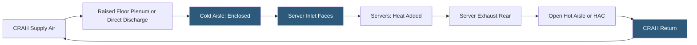

**Category:** Gigawatt Cooling Infrastructure
**Difficulty:** Intermediate
**Reading time:** 6 min read

---

Cold aisle containment (CAC) physically isolates the cold supply air in the aisle between server rack fronts from the hot exhaust air in the room, preventing mixing and allowing higher CRAH setpoints, reduced airflow volumes, and significantly improved cooling efficiency. At gigawatt scale, effective containment reduces cooling energy by 20–40% compared to uncontained data halls, making it one of the highest-return infrastructure investments available.

- **Cold Aisle Containment** — enclosing the cold aisle with overhead panels and end doors to prevent cold air from mixing with room air
- **Hot Aisle Containment** — the alternative approach that encloses the hot aisle, with room air serving as the cold supply
- **Mixing** — the undesirable blending of cold supply and hot exhaust air before the air reaches server inlets; increases inlet temperatures and reduces capacity
- **Return Temperature Index (RTI)** — a metric of containment effectiveness; RTI = (CRAH return temp - supply temp) / (server inlet target - supply temp); target >100% for good containment
- **Blanking Panels** — solid panels filling empty rack U-positions to prevent hot exhaust from recirculating to the front of the rack
- **End-of-row Doors** — hinged or sliding doors at each end of a contained aisle; allow personnel access while minimizing air leakage
- **Overhead Panels** — rigid or flexible panels spanning the ceiling of the cold aisle between rack tops and building ceiling
- **Containment Pressure** — positive air pressure maintained in the cold aisle; minimizes leakage through imperfect panel joints

Without containment, cold supply air mixes with hot exhaust air in the open data hall before reaching server inlets. This mixing forces operators to supply very cold air (55–60°F) at very high flow rates to ensure servers receive adequately cool air after dilution. With containment, servers receive supply air at near the CRAH discharge temperature, allowing CRAH setpoints to be raised by 10–15°F and airflow to be reduced by 20–30%.

Cold aisle containment is implemented with four elements: overhead panels spanning between rack tops and the ceiling (or a suspended panel system), end-of-row doors providing personnel access while minimizing leakage, blanking panels in all empty rack U-positions, and adequate perforated floor tile open area (or direct discharge grilles) to supply required airflow without excessive pressure.

The key design challenge is matching supply air volume to IT demand. Under-supplying a cold aisle creates negative pressure relative to the room, drawing in warm air through gaps and degrading containment. Over-supplying creates excessive pressure, wasting fan energy. Perforated tile placement and percentage open area must be calculated based on each row's IT power load.

Flexible containment systems use vinyl curtain overlays on rack arrays for quick deployment and reconfiguration—preferred by colocation providers where tenant equipment changes frequently. Rigid overhead panels with fixed aluminum framing provide better sealing and more permanent installations for owner-occupied hyperscaler campuses.

Hot aisle containment (HAC) is an alternative where the hot exhaust side is enclosed and room air is used as the cold supply. HAC avoids the overhead panel complexity but requires the CRAH return air path to route through the enclosed hot corridor, making it less compatible with raised-floor systems.

- All medium-to-high density data halls targeting PUE improvement
- Hyperscaler white space deployments standardizing on fully contained row layouts
- Colocation facilities using flexible curtain systems for tenant-specific configurations
- Retrofit projects upgrading legacy open data halls
- Facilities seeking to raise CRAH chilled water setpoints to expand economizer hours

| Advantage | Disadvantage |
|-----------|--------------|
| 20–40% cooling energy reduction from raised setpoints and lower airflow | End-of-row doors and overhead panels add capital and maintenance cost |
| Reduces CRAH capacity requirement, saving equipment capital | Flexibility for tenant reconfiguration is reduced in rigid containment systems |
| Enables chilled water setpoint increase, expanding economizer mode hours | Imperfect panel sealing and cable penetrations create leakage degrading containment |
| Blanking panels improve containment and server inlet temperature uniformity | Hot aisle containment may be preferred for new builds with specific CRAH placement |

- [Hot Aisle Containment at Scale](hot-aisle-containment-at-scale.md)
- [CRAH Unit Deployment Strategy](crah-unit-deployment-strategy.md)
- [In-row Cooling Deployment](in-row-cooling-deployment.md)

---
*Part of the [Gigawatt Cooling Infrastructure](index.md) category · [Back to Master Index](../../index.md)*
