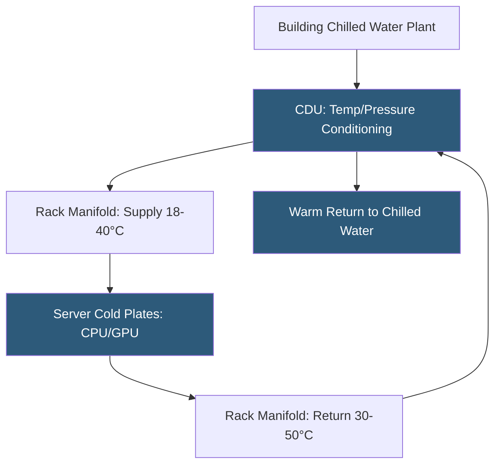

**Category:** Gigawatt Cooling Infrastructure
**Difficulty:** Advanced
**Reading time:** 7 min read

---

Cold plate cooling attaches liquid-cooled metal plates directly to CPUs, GPUs, and other high-power silicon components, conducting heat into circulating coolant rather than blowing air across chips. At gigawatt scale, cold plate deployment across tens of thousands of servers enables rack densities of 50–150+ kW per rack while consuming minimal cooling energy, fundamentally transforming datacenter design from air-centric to liquid-centric infrastructure.

- **Cold Plate** — a metal block (copper or aluminum) with internal microchannels through which coolant flows, bonded to chip surfaces with thermal interface material
- **Thermal Interface Material (TIM)** — a conformable material (phase-change pad, thermal paste, indium foil) filling micro-gaps between cold plate and chip lid
- **Coolant Distribution Unit (CDU)** — a rack-level or row-level unit that conditions coolant temperature, pressure, and flow for server cold plates
- **Supply/Return Manifold** — plumbing headers distributing coolant to and collecting from individual cold plates within a server or rack
- **Quick-disconnect Coupling** — dry-break fittings enabling coolant circuit connection/disconnection without fluid spills; essential for field serviceability
- **Dielectric Coolant** — an electrically non-conducting fluid (water-glycol, propylene glycol, or synthetic fluid) used near electronics
- **Chip Junction Temperature** — the temperature at the semiconductor die; cold plates keep junction temperatures 15–30°C lower than air cooling at high TDP
- **Thermal Design Power (TDP)** — the maximum heat a processor generates under maximum workload; modern AI chips reach 700–1,000W TDP

Cold plate systems consist of three nested levels of fluid distribution: the building chilled water (or higher-temperature facility water) plant, the CDU conditioning loop within each rack or row, and the individual server manifolds delivering coolant to each cold plate. The CDU is the critical interface: it receives facility water, conditions it to the correct temperature and pressure for direct chip contact, and sends it to server manifolds. Some CDUs also include leak detection, flow measurement, and pressure monitoring for each connected server.

Modern AI server architectures (NVIDIA DGX H100, AMD MI300X clusters) incorporate OEM cold plate systems designed by the chip manufacturer. NVIDIA's NVLink Switch systems for H100 clusters include factory-installed cold plates on all GPUs, with fluid manifolds integrated into the server chassis. Field installation requires connecting quick-disconnect hose pairs from the server rear to the rack manifold—a 30-second operation that can be performed on live adjacent servers without service interruption.

The coolant supply temperature for cold plate systems can be significantly higher than traditional chilled water: 18–35°C (64–95°F) supply is adequate for GPU junction temperatures within safe limits, compared to 7–12°C supply required for air cooling coils. This higher temperature dramatically expands free cooling hours—in most climates, 18–25°C water can be produced by cooling towers without mechanical chilling for the majority of the year, enabling near-zero cooling energy.

Scale deployment at gigawatt facilities requires standardized quick-disconnect specifications, leak detection sensor networks along rack rows, and secondary containment drip trays beneath all liquid-cooled racks. Coolant management—monitoring total system fill volume, detecting micro-leaks via flow imbalance, and managing coolant quality over time—becomes an operational discipline requiring dedicated systems and procedures.

- AI training clusters deploying NVIDIA H100/H200, AMD MI300X, or Google TPU v5 hardware
- Hyperscaler campuses targeting rack densities above 50 kW per rack
- HPC (High Performance Computing) facilities with sustained high-TDP CPU workloads
- New facilities designed from the ground up for liquid-dominant cooling infrastructure
- Data halls transitioning from air-cooled to liquid-cooled AI infrastructure over equipment refresh cycles

| Advantage | Disadvantage |
|-----------|--------------|
| Enables 50–150+ kW/rack density impossible with air cooling | Introduces water near electronics; requires leak detection and robust quick-disconnects |
| High coolant supply temperature enables near-year-round free cooling | Custom cold plate designs per server model require vendor-specific parts inventory |
| Eliminates hot aisle/cold aisle problems; simplified data hall layout possible | CDU capital cost and maintenance adds infrastructure overhead per rack |
| Reduced air movement in data hall; lower fan noise and energy | Field technicians require training on liquid-cooled systems; new maintenance discipline |

- [Coolant Distribution Unit (CDU) Arrays](coolant-distribution-unit-cdu-arrays.md)
- [Direct Liquid Cooling Infrastructure](direct-liquid-cooling-infrastructure.md)
- [Two-phase Immersion Cooling Facilities](two-phase-immersion-cooling-facilities.md)

---
*Part of the [Gigawatt Cooling Infrastructure](index.md) category · [Back to Master Index](../../index.md)*
