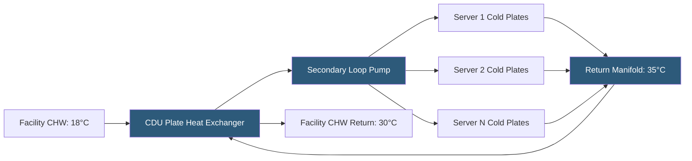

**Category:** Gigawatt Cooling Infrastructure
**Difficulty:** Advanced
**Reading time:** 6 min read

---

Coolant Distribution Units (CDUs) are the critical interface between a facility's chilled water plant and the individual cold plate circuits within servers. They regulate coolant temperature, pressure, and flow to ensure safe, efficient operation of liquid-cooled IT equipment. At gigawatt scale, CDU arrays of hundreds or thousands of units require standardized specifications, centralized monitoring, and robust redundancy to maintain continuity of cooling across a campus.

- **CDU (Coolant Distribution Unit)** — a rack-mounted or row-mounted device that receives facility water and conditions it for direct delivery to server cold plates
- **Plate Heat Exchanger** — the internal heat exchanger in a CDU isolating facility water from server coolant; prevents cross-contamination
- **Secondary Coolant Loop** — the closed-loop circuit between the CDU and server cold plates; separate from the facility chilled water primary loop
- **Temperature Setpoint** — the CDU outlet temperature maintained for server cold plate supply; typically 18–35°C depending on chip TDP and coolant compatibility
- **Differential Pressure Regulator** — maintains constant pressure differential across the secondary loop regardless of server manifold resistance variations
- **Redundant Pumps** — most CDUs include dual pumps (N+1) for secondary loop circulation; one active, one standby
- **Leak Detection** — conductivity sensors in the secondary loop drip tray trigger alarms on any fluid release
- **Remote Monitoring** — SNMP or REST API access enabling BMS integration and real-time telemetry from each CDU

A CDU typically serves 2–8 racks of liquid-cooled servers. The unit's plate heat exchanger thermally couples the facility chilled water to the server secondary loop without physical contact between the fluids—critical because server manufacturers require specific coolant chemistry (often deionized water with corrosion inhibitors) incompatible with the facility's chilled water containing different chemicals and higher mineral content.

Secondary loop pumps in the CDU maintain the required flow rate to all connected server cold plates. Most AI server designs specify a minimum flow rate per GPU cold plate (e.g., 0.5 GPM per H100 GPU). With 8 GPUs per server and 8 servers per CDU, the secondary loop must deliver 32 GPM minimum—requiring pump sizing with adequate head pressure to overcome manifold and cold plate resistance at this flow rate.

Temperature control is achieved by modulating a three-way valve on the facility water side of the plate heat exchanger. When the secondary return temperature rises (IT load increases), the valve opens to increase facility water flow through the exchanger, cooling the secondary loop. At lower loads, the valve throttles to maintain the secondary supply at setpoint without overcooling.

At gigawatt scale with 2,000 CDUs on a campus, centralized management is essential. CDU vendors provide management software aggregating status across all units, with alarm dashboards showing temperature exceedances, pump failures, or leak alerts. Integration with the BMS enables correlation of CDU data with IT power telemetry to calculate rack-level power usage effectiveness in real time.

Standardization across the CDU fleet enables efficient spare parts management: a single spare pump kit serves any unit in the campus. Predictive maintenance programs use CDU telemetry (pump current draw, differential pressure, flow rate) to detect bearing wear or impeller fouling before failure occurs.

- AI training clusters with factory cold-plate-equipped GPU servers
- HPC facilities requiring controlled secondary loop chemistry independent of facility water
- Hyperscaler campuses standardizing on liquid cooling for all future IT deployments
- Colocation environments offering liquid cooling as a premium service with per-CDU metering
- Data halls deploying mixed air and liquid cooling with CDUs serving only the liquid zones

| Advantage | Disadvantage |
|-----------|--------------|
| Hydraulic isolation protects both facility and server equipment from cross-contamination | Capital cost of CDU array is substantial at $5,000–$20,000 per unit |
| Secondary loop pressure and temperature control protects server cold plate specs | Each CDU is a single point of failure for its served racks; requires N+1 redundancy |
| Centralized monitoring enables real-time visibility into liquid cooling performance | CDU maintenance adds to operations workload compared to air-cooled systems |
| Standardized CDUs reduce training and spare parts complexity at scale | Leak in secondary loop can damage IT equipment in adjacent racks |

- [Cold Plate Deployment at Scale](cold-plate-deployment-at-scale.md)
- [Direct Liquid Cooling Infrastructure](direct-liquid-cooling-infrastructure.md)
- [Two-phase Immersion Cooling Facilities](two-phase-immersion-cooling-facilities.md)

---
*Part of the [Gigawatt Cooling Infrastructure](index.md) category · [Back to Master Index](../../index.md)*
