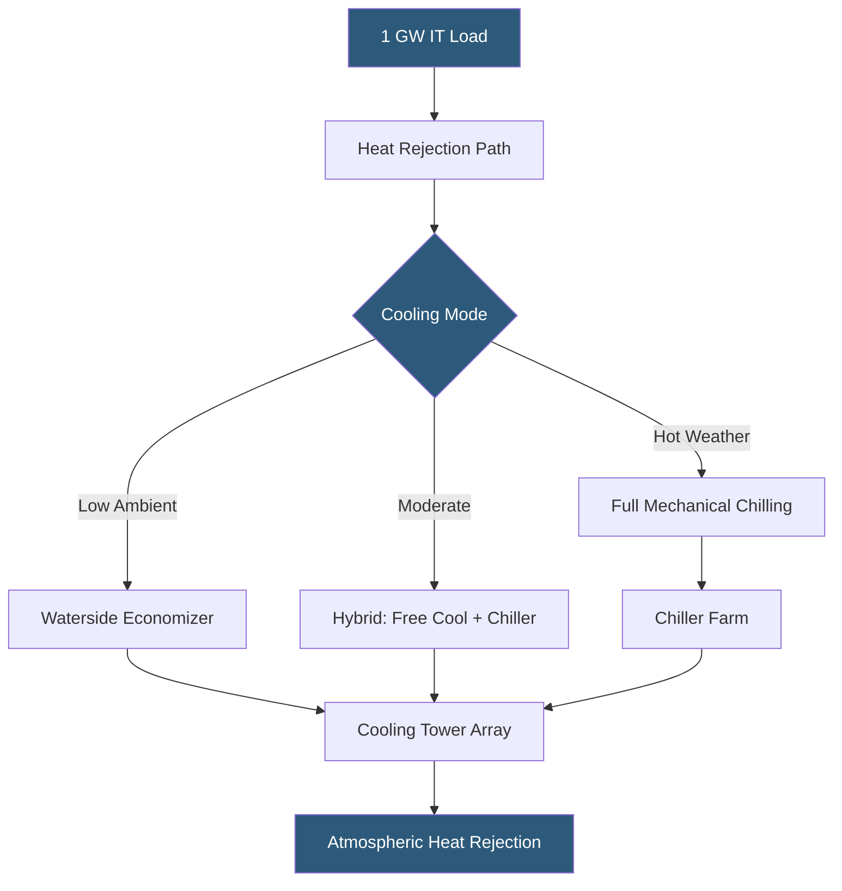

**Category:** Gigawatt Cooling Infrastructure
**Difficulty:** Advanced
**Reading time:** 7 min read

---

Providing sufficient cooling capacity for gigawatt-scale IT loads is one of the defining engineering challenges of hyperscale datacenters. At 1 GW of IT power, cooling systems must reject over 3.4 billion BTUs per hour — equivalent to the output of a medium-sized power plant — requiring a complete rethinking of traditional CRAC-based cooling architectures.

- **Heat Rejection Capacity** — total thermal energy dissipated from the facility; at GW scale, measured in gigawatts thermal (GWth)
- **Tons of Refrigeration (TR)** — traditional cooling capacity unit; 1 TR = 12,000 BTU/hr; 1 GW IT requires ~285,000 TR
- **Cooling Tower Approach Temperature** — difference between leaving water temperature and wet-bulb temperature; lower approach = higher capacity
- **Chilled Water Delta-T** — temperature rise across IT equipment; higher delta-T reduces flow rate and pumping energy
- **Cooling Hierarchy** — layered cooling approach: free cooling → economizer → mechanical cooling, in order of energy efficiency
- **Wet Bulb Temperature** — thermodynamic limit for evaporative cooling; site selection is constrained by annual wet-bulb statistics
- **Cooling Redundancy** — N+1 or 2N capacity built in to survive equipment failures without thermal event
- **Water Consumption Index (WCI)** — liters of water consumed per kWh of IT energy; GW facilities face significant water sourcing challenges

Cooling a gigawatt-scale datacenter requires a fundamentally different infrastructure paradigm than traditional enterprise cooling. The math is stark: 1 GW of IT power at a PUE of 1.3 requires rejecting 1.3 GW of heat. With typical cooling tower capacities of 2,000–5,000 TR each, a 1 GW facility needs 60–150 cooling towers, consuming acres of site area and requiring millions of gallons of water per day.

The architecture response is a tiered cooling hierarchy. During low ambient temperature periods (wet-bulb < 55°F), free waterside economizers pass cooling tower water directly through heat exchangers to cool IT equipment without running chiller compressors, achieving PUEs of 1.05–1.10. As ambient temperatures rise, chillers supplement free cooling in hybrid mode. Only during peak summer heat is full mechanical refrigeration required, which might represent 10–20% of annual operating hours in favorable climates.

Chilled water distribution at GW scale moves enormous water volumes: at 10°F delta-T and 1 GW of cooling, flow rates exceed 10 million gallons per hour. Variable-speed pumping in primary-secondary or variable primary configurations reduces pumping energy by 30–60% compared to constant-flow systems. Distribution piping headers 24–48 inches in diameter run in dedicated utility corridors underground or in pipe bridges.

Liquid cooling — direct cold plates and immersion tanks — is transforming this calculus for high-density AI workloads. By accepting heat at 40–50°C coolant temperature, liquid cooling enables rejection via cooling towers without mechanical refrigeration, even in warm climates. This can reduce cooling energy to near-zero for the fraction of load served by liquid cooling.

- 500 MW campus in Phoenix requiring full chiller plant with supplemental liquid cooling
- 1 GW AI cluster in Finland leveraging free cooling for 95% of annual hours
- Mixed colocation campus with 200 MW air-cooled and 100 MW liquid-cooled zones
- Waterside economizer optimization to maximize free cooling hours per year
- Cooling tower replacement program upgrading from drift-prone towers to high-efficiency units

| Advantage | Disadvantage |
|-----------|--------------|
| Waterside economizers reduce annual cooling energy by 40–70% | Economizer systems require significant water treatment infrastructure |
| Liquid cooling eliminates mechanical refrigeration for high-density loads | Liquid cooling infrastructure cost is 2–3x per kW vs air cooling |
| Climate-optimized site selection reduces cooling costs over facility life | Favorable climate sites may have limited power and water availability |
| Modular chiller deployment allows staged capacity additions | Cooling tower farms require significant site area and visual mitigation |

- [Cooling Tower Arrays](cooling-tower-arrays.md)
- [Waterside Economizers](waterside-economizers.md)
- [Direct Liquid Cooling Infrastructure](direct-liquid-cooling-infrastructure.md)

---
*Part of the [Gigawatt Cooling Infrastructure](index.md) category · [Back to Master Index](../../index.md)*
