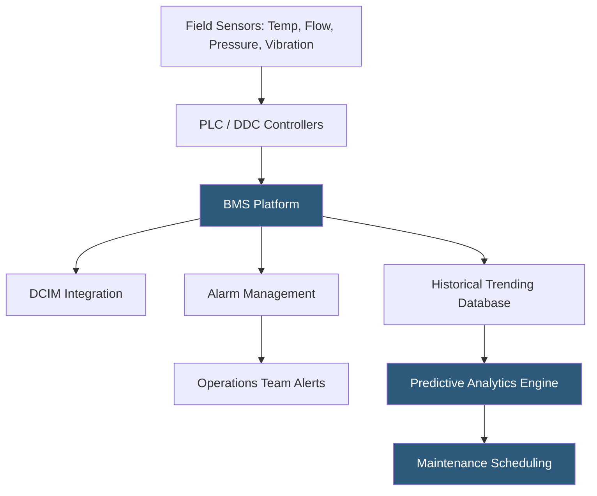

**Category:** Gigawatt Cooling Infrastructure
**Difficulty:** Intermediate
**Reading time:** 6 min read

---

Cooling system monitoring at gigawatt datacenters involves collecting, aggregating, and analyzing thousands of sensor data points from chiller plants, cooling towers, pumps, CRAH units, and liquid cooling circuits to ensure continuous cooling availability and optimize energy consumption. Comprehensive monitoring infrastructure provides the real-time situational awareness required to manage complex multi-MW cooling systems and identify developing faults before they cause equipment failures.

- **BMS (Building Management System)** — the central control and monitoring platform for all mechanical and electrical building systems
- **DCIM (Datacenter Infrastructure Management)** — software correlating IT load data with cooling infrastructure performance for capacity planning
- **Sensor Point** — an individual measurement device (temperature, flow, pressure, humidity, vibration); large facilities have 10,000–100,000 sensor points
- **Alarm Priority** — classification of alarms by severity (critical, major, minor, advisory) determining required response time and escalation path
- **Trending** — recording sensor values over time to identify gradual degradation before failure
- **Remote Monitoring Center** — a facility monitoring the datacenter cooling systems from off-site, providing 24/7 coverage
- **Mean Time To Detect (MTTD)** — the average time between when a fault develops and when it is detected by the monitoring system
- **Predictive Analytics** — using statistical models or AI to identify anomalies in sensor data suggesting developing failures

A gigawatt campus cooling monitoring system begins at the sensor level with thousands of instruments measuring temperature, pressure, flow, vibration, power consumption, and fluid quality throughout the cooling infrastructure. Standard instruments transmit via 4–20 mA, Modbus RTU, or BACnet/IP protocols to distributed controllers (PLCs or DDC panels) located in each mechanical room. These controllers perform local control logic (PID loops, equipment sequencing) while transmitting summary data to the campus BMS.

The BMS platform aggregates all points into a unified operational interface, typically a graphical one-line diagram or schematic view of the chiller plant, cooling towers, and distribution loops. Operations staff view current temperatures, flows, chiller status, and alarm states from a central console or mobile device. Critical alarms—chiller failure, loss of cooling tower fans, pump trip, refrigerant leak—trigger immediate notifications to on-call engineering staff with defined response escalation procedures.

Trend analysis is essential for proactive maintenance. Chiller efficiency trending—plotting kW/ton against load and ambient temperature over time—detects fouling of condenser tubes, refrigerant charge losses, or compressor wear months before a failure occurs. Pump vibration trending, measured by accelerometers on pump housings, identifies bearing degradation that would be invisible to temperature sensors.

DCIM integration correlates IT power draw per rack or zone with the cooling infrastructure supporting that zone. When an IT cluster ramps up load rapidly, the DCIM triggers pre-staging of cooling capacity (opening valve positions, staging cooling tower cells) before IT temperature sensors register heat buildup. This feed-forward approach reduces the thermal transient response time from minutes to seconds.

- 24/7 campus cooling operations requiring real-time situational awareness
- Predictive maintenance programs targeting early fault detection
- PUE optimization projects needing granular cooling efficiency data by zone
- Commissioning and fault isolation during major system changes or expansions
- Remote monitoring center staffing programs for campus groups

| Advantage | Disadvantage |
|-----------|--------------|
| Early fault detection reduces cooling outage risk and emergency repair cost | Dense sensor networks require calibration, maintenance, and sensor replacement programs |
| Trending data supports predictive maintenance and equipment lifecycle planning | BMS platforms are complex; require dedicated BMS engineers and vendor support |
| DCIM integration enables proactive cooling pre-staging for IT load changes | Data volume from 100,000 sensor points requires significant data management infrastructure |
| Remote monitoring enables 24/7 coverage with fewer on-site staff | Alert fatigue from excessive minor alarms reduces effectiveness of critical alarm response |

- [Building Management System (BMS) Integration](building-management-system-bms-integration.md)
- [Predictive Cooling Optimization](predictive-cooling-optimization.md)
- [Cooling System Maintenance Planning](cooling-system-maintenance-planning.md)

---
*Part of the [Gigawatt Cooling Infrastructure](index.md) category · [Back to Master Index](../../index.md)*
