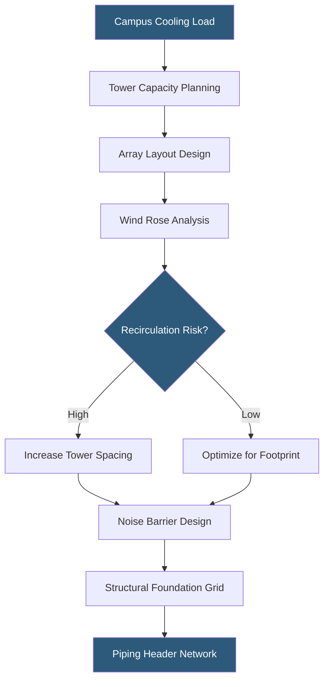

**Category:** Gigawatt Cooling Infrastructure
**Difficulty:** Advanced
**Reading time:** 6 min read

---

Cooling tower arrays at gigawatt-scale facilities represent some of the largest heat rejection installations in the industrial world, with hundreds of individual units arranged in structured fields covering multiple acres. Design of these arrays requires careful attention to thermal performance, water chemistry, structural integration, noise management, and operational accessibility.

- **Induced Draft Tower** — fan at top of tower draws air upward through fill media; dominant type at GW facilities
- **Forced Draft Tower** — fan at base forces air into tower; less common, used where discharge plume must be directed
- **Fill Media** — structured plastic or splash material inside tower that increases water/air contact area for evaporation
- **Basin** — cold water collection sump at tower base; sized for thermal mass and equalization
- **Approach Temperature** — difference between leaving water temperature and ambient wet-bulb temperature; typically 4–7°F
- **Drift Eliminator** — multi-pass mist separator preventing droplet carryover; critical for Legionella risk management
- **Plume** — visible water vapor discharge above tower; can cause icing issues and local visibility concerns
- **Tower Grouping** — arrangement of towers in rows and clusters to optimize airflow and prevent recirculation

A 1 GW facility needs 60–150 cooling towers depending on unit size and ambient conditions, arranged in rows with spacing of 30–50 ft between towers to prevent hot exhaust air recirculation. Recirculation — where a tower's warm exhaust re-enters an adjacent tower's intake — degrades thermal performance and can cause cascade failure in hot weather. Wind rose analysis determines prevailing wind direction, and towers are oriented perpendicular to prevailing winds to maximize natural assist and minimize recirculation.

Tower structural design at this scale involves pre-cast concrete basins, fiberglass or galvanized steel casing, and hot-dip galvanized or stainless steel internal components for longevity in the chemical environment. Basin size is critical: each 1,000 TR tower has a 10,000–20,000 gallon basin that provides thermal mass to absorb load swings and holds water volume for chemical dosing.

Piping headers connect towers to the chiller plant through large-diameter supply and return headers, typically 24–36 inches in diameter for arrays serving 100+ MW of load. Variable-speed fan drives on tower fans allow turndown in cool weather — reducing both water consumption and fan energy — while maintaining adequate airflow across the fill. Modern high-efficiency fills with close-packed structured packing achieve heat transfer coefficients 30–40% higher than older splash fill designs.

Noise is a significant challenge for large arrays: a single induced-draft tower generates 65–75 dB(A) at 30 ft; a field of 100 towers is a major noise source. Sound attenuators on fan inlets and discharge, combined with earth berms and perimeter barriers, can achieve 10–15 dB attenuation at facility boundaries. Community noise complaints have delayed or halted facility approvals in multiple jurisdictions.

- 200 MW chiller plant served by 50 induced-draft cooling towers in 4 rows
- Recirculation analysis for tower array adjacent to prevailing westerly wind exposure
- Seasonal tower staging to minimize water consumption during spring/fall free cooling
- Cooling tower replacement program upgrading legacy splash fill to structured fill
- Tower array with plume abatement system required by local planning conditions

| Advantage | Disadvantage |
|-----------|--------------|
| Evaporative towers achieve lowest leaving water temperature (approach 4–7°F) | Arrays consume millions of gallons of water per day |
| Modular tower additions allow staged capacity expansion | Tower fields require 2–5 acres per 100 MW at spacing needed to prevent recirculation |
| Variable-speed fans reduce energy at part load | Fan noise requires mitigation in community-proximate sites |
| High-efficiency fill improves thermal performance 30–40% vs legacy fill | Fill replacement requires tower shutdown for 1–2 days per unit |

- [Cooling Capacity for Gigawatt Loads](cooling-capacity-for-gigawatt-loads.md)
- [Water Consumption at GW Scale](water-consumption-at-gw-scale.md)
- [Waterside Economizers](waterside-economizers.md)

---
*Part of the [Gigawatt Cooling Infrastructure](index.md) category · [Back to Master Index](../../index.md)*
