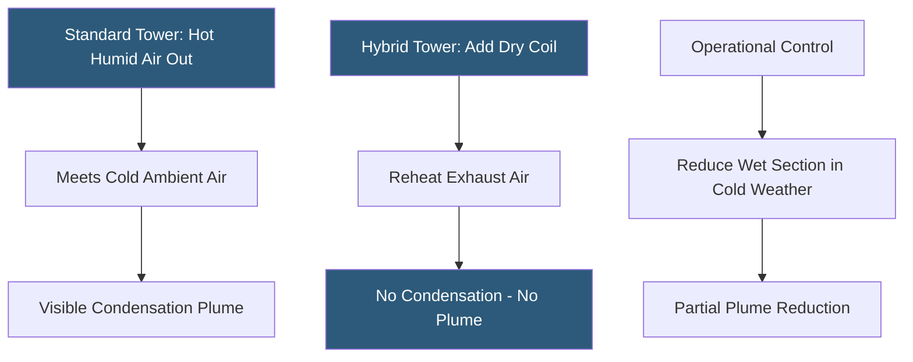

**Category:** Gigawatt Cooling Infrastructure
**Difficulty:** Intermediate
**Reading time:** 6 min read

---

Cooling towers emit a visible water vapor plume when humid exhaust air meets cooler ambient conditions, creating fog, ice on adjacent roads, and aesthetic concerns for nearby communities. At gigawatt scale, 100–200 cooling tower cells produce enormous continuous plumes visible for miles and imposing safety hazards in cold climates. Plume abatement technologies—heated coils, hybrid towers, and optimized operating strategies—reduce or eliminate visible plumes while maintaining cooling capacity.

- **Plume** — the visible condensation trail of water vapor from cooling tower exhaust air when it meets cooler ambient air
- **Hybrid Cooling Tower** — a tower with an integrated dry coil section that reheats exhaust air before it mixes with ambient, eliminating condensation
- **Plume Abatement** — the reduction or elimination of visible plume through equipment modifications or operational controls
- **Plume Dispersion Modeling** — computational analysis predicting the height, extent, and ground-level effects of a tower plume under various wind and temperature conditions
- **Drift** — tiny liquid water droplets carried by tower fan airflow into the atmosphere; different from plume and regulated separately
- **Drift Eliminators** — wave-shaped plastic baffles in the tower fan discharge capturing drift droplets and returning them to the basin
- **Thermal Inversion** — a meteorological condition where warm air traps cool air near the ground; can keep tower plumes low and affecting ground-level visibility
- **Freeze Projection Zone** — the area downwind of a tower where plume droplets may freeze on cold surfaces; requires site analysis for road safety

Cooling tower plumes form when saturated exhaust air at 80–95°F meets ambient air below the mixture's dew point. In cold weather (ambient below 40°F), this condensation is immediate and the plume extends horizontally for hundreds of feet before evaporating. Plume droplets can freeze on road surfaces, power lines, and building facades within the freeze projection zone.

Hybrid (plume abatement) cooling towers incorporate a dry coil section—a finned heat exchanger carrying hot condenser water—upstream of the evaporative section. Fan-driven ambient air passes over the dry coil, heating it by 10–20°F before mixing with saturated tower exhaust. This preheated dry air mixture prevents condensation, eliminating the visible plume. The dry coil section reduces the tower's overall cooling efficiency by 8–15% compared to a standard tower, and adds 20–30% to the capital cost of the tower.

At gigawatt scale, plume abatement towers may be required by environmental permits or local ordinances. Community opposition to visible plumes—particularly from airports where fog near runways is a safety concern, or from residential communities near large industrial facilities—has forced operators to retrofit abatement systems after initial permitting. Proactively specifying hybrid towers in the design phase is less expensive than retrofitting.

Plume dispersion modeling is performed during the environmental permitting phase using Gaussian dispersion models or CFD. The model predicts plume trajectory under design meteorological conditions including minimum wind speed and temperature inversions. Results demonstrate that the plume rises above 50 meters (FAA height clearance), does not reach populated areas at condensation-producing concentrations, and does not create icing conditions on public roads.

- Sites near airports or helicopter landing facilities requiring FAA airspace clearance
- Urban or suburban sites where visible plumes would generate community opposition
- Cold climate facilities where plume icing on roads or structures is a safety concern
- Environmental permit applications requiring plume impact analysis
- New builds near residential areas where plume aesthetics are a permitting concern

| Advantage | Disadvantage |
|-----------|--------------|
| Eliminates visible plumes and associated community and regulatory concerns | Hybrid towers cost 20–30% more than standard evaporative towers |
| Reduces icing risk on adjacent roads and structures | Dry coil section reduces overall cooling tower efficiency |
| Proactive compliance avoids costly retrofit later in facility life | Dry coil section consumes additional condenser water circuit connections |
| Modern drift eliminators separately address chemical drift concerns | Partial abatement operational strategies provide limited effectiveness in cold weather |

- [Cooling Tower Arrays](cooling-tower-arrays.md)
- [Noise Mitigation for Cooling Systems](noise-mitigation-for-cooling-systems.md)
- [Heat Rejection at Gigawatt Scale](heat-rejection-at-gigawatt-scale.md)

---
*Part of the [Gigawatt Cooling Infrastructure](index.md) category · [Back to Master Index](../../index.md)*
