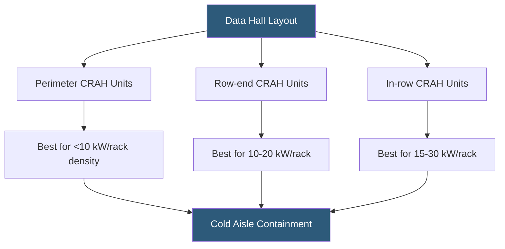

**Category:** Gigawatt Cooling Infrastructure
**Difficulty:** Intermediate
**Reading time:** 6 min read

---

Computer Room Air Handlers (CRAHs) are the room-level air conditioning units that deliver cooled air to server rows in traditional data halls. At gigawatt scale, deploying hundreds of CRAH units across multi-million-square-foot facilities requires careful strategic decisions about unit sizing, placement, redundancy, and integration with containment systems to achieve energy efficiency and operational reliability.

- **CRAH (Computer Room Air Handler)** — a water-cooled air handling unit circulating chilled air through a data hall; uses chilled water coils, fans, and controls
- **CRAC (Computer Room Air Conditioner)** — a self-contained air conditioner with DX refrigerant; less common in large facilities
- **Down-flow CRAH** — delivers cold air downward through a raised floor plenum; traditional approach
- **Up-flow CRAH** — delivers cold air upward from floor-level discharge directly into cold aisles; used on slab-on-grade floors
- **Perimeter Placement** — CRAHs positioned along building walls; effective for lower density but poor for high-density central areas
- **In-row Cooling** — CRAHs installed within the server rack rows themselves, providing short air paths and efficient cooling
- **Hot Aisle/Cold Aisle Containment** — physical barriers channeling hot exhaust air back to CRAH return and cold supply air to server inlets
- **Sensible Heat Ratio (SHR)** — the fraction of CRAH cooling capacity that addresses temperature (vs humidity); datacenters typically need SHR > 0.95

CRAH deployment strategy begins with the design IT power density. At densities below 8–10 kW/rack, perimeter-placed CRAHs with raised floor distribution can effectively cool server rows up to 40–50 feet from the unit. Cold air supplied through perforated floor tiles flows to server inlets in cold aisles; hot exhaust returns to the room overhead and back to CRAH return grilles.

As rack density increases above 10–15 kW/rack, the air path from perimeter CRAHs to central rack rows becomes too long, resulting in hot spots from air mixing before reaching server inlets. Row-end CRAHs—units placed perpendicular to server rows at each end—reduce air travel distance to a maximum of 10–15 feet. This configuration supports 15–25 kW/rack with good containment.

For AI training deployments at 30–50 kW/rack, in-row cooling units installed directly within the rack rows in dedicated 1U positions provide the shortest possible air path. Each in-row unit serves 5–7 adjacent racks. Chilled water connections from the building loop feed the units through flexible hoses connected to overhead or underfloor branch circuits.

At gigawatt scale, the number of CRAH units can reach 500–2,000 units per campus. Standardizing on a single CRAH model from a single vendor reduces spare parts inventory, simplifies maintenance training, and enables negotiated pricing leverage. Most hyperscalers establish master service agreements with their CRAH vendors covering preventive maintenance scheduling and emergency response times.

CRAH fan energy is a significant component of campus power overhead. High-efficiency fan assemblies (ECM motors, backward-curved impellers) reduce fan power by 30–40% compared to older designs. Reducing fan speed from 100% to 80% under partial load conditions cuts fan power in half, making variable-speed fan control a high-priority optimization on any large deployment.

- Standard-density data halls at 5–15 kW/rack using raised floor air distribution
- Mixed-density facilities requiring different CRAH types in different zones
- Legacy facility retrofits adding in-row cooling to handle density increases
- Containment system design requiring CRAH placement aligned with row orientation
- Energy optimization projects targeting fan speed reduction at partial IT load

| Advantage | Disadvantage |
|-----------|--------------|
| Well-understood technology with extensive industry experience | Air-based CRAH cooling limited to approximately 30–40 kW/rack maximum practical density |
| Large variety of unit types available for different density ranges | High-density aisles with many CRAHs create complex airflow management challenges |
| Standardization enables cost reduction and simplified maintenance | CRAH cooling efficiency (PUE contribution) is higher than liquid cooling alternatives |
| ECM fans and variable speed control deliver significant energy savings | CRAH units occupy valuable floor or row space that could otherwise hold IT equipment |

- [Hot Aisle Containment at Scale](hot-aisle-containment-at-scale.md)
- [Cold Aisle Containment Strategies](cold-aisle-containment-strategies.md)
- [In-row Cooling Deployment](in-row-cooling-deployment.md)

---
*Part of the [Gigawatt Cooling Infrastructure](index.md) category · [Back to Master Index](../../index.md)*
