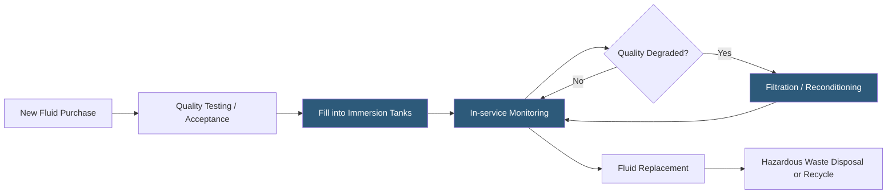

**Category:** Gigawatt Cooling Infrastructure
**Difficulty:** Advanced
**Reading time:** 6 min read

---

Dielectric fluids are electrically non-conducting liquids used in immersion cooling systems to submerge IT equipment directly in cooling fluid, enabling heat transfer rates far exceeding air or water-based methods. At gigawatt scale, managing thousands of gallons of dielectric fluid—tracking inventory, maintaining fluid quality, handling spills, disposing of degraded fluid, and managing regulatory compliance—represents a specialized operational discipline distinct from conventional datacenter cooling.

- **Dielectric Fluid** — an electrically insulating liquid with low viscosity and high thermal capacity; does not conduct electricity even in direct contact with live electronics
- **Single-phase Immersion** — submerging servers in dielectric fluid that remains liquid; heat removed by pumping fluid through an external heat exchanger
- **Two-phase Immersion** — using a fluid that boils at the chip surface, vaporizing and condensing on a coil above the fluid; very high heat transfer coefficient
- **Fluorocarbon Fluid** — a class of synthetic dielectric fluids (3M Novec, Solvay Galden); high performance but high GWP environmental concern
- **Mineral Oil** — a lower-cost dielectric alternative; safe, widely available, but requires significant cleanup effort from servers before maintenance
- **GWP (Global Warming Potential)** — a measure of a fluid's contribution to climate change if released; some fluorocarbons have very high GWP
- **Fluid Quality Testing** — periodic sampling and analysis for dissolved metals, particulates, moisture, and dielectric strength
- **Fluid Containment** — secondary containment systems (liners, berms, drip trays) capturing fluid in the event of tank or plumbing leaks

Dielectric fluid management starts with procurement specification and acceptance testing. Fluid must meet electrical isolation requirements (dielectric strength >30 kV), thermal properties (specific heat, viscosity, boiling point for two-phase), and environmental compliance standards. Fluorocarbon fluids used in two-phase systems—such as 3M Novec 649 and Solvay Galden HT55—have very high performance but GWP of 300–2,100, making releases environmentally significant.

In service, fluid quality degrades through exposure to electronic components, thermal cycling, and oxidation. Dissolved copper and tin from PCB traces accumulate in the fluid. Water ingress from humid air increases dielectric constant. Particulates from flux residues and corrosion products circulate through the system. Periodic sampling (every 6–12 months) measures these parameters and determines whether filtration or replacement is needed.

Filtration systems using particulate filters (down to 0.5 micron) and activated carbon beds can extend fluid service life significantly. Ion exchange resins remove dissolved metal ions. For mineral oil systems, standard industrial oil purification equipment can reconditioning oil to near-new dielectric strength. Fluorocarbon fluids are more difficult to recondition and often require return to the manufacturer for reprocessing.

Spill response protocols must be established before any fluid enters the building. Fluorocarbon fluids vaporize at room temperature, creating an inert gas cloud that can displace oxygen—a confined space hazard. MSDS sheets must be reviewed, appropriate respiratory protection staged, and ventilation requirements incorporated into the building design around immersion tank areas.

End-of-life fluid management requires manifests, licensed haulers, and disposal or recycling documentation. Some vendors (3M, Solvay) offer take-back programs for fluorocarbon fluids. Mineral oil follows industrial waste oil protocols.

- Two-phase immersion cooling deployments using fluorocarbon working fluids
- Single-phase immersion systems using mineral oil or synthetic dielectric
- Quality monitoring programs for large fleet of immersion tanks
- Spill response planning for facilities with significant dielectric fluid inventory
- Environmental compliance programs tracking GWP emissions from fluid losses

| Advantage | Disadvantage |
|-----------|--------------|
| Dielectric immersion enables highest rack densities (100–400 kW/rack) | Fluorocarbon fluids have high GWP; fluid losses are environmental incidents |
| Fluid quality monitoring extends service life and protects equipment | Fluid inventory, quality control, and disposal adds operational complexity |
| Secondary containment prevents environmental release in normal operations | IT equipment maintenance requires cleaning servers before and after immersion |
| Mineral oil is low-cost and environmentally benign | Mineral oil is viscous and difficult to remove from equipment for maintenance |

- [Two-phase Immersion Cooling Facilities](two-phase-immersion-cooling-facilities.md)
- [Direct Liquid Cooling Infrastructure](direct-liquid-cooling-infrastructure.md)
- [Wastewater Management](wastewater-management.md)

---
*Part of the [Gigawatt Cooling Infrastructure](index.md) category · [Back to Master Index](../../index.md)*
