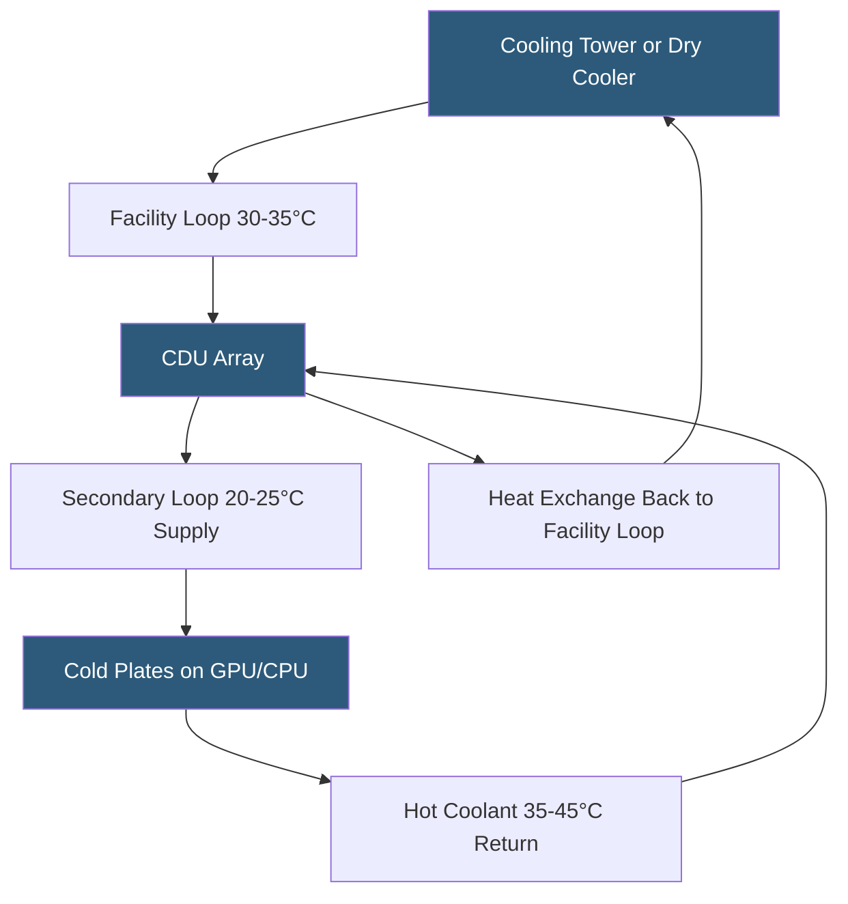

**Category:** Gigawatt Cooling Infrastructure
**Difficulty:** Advanced
**Reading time:** 7 min read

---

Direct liquid cooling (DLC) — delivering coolant directly to server processors rather than cooling the room air — is rapidly becoming the dominant approach for high-density AI accelerator workloads at gigawatt scale. It eliminates the thermodynamic inefficiency of air as a heat transfer medium and enables heat rejection at temperatures that can leverage free cooling year-round.

- **Cold Plate** — metal block with internal fluid channels attached directly to processor or memory surface
- **Coolant Distribution Unit (CDU)** — rack-level or row-level system conditioning and circulating liquid coolant to equipment
- **Facility Water Loop** — campus chilled or cooling tower water supply interfacing with CDU secondary loop via heat exchanger
- **Two-Phase Immersion Cooling** — servers submerged in dielectric fluid that boils at chip temperatures, carrying heat to condenser
- **Single-Phase Immersion** — servers submerged in non-boiling dielectric fluid pumped through external heat exchanger
- **Rear-Door Heat Exchanger (RDHx)** — water-cooled door replacing standard rack door, capturing hot exhaust air
- **Manifold Distribution** — piped supply/return network delivering coolant to row or rack level from building infrastructure
- **Coolant Temperature** — typical CDU supply 20–25°C; heat can be rejected via cooling tower without chillers above ~30°C WB

DLC systems create a closed secondary loop of deionized water or glycol/water mixture that circulates through cold plate assemblies bolted directly onto processors and memory modules. Heat transfers from chip junction to cold plate at thermal resistance values 5–20x lower than air cooling, enabling chip thermal design powers (TDPs) of 500–1,000W per chip that are simply not feasible with air.

CDUs serve as the thermal interface between the facility cooling plant and the rack-level secondary loop. Each CDU contains a pump, heat exchanger, expansion tank, and monitoring electronics. CDUs are typically sized for 50–200 kW of cooling per unit and can be mounted in dedicated rack positions, in row-end enclosures, or in overhead utility corridors. At gigawatt scale, a facility with 5,000 CDUs requires significant infrastructure for power, network management, and preventive maintenance scheduling.

The facility-side loop connecting CDUs to central cooling plant runs at 28–35°C supply temperature, warm enough to be cooled by cooling towers without running chillers in most climates. A 100 kW rack with DLC can reject heat entirely without mechanical refrigeration for 5,000–7,000 hours per year in US East Coast climates, versus only 2,000–3,000 hours for a chilled-water air cooling system serving equivalent load.

Fluid management is critical: the secondary loop must maintain deionized water resistivity above 1 MΩ·cm to prevent galvanic corrosion of copper and aluminum wetted surfaces. Automated makeup water systems with mixed-bed resin deionizers continuously maintain water quality. Microbial growth is controlled through UV sterilization or low-concentration biocides compatible with wetted materials.

- 500 MW AI training campus where 80% of load is liquid-cooled GPU racks
- Hyperscaler transitioning from 20 kW air-cooled to 100 kW liquid-cooled rack standard
- CDU manifold design for 200-rack liquid-cooled AI cluster pod
- Immersion cooling facility for cryptocurrency mining with high-temperature heat reuse
- DLC retrofit of existing air-cooled data hall for GPU-accelerated workloads

| Advantage | Disadvantage |
|-----------|--------------|
| Enables 10–100x higher rack densities than air cooling | DLC infrastructure adds $200–500/kW vs air cooling systems |
| Free cooling achievable year-round in most climates | Coolant leaks near live IT equipment require rigorous leak detection |
| Eliminates CRAH units, reducing fan energy in data halls | Fluid quality management requires ongoing monitoring and maintenance |
| Lower supply temperatures reduce chip TJ, potentially extending hardware life | Not all server components are designed for liquid cooling attachment |

- [Cooling Capacity for Gigawatt Loads](cooling-capacity-for-gigawatt-loads.md)
- [Two-phase Immersion Cooling Facilities](two-phase-immersion-cooling-facilities.md)
- [Coolant Distribution Unit (CDU) Arrays](coolant-distribution-unit-cdu-arrays.md)

---
*Part of the [Gigawatt Cooling Infrastructure](index.md) category · [Back to Master Index](../../index.md)*
