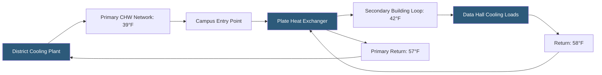

**Category:** Gigawatt Cooling Infrastructure
**Difficulty:** Advanced
**Reading time:** 6 min read

---

District cooling systems distribute chilled water from a centralized plant to multiple buildings or customers through insulated underground pipe networks, eliminating the need for each building to operate its own chiller plant. For gigawatt datacenters in dense urban areas or industrial parks, connecting to an existing district cooling network can reduce capital cost and operational complexity, though it introduces dependency on a third-party service provider and constrains cooling temperatures and flow rates.

- **District Cooling Plant** — a centralized chiller plant serving multiple buildings via a chilled water distribution network
- **Primary Loop** — the chilled water circuit within the district cooling network; typically operated at 39–44°F supply and 59°F return
- **Secondary Loop** — the building-internal chilled water circuit decoupled from the primary loop through a plate heat exchanger
- **Plate-and-Frame Heat Exchanger** — a compact, high-efficiency heat exchanger that thermally couples primary and secondary circuits without mixing
- **Thermal Approach** — the temperature difference between primary supply and secondary supply; typically 2–4°F
- **Load Profile** — the hourly variation in cooling demand; important for sizing the district connection and pricing
- **Service Level Agreement (SLA)** — a contract specifying guaranteed chilled water temperature, pressure, and flow rate from the district operator
- **Backup Cooling** — on-site mechanical cooling capacity maintained for periods when district supply is unavailable

District cooling networks are common in Middle Eastern cities (Abu Dhabi, Dubai, Singapore), European urban centers, and US downtown areas. For a gigawatt datacenter locating in an established business district or government technology zone, district cooling can eliminate the capital cost of chiller plants (typically $5–15 million per 100 MW), cooling towers, and associated water treatment systems. The district operator handles the plant, water treatment, and grid reliability; the datacenter simply pays for thermal energy consumed.

The technical interface between the district network and the datacenter is a plate-and-frame heat exchanger that isolates the datacenter's secondary chilled water loop from the district primary loop. This isolation protects both parties: the datacenter maintains control over its own water chemistry and equipment, while the district network is protected from contamination or pressure transients originating in the facility.

However, district cooling introduces significant constraints. Primary supply temperatures of 39–44°F imposed by the district operator determine the achievable secondary supply temperature (always higher due to approach temperature losses). If the datacenter requires 44°F chilled water but the district supplies at 42°F after approach loss, supplemental chilling may be required for high-density zones. The datacenter has no control over district plant reliability—an outage at the central plant affects all customers. Most datacenter designers therefore specify on-site backup chiller capacity sufficient to sustain operations for 2–4 hours while the district plant is restored.

Commercial arrangements vary considerably. Some district operators offer capacity-based contracts where the datacenter pays for reserved peak capacity regardless of actual use; others use energy-based pricing proportional to thermal energy consumed. Negotiating favorable pricing requires detailed analysis of the facility's load profile, diversity factor, and peak demand hours.

- Urban datacenter projects in cities with established district cooling networks
- Middle East hyperscaler campuses where district cooling infrastructure is built as part of national programs
- Facilities where land area constraints prevent on-site cooling tower and chiller installations
- Tenants in colocation campuses where the campus operator provides centralized cooling as a utility
- Facilities seeking to reduce on-site mechanical complexity and associated O&M staff

| Advantage | Disadvantage |
|-----------|--------------|
| Eliminates on-site chiller plant capital cost and maintenance burden | Dependency on third-party operator introduces single-point-of-failure risk |
| Reduces on-site water treatment, Legionella management, and chemical handling | District supply temperature may be insufficient for high-density liquid cooling applications |
| Simplifies building systems, potentially reducing operations staff | District cooling pricing may be higher than self-generated cooling over lifecycle |
| District operator achieves economies of scale, reducing total system cost | Long-term contract lock-in limits flexibility to change cooling strategy |

- [Water-cooled Chiller Installations](water-cooled-chiller-installations.md)
- [Seawater Cooling Systems](seawater-cooling-systems.md)
- [Cooling Redundancy Architectures](cooling-redundancy-architectures.md)

---
*Part of the [Gigawatt Cooling Infrastructure](index.md) category · [Back to Master Index](../../index.md)*
