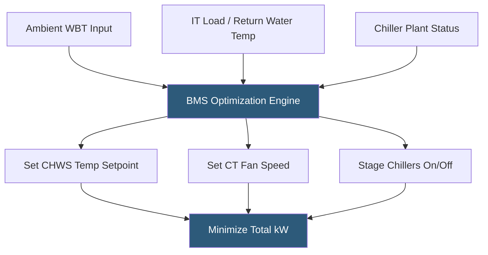

**Category:** Gigawatt Cooling Infrastructure
**Difficulty:** Advanced
**Reading time:** 7 min read

---

Economizer mode optimization involves configuring the cooling plant control system to maximize free cooling utilization and minimize total plant energy across all ambient conditions. At gigawatt scale, optimizing economizer transition setpoints, cooling tower fan staging, and chiller sequencing during transitional conditions can reduce annual cooling energy by 5–15% beyond basic economizer operation, representing millions of dollars in annual savings.

- **Optimum Reset** — dynamically adjusting setpoints (chilled water temperature, cooling tower leaving water temperature) based on current ambient conditions and load
- **Chilled Water Temperature Reset** — raising the chilled water supply temperature setpoint during low-load or low-ambient conditions, reducing chiller lift
- **Cooling Tower Fan Staging** — the sequence in which cooling tower cells and fan speeds are activated to minimize combined chiller + tower fan power
- **Total Plant Power** — the sum of chiller, cooling tower fan, and pump power; the true measure of cooling plant efficiency
- **Full Free Cooling Mode** — no chiller compressors running; cooling towers provide all heat rejection
- **Assisted Free Cooling (Partial Economizer)** — chillers running at reduced load with cooling towers providing partial heat rejection
- **BMS Optimization Algorithm** — software logic in the Building Management System that continuously adjusts setpoints and staging to minimize total power
- **Model Predictive Control (MPC)** — an advanced control approach using weather forecasts and load predictions to optimize the plant hours in advance

Basic economizer operation uses fixed setpoints: the cooling tower targets a fixed leaving water temperature (e.g., 70°F), and the chiller operates when the waterside economizer cannot maintain chilled water supply temperature. Optimized operation continuously adjusts these setpoints in response to actual conditions.

Chilled water temperature reset is the highest-impact single optimization. IT equipment cooling coils are designed for supply water at 44°F at full load, but at 30–50% IT load, supply temperatures of 50–55°F are sufficient. Raising the CHWS setpoint by 10°F reduces chiller compressor lift by approximately 10%, improving COP by 15–20%. The BMS continuously calculates the highest supply temperature the IT load can accommodate and commands the chiller plant accordingly.

Cooling tower fan optimization balances tower fan energy against chiller energy. Operating towers at full fan speed reduces CWST, which reduces chiller power but increases tower fan power. The optimum tower fan speed minimizes the sum of chiller + fan power, which varies with ambient conditions and load. At low ambient, aggressive tower fan operation may be uneconomic because the chiller is already operating near minimum lift. At high ambient, maximum tower fan speed is always beneficial.

During transitional periods when ambient WBT is near the free cooling switchover threshold, chiller staging logic determines whether running one chiller at light load is more efficient than running no chillers with the waterside economizer at maximum capacity. The BMS optimizer evaluates the total power of each configuration in real time.

Advanced implementations use Model Predictive Control (MPC), which ingests hourly weather forecast data to anticipate morning ramp-up loads, pre-cools chilled water storage, and pre-positions equipment to minimize demand charge peaks. Google's DeepMind AI optimization of datacenter cooling systems reported 40% reduction in cooling energy using similar predictive approaches.

- Post-commissioning optimization of existing cooling plants
- BMS upgrade projects targeting PUE improvement without capital equipment changes
- Facilities with chilled water storage where pre-cooling during low-rate periods is economic
- AI and ML-based cooling control deployments at hyperscaler campuses
- Demand charge reduction programs using predictive cooling pre-cooling

| Advantage | Disadvantage |
|-----------|--------------|
| Software-only optimizations provide ROI within months | Advanced optimization requires sophisticated BMS and skilled operations staff |
| CHWS reset can reduce chiller energy 15–20% at part load | CHWS reset requires careful validation that all cooling coils can meet loads at elevated temperature |
| MPC anticipates conditions before they occur, reducing response lag | Weather forecast errors propagate into control decisions |
| Total plant power optimization captures interactions between chillers and towers | Complex control logic increases risk of operational errors during maintenance |

- [Free Cooling Hours Analysis](free-cooling-hours-analysis.md)
- [Waterside Economizers](waterside-economizers.md)
- [PUE Optimization Strategies](pue-optimization-strategies.md)

---
*Part of the [Gigawatt Cooling Infrastructure](index.md) category · [Back to Master Index](../../index.md)*
