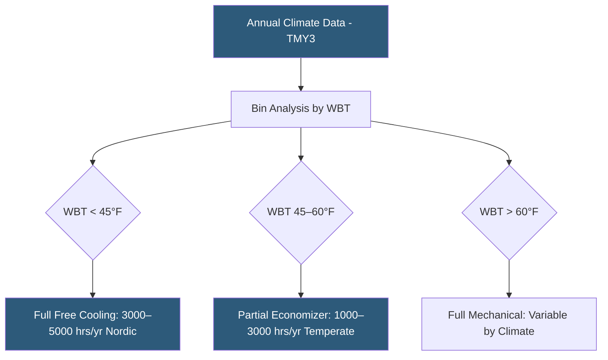

**Category:** Gigawatt Cooling Infrastructure
**Difficulty:** Intermediate
**Reading time:** 6 min read

---

Free cooling hours analysis quantifies the number of annual hours during which outdoor conditions allow a datacenter to reduce or eliminate compressor-based refrigeration, using ambient air or water temperature directly for heat rejection. This analysis is foundational to cooling system design, energy modeling, and site selection, as annual free cooling hours directly determine PUE, energy cost, and carbon emissions over the facility's operating life.

- **Free Cooling** — operation where chiller compressors are fully off; cooling towers or direct air provide all heat rejection
- **Economizer Hours** — annual hours when ambient WBT (waterside) or DBT (airside) is below the facility's economizer transition threshold
- **Transitional Mode** — partial economizer operation with reduced chiller load; typically 500–1,500 annual hours depending on climate
- **Switchover Setpoint** — the ambient WBT at which the BMS transitions from full free cooling to mechanical cooling
- **Annual Energy Savings** — the kWh reduction from free cooling vs. mechanical cooling, calculated over all economizer hours
- **Bin Analysis** — a calculation method using hourly weather data sorted into temperature bins to sum energy for each operating mode
- **TMY3 Data** — Typical Meteorological Year version 3; NREL's hourly dataset of representative annual weather conditions by location
- **Threshold Temperature** — the CWST below which the waterside economizer heat exchanger can maintain required chilled water temperature

Free cooling hours analysis begins with hourly weather data for the proposed site, typically sourced from the nearest NOAA weather station and formatted as a TMY3 or IWEC file. Engineers use bin analysis to group the 8,760 annual hours into temperature intervals (e.g., every 5°F) and calculate the cooling plant operating mode for each bin.

For a waterside economizer system with a 44°F chilled water supply requirement, the waterside economizer can operate fully when cooling tower CWST reaches approximately 42–43°F—requiring ambient WBT of roughly 35–37°F (accounting for cooling tower approach temperature). Full free cooling hours are those when WBT is below 35°F. In Portland, Oregon (temperate marine), this occurs for approximately 3,500 hours per year (40% of hours). In Phoenix (hot desert), only 800–1,000 hours qualify for full free cooling.

When free cooling operates, chiller power drops from 0.15–0.20 kW/ton (mechanical) to 0.02–0.04 kW/ton (pumps and fans only). For a 100 MW campus with 40 MW cooling load, the difference is 6–8 MW of saved chiller power. Over 3,500 annual free cooling hours, this represents 21,000–28,000 MWh of avoided energy—worth $1.5–2.5 million annually at $70–90/MWh.

Higher chilled water supply temperatures (55°F for liquid cooling systems vs. 44°F for air-cooled systems) dramatically expand free cooling hours. At 55°F CHWS, the WBT threshold for full free cooling rises to approximately 48–50°F, adding 1,000–2,500 hours of free cooling in temperate climates. This is one of the most powerful arguments for deploying liquid cooling at high densities: the higher coolant temperature enables extended free cooling, reducing both chiller capital cost and annual energy.

- Site selection comparison of candidate locations by free cooling hours potential
- Annual energy model inputs for utility rate negotiations and PPA sizing
- Cooling system design: whether economizer justifies capital investment
- LEED energy credit calculations requiring climate-based energy modeling
- Carbon emissions calculations for sustainability reporting

| Advantage | Disadvantage |
|-----------|--------------|
| Quantifies real energy and cost savings from economizer investment | Analysis accuracy depends on weather station quality and proximity to actual site |
| Enables data-driven site selection maximizing cooling efficiency | Future climate change will reduce free cooling hours in most locations |
| Higher CHWS temperatures dramatically increase free cooling hours | TMY3 data represents typical years; extreme hot years reduce realized savings |
| Simple bin analysis can be done in a spreadsheet | Full dynamic simulation requires specialized tools and expertise |

- [Wet Bulb Temperature Impact](wet-bulb-temperature-impact.md)
- [Waterside Economizers](waterside-economizers.md)
- [Economizer Mode Optimization](economizer-mode-optimization.md)

---
*Part of the [Gigawatt Cooling Infrastructure](index.md) category · [Back to Master Index](../../index.md)*
