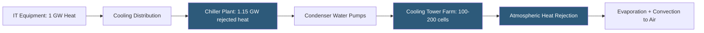

**Category:** Gigawatt Cooling Infrastructure
**Difficulty:** Advanced
**Reading time:** 7 min read

---

Heat rejection is the final step in the datacenter cooling chain: transferring waste heat from IT equipment to the outdoor environment. At gigawatt scale, rejecting 500 MW to 2 GW of thermal energy to the environment is an engineering challenge of extraordinary magnitude, requiring large cooling tower farms, alternative heat sinks, or innovative heat reuse strategies. The heat rejection system determines ultimate facility energy efficiency, water consumption, and environmental footprint.

- **Heat Rejection** — the process of transferring waste heat from the cooling system to the outdoor environment as the final step in the cooling chain
- **Cooling Tower** — an evaporative heat rejection device transferring heat to ambient air through water evaporation; most efficient method in most climates
- **Dry Cooler** — an air-cooled heat rejection device with no water evaporation; lower efficiency than cooling towers but zero water consumption
- **Plate Heat Exchanger (Free Cooling)** — a heat exchanger transferring heat from chilled water to cooling tower water without compressors
- **Condenser Water System** — the closed loop between cooling towers and chiller condensers carrying rejected heat from chillers to towers
- **Heat Rejection Capacity (tons)** — the rate at which the system can reject heat; must exceed IT load + chiller power input
- **Approach Temperature** — the temperature difference between cooling tower leaving water and ambient WBT; lower approach = larger, more expensive tower
- **Heat Island Effect** — the localized warming of ambient air above a large cooling tower installation; can raise inlet temperatures if towers are poorly arranged

For a 1 GW IT load at PUE 1.15, the total facility power consumption is 1.15 GW—meaning the cooling system must reject 1.15 GW of heat to the environment (the additional 0.15 GW beyond IT load is the overhead systems energy, also ultimately converted to heat). At an ambient WBT of 65°F and a 5°F cooling tower approach temperature, each standard cooling tower cell with a 3,000 GPM water flow can reject approximately 5–7 MW. Rejecting 1.15 GW therefore requires 165–230 individual cooling tower cells covering 8–15 acres of mechanical yard.

Cooling tower placement at gigawatt scale creates significant challenges. Towers discharge warm, humid air upward from their fans. If discharge air recirculates back to tower inlets due to wind or proximity to obstacles, the effective ambient WBT rises and cooling performance degrades. Large installations use computational fluid dynamics (CFD) modeling to optimize tower placement, inter-tower spacing (typically 1.5–2× tower height), and orientation relative to prevailing winds to minimize recirculation.

For facilities seeking to reduce water consumption, dry coolers (air-cooled fluid coolers) provide heat rejection without evaporation but at significantly higher ambient temperature approach—typically 10–15°F above dry bulb vs. 5°F above wet bulb for towers. In hot weather, this means the dry cooler condenser water is 25–35°F warmer than cooling tower water, requiring chillers to work harder and reducing COP. Most gigawatt facilities use hybrid systems—cooling towers for primary heat rejection with dry coolers for low-water periods.

Innovative heat reuse options are emerging at gigawatt scale. Capturing server exhaust at 40–50°C and supplying district heating to adjacent buildings, greenhouses, or fish farms converts waste heat into economic value while reducing the facility's environmental heat signature.

- Primary heat rejection for gigawatt chiller plants using cooling towers
- Alternative heat rejection in water-scarce regions using dry coolers
- Heat recovery programs providing district heating from waste datacenter heat
- Offshore or seawater heat rejection using ocean as the thermal sink
- Thermal plume modeling for environmental permits and community relations

| Advantage | Disadvantage |
|-----------|--------------|
| Evaporative cooling towers provide highest efficiency heat rejection | Large tower farms require substantial land area and continuous water consumption |
| Dry coolers eliminate water use and associated treatment/permit requirements | Dry coolers significantly reduce chiller efficiency in hot weather |
| Heat reuse converts waste into economic value and reduces environmental impact | Heat reuse requires nearby heat consumers with matching temperature requirements |
| Cooling tower modular design enables incremental capacity addition | Thermal plume from large tower farms can create fog and icing on adjacent roads |

- [Cooling Tower Arrays](cooling-tower-arrays.md)
- [Cooling Tower Plume Abatement](cooling-tower-plume-abatement.md)
- [Water Consumption at GW Scale](water-consumption-at-gw-scale.md)

---
*Part of the [Gigawatt Cooling Infrastructure](index.md) category · [Back to Master Index](../../index.md)*
