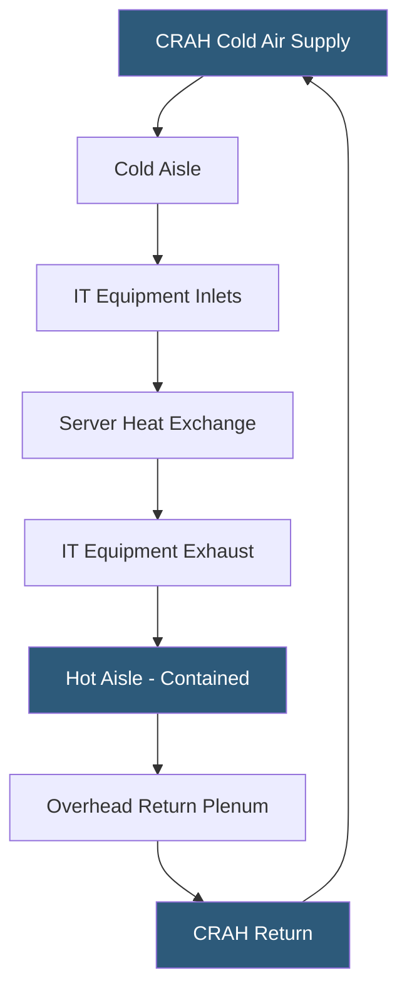

**Category:** Gigawatt Cooling Infrastructure
**Difficulty:** Intermediate
**Reading time:** 5 min read

---

Hot aisle containment (HAC) is the most cost-effective airflow management improvement available to gigawatt-scale air-cooled datacenters, typically reducing cooling energy 15–30% by preventing hot exhaust air from recirculating to server inlets. At GW scale, even modest per-rack temperature improvements translate to tens of millions of dollars in annual energy savings.

- **Hot Aisle Containment** — physical enclosure of rack exhaust space, forcing hot air to return path rather than mixing with cold supply air
- **Cold Aisle Containment (CAC)** — alternative approach enclosing cold aisle; requires positive pressure in cold aisle
- **Return Plenum** — enclosed pathway from hot aisle ceiling to CRAH/CRAH return; may be overhead ducted or above-ceiling
- **Chimney Cap** — individual rack-top enclosure directing exhaust directly to return plenum above racks
- **Bypass Airflow** — cold air that travels from supply to return without passing through IT equipment; represents wasted cooling capacity
- **ΔTCOOL** — temperature difference between hot aisle and cold aisle; higher delta indicates better containment
- **Blanking Panel** — filler panels in unused rack unit spaces preventing hot/cold air mixing within rack
- **Containment Effectiveness** — percentage of IT airflow captured by containment vs mixing with room air

Without containment, server exhaust air from hot aisles mixes freely with cold aisle supply air, raising inlet temperatures and causing servers to increase fan speeds to maintain safe operating temperatures. This creates a vicious cycle: hotter inlets require more fan airflow, more fan airflow produces more heat, requiring even more cooling. Measured inlet temperatures in uncontained data halls often run 5–15°F above design targets.

Hot aisle containment breaks this cycle by creating a physical barrier — typically framed panels, curtains, or hard walls — along the length and ends of each hot aisle, with a solid ceiling panel connecting rack tops to the overhead return plenum. Hot exhaust air has only one exit path: directly into the return plenum and back to CRAH units, preventing recirculation.

At gigawatt scale, the implementation challenge is fitting containment around dozens of different rack sizes, densities, and configurations while maintaining required egress paths (every containment zone needs emergency egress doors meeting fire code). End-of-row doors must be self-closing and fire-rated in some jurisdictions; overhead panels must support cable loads and provide access for adds, moves, and changes.

Containment also enables significant CRAH supply temperature increases. A well-contained data hall can operate with supply air at 65–70°F vs. 55–60°F in non-contained spaces, because cold aisle temperatures are guaranteed by containment rather than relying on cold air volume to overwhelm recirculation. Each 5°F increase in supply temperature unlocks more economizer hours and reduces chiller energy.

- Legacy data hall retrofit adding HAC to existing rack rows with mixed heights
- New AI cluster designed with overhead return plenum integrated into building structure
- Colocation facility implementing HAC to guarantee customer inlet temperature SLAs
- Mixed-density hall using chimney caps on high-density racks while using CAC elsewhere
- CRAH supply temperature raise program enabled by full-campus HAC deployment

| Advantage | Disadvantage |
|-----------|--------------|
| HAC reduces cooling energy 15–30% with minimal capital investment | End-of-row doors require maintenance and can be propped open |
| Higher CRAH supply temperatures unlock more economizer hours | Non-standard rack heights create containment sealing challenges |
| Containment eliminates hot spots from recirculation | Overhead return plenums collect cable mass, complicating access |
| Blanking panels within racks improve containment effectiveness | Retro-fit HAC around existing cable runs is labor-intensive |

- [Cooling Capacity for Gigawatt Loads](cooling-capacity-for-gigawatt-loads.md)
- [CRAH Unit Deployment Strategy](crah-unit-deployment-strategy.md)
- [PUE Optimization Strategies](pue-optimization-strategies.md)

---
*Part of the [Gigawatt Cooling Infrastructure](index.md) category · [Back to Master Index](../../index.md)*
