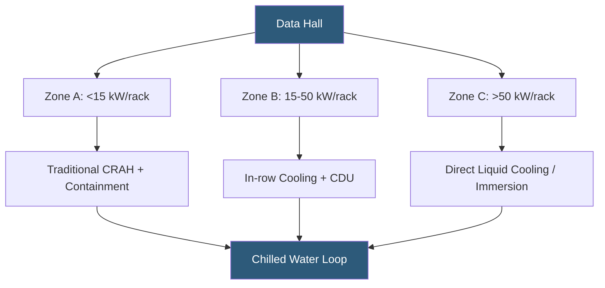

**Category:** Gigawatt Cooling Infrastructure
**Difficulty:** Advanced
**Reading time:** 7 min read

---

Hybrid cooling strategies combine multiple cooling technologies within a single datacenter—typically pairing air-based cooling with liquid cooling, or mechanical refrigeration with economizer systems—to optimize efficiency, cost, and flexibility as IT equipment evolves. At gigawatt scale, hybrid approaches allow incremental adoption of high-density liquid cooling while maintaining air-cooled capacity for legacy equipment, protecting infrastructure investment across multiple equipment generations.

- **Mixed-mode Cooling** — simultaneous operation of different cooling technologies within a single data hall
- **Density Tiering** — allocating racks to cooling tiers based on their power density (e.g., <10 kW air-cooled; 10–50 kW in-row; >50 kW direct liquid)
- **Cooling Distribution Unit (CDU)** — a local fluid circuit conditioner that distributes coolant to server cold plates within a rack or row
- **Rear-door Heat Exchanger (RDHx)** — a water-cooled door panel replacing the standard server rack door; captures server exhaust air heat
- **ASHRAE A4 Envelope** — the most aggressive ASHRAE server equipment thermal specification, allowing inlet temperatures up to 113°F (45°C)
- **Supplemental Cooling** — liquid cooling added to specific high-density racks while bulk air cooling serves remaining infrastructure
- **Thermal Zoning** — physical separation of different density cooling zones within a data hall
- **Redundant Infrastructure** — maintaining both air and liquid cooling paths to allow failover between technologies

Modern gigawatt campuses rarely have uniform power density across all racks. A hyperscaler might have AI training clusters at 60–100 kW/rack alongside general compute at 10–15 kW/rack and storage infrastructure at 2–5 kW/rack. Designing the entire data hall for the peak density is wasteful; hybrid zoning assigns cooling technology appropriate to each density tier.

The most common hybrid architecture uses a chilled water backbone serving multiple cooling delivery subsystems. Air-side delivery—CRAH units and containment—covers standard-density zones. In-row cooling units (installed in dedicated 1U rack positions every 5–7 racks) supplement room cooling in medium-density zones. Direct liquid cooling CDUs and cold-plate circuits serve the highest-density GPU clusters.

The key engineering challenge is maintaining thermal stability across zones when equipment configurations change. If a row transitions from air-cooled servers to GPU nodes, the cooling delivery must be reconfigured—CDUs commissioned, air-side capacity partially decommissioned—without disrupting adjacent zones. Modular cooling infrastructure (skid-mounted CDUs with quick-disconnect fittings) facilitates this evolution.

Rear-door heat exchangers represent an accessible hybrid entry point: standard rack installations receive RDHx panels connected to the building's chilled water loop. These panels capture 50–70% of the server heat before it reaches the room air volume, reducing CRAH loading. RDHx installations require less civil infrastructure change than immersion cooling but achieve limited density compared to full liquid cooling.

Gigawatt facilities planning 20+ year operational lives increasingly specify piping headers and secondary loop provisions in new buildings for future liquid cooling even when deploying air cooling initially. This brownfield-readiness approach preserves optionality at modest incremental cost during construction.

- Hyperscaler campuses with mixed AI and general compute requiring tiered cooling infrastructure
- Colocation facilities accommodating diverse tenant equipment ranging from 5 to 80 kW/rack
- Phased migration from air cooling to liquid cooling over multiple equipment refresh cycles
- Data halls with isolated high-density GPU pods surrounded by standard air-cooled compute
- Facilities seeking to protect air cooling infrastructure investment while adding liquid for new deployments

| Advantage | Disadvantage |
|-----------|--------------|
| Matches cooling technology to actual rack density, avoiding over-engineering | Multiple cooling systems increase operations complexity and training requirements |
| Preserves air-cooled infrastructure investment during liquid cooling transition | Zone boundaries must be carefully managed to prevent thermal interactions |
| Phased liquid cooling adoption manages capital deployment risk | Hybrid infrastructure requires more floor space than single-mode designs |
| Provides redundancy path between cooling technologies | Mixed vendor equipment and controls require integration effort |

- [Direct Liquid Cooling Infrastructure](direct-liquid-cooling-infrastructure.md)
- [CRAH Unit Deployment Strategy](crah-unit-deployment-strategy.md)
- [Two-phase Immersion Cooling Facilities](two-phase-immersion-cooling-facilities.md)

---
*Part of the [Gigawatt Cooling Infrastructure](index.md) category · [Back to Master Index](../../index.md)*
