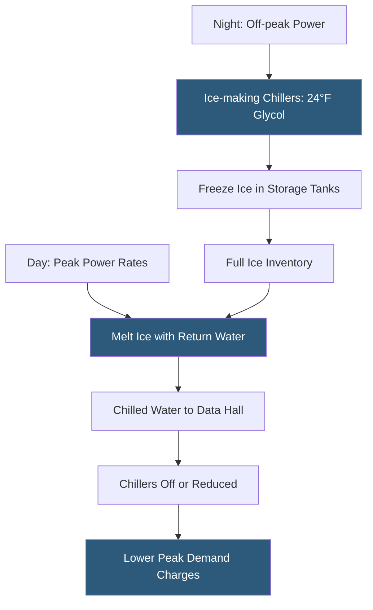

**Category:** Gigawatt Cooling Infrastructure
**Difficulty:** Advanced
**Reading time:** 6 min read

---

Ice-based thermal energy storage systems freeze water overnight using lower-cost off-peak electricity, then melt the ice during peak periods to supplement or replace chiller cooling capacity. Ice stores approximately 6× more thermal energy per unit volume than stratified chilled water, enabling meaningful storage in a smaller footprint—an important advantage at gigawatt campuses where mechanical yard space is at a premium.

- **Latent Heat of Fusion** — the energy stored or released when water changes phase between liquid and solid; 144 BTU per pound (334 kJ/kg)
- **Ice Ball / Ice Coil** — proprietary systems using plastic containers or coils submerged in water to form ice; the stored medium is ice in water
- **Glycol Circuit** — a water-glycol solution chilled below 32°F by specialty ice-making chillers to form ice on coils inside the storage tank
- **Ice-making Chiller** — a chiller specifically designed for sub-freezing evaporating temperatures required to create ice; lower COP than standard chillers
- **Partial Storage** — a strategy where ice storage handles peak demand reduction but chillers run continuously; lowers equipment cost
- **Full Storage** — chillers run only at night to make ice; during business hours, all cooling comes from stored ice; maximizes demand reduction
- **Discharge Rate** — the rate at which ice can be melted to provide cooling; limited by heat transfer surface area inside storage tanks
- **Ice Inventory** — the remaining stored cooling capacity in the system; monitored and displayed on the BMS

Ice storage tanks are insulated vessels containing stainless steel or HDPE coils submerged in water. During charging, a glycol-water solution chilled to 24–28°F circulates through the coils, freezing the surrounding water. A well-designed system builds a full charge (100% ice) over 8–12 hours of overnight operation. The ice-making chiller must be capable of sub-freezing evaporating temperatures, which reduces its COP to 2.5–4.0 compared to 5–7 for standard chillers operating above freezing. This energy penalty during charging is offset by the avoided peak demand charges during discharge.

During discharge, warm return water from the data hall flows through or around the ice coils, melting ice and cooling to approximately 34–36°F. This very low supply temperature enables the secondary building chilled water loop to deliver supply water at 42–44°F even at the furthest heat exchanger from the tank, maintaining effective cooling despite the energy of melting adding only latent heat.

The primary advantage of ice storage over stratified chilled water is volumetric density. One million BTU (83 ton-hours) of ice requires approximately 580 gallons, compared to 7,500 gallons of stratified chilled water at a 16°F delta. For a campus requiring 50,000 ton-hours of storage, ice systems need roughly 350,000 gallons of tank volume versus 2.1 million gallons for chilled water—a 6× reduction.

Ice storage is particularly well-suited to facilities with high peak-to-average load ratios and aggressive demand charge management objectives. The combination of very low discharge temperatures and high density makes ice attractive for high-density liquid cooling circuits where supply temperatures below 40°F are sometimes required.

- Facilities on demand-charge-intensive utility tariffs seeking peak demand reduction
- Campus expansions where mechanical yard space limits chilled water tank size
- High-density liquid cooling plants requiring sub-40°F coolant supply temperatures
- Facilities with grid-scale demand response obligations requiring rapid load reduction
- Hyperscaler plants combining ice storage with coincident peak management programs

| Advantage | Disadvantage |
|-----------|--------------|
| 6× higher energy density than chilled water storage reduces footprint | Ice-making chillers have lower COP (2.5–4.0) vs standard chillers (5–7); higher off-peak energy |
| Very low discharge temperatures (34–36°F) support high-density cooling | Glycol circuit maintenance adds system complexity vs pure water chilled water systems |
| Enables aggressive demand charge management with modest tank volume | Higher capital cost per ton-hour than stratified chilled water systems |
| Phase-change storage provides buffer without thermal mixing degradation | Discharge rate limited by heat transfer surface; cannot meet unlimited instantaneous demand |

- [Thermal Storage Systems](thermal-storage-systems.md)
- [Chilled Water Storage Tanks](chilled-water-storage-tanks.md)
- [Water-cooled Chiller Installations](water-cooled-chiller-installations.md)

---
*Part of the [Gigawatt Cooling Infrastructure](index.md) category · [Back to Master Index](../../index.md)*
