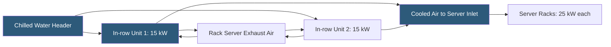

**Category:** Gigawatt Cooling Infrastructure
**Difficulty:** Intermediate
**Reading time:** 6 min read

---

In-row cooling units are compact air handlers positioned within the rack rows of a data hall, placed directly adjacent to or between server racks to provide short-path, high-density cooling. At gigawatt scale, in-row cooling supplements or replaces room-level CRAH systems for zones with IT power densities of 15–40 kW per rack where conventional air distribution cannot efficiently deliver adequate cooling.

- **In-row Cooler (IRC)** — a rack-height, rack-width cooling unit containing a chilled water coil and fans; mounted in the rack row
- **Short Air Path** — the key advantage of in-row cooling; server exhaust travels less than 3 feet before entering the cooling unit
- **Rack Unit (U) Consumption** — in-row units typically occupy 1–4U of rack space or a full rack position
- **Chilled Water Branch Circuit** — the supply and return water piping serving in-row units; typically 2-pipe or 4-pipe
- **Flexible Hose Connection** — a quick-connect hose coupling the in-row unit to overhead or underfloor piping headers
- **Cooling Capacity** — individual in-row units provide 10–30 kW of cooling; multiple units serve a row of high-density racks
- **N+1 Redundancy** — deploying one additional in-row unit per zone beyond the minimum required, enabling maintenance without service interruption
- **Monitoring Integration** — in-row units with built-in sensors reporting temperature, flow, and alarm data to the BMS

In-row cooling units are installed perpendicular to or within the rack row, typically placed every 5–7 racks for a given cooling capacity. The unit draws hot server exhaust air from the hot aisle side, passes it over a chilled water coil, and discharges cool air into the cold aisle. With hot and cold aisle containment, this creates a local closed-loop airflow circuit independent of the room-level air system.

Chilled water supply connections use flexible braided hoses connecting the unit to overhead busway piping or underfloor supply/return manifolds. Quick-connect fittings allow in-row unit removal for maintenance without draining the entire branch circuit—a critical feature in a live operational environment. Units are typically designed for chilled water supply at 44–55°F, with higher temperatures (from liquid cooling high-setpoint plants) enabling more economizer operation.

For very high-density deployments (>30 kW/rack), multiple in-row units must serve each rack section. Proper hydraulic balancing ensures each unit receives adequate chilled water flow at its designed flow rate. Pressure-independent control valves at each unit outlet prevent over-or under-flow from hydraulic imbalance in the branch circuit.

In-row cooling is most commonly deployed as a supplemental cooling layer in data halls that also have room-level CRAH systems. The CRAH units handle lower-density areas and provide backup cooling capacity; in-row units address the hot spots created by high-density AI clusters or storage arrays. This hybrid approach allows gradual density increases without redesigning the entire building cooling system.

At gigawatt scale, standardizing in-row unit specifications—manufacturer, capacity, chilled water connections, and monitoring protocol—simplifies procurement, spare parts management, and technician training across hundreds of in-row units on a campus.

- AI training rack deployments at 25–50 kW requiring cooling beyond room CRAH capacity
- Mixed-density floors where specific rows need supplemental cooling
- Colocation facilities offering premium high-density cages with guaranteed cooling
- Storage arrays and networking equipment generating dense localized heat loads
- Retrofit of existing data halls to support increased densities without building modifications

| Advantage | Disadvantage |
|-----------|--------------|
| Short air path eliminates hot spots in high-density zones | Each unit requires individual chilled water piping and hose connections |
| Modular deployment allows incremental capacity addition | Units occupy rack space or row positions reducing available IT footprint |
| Close coupling to heat sources improves cooling efficiency vs room CRAH | Multiple units per row increase maintenance touchpoints |
| Can target specific high-density zones without affecting rest of data hall | Requires dedicated chilled water distribution infrastructure for each zone |

- [CRAH Unit Deployment Strategy](crah-unit-deployment-strategy.md)
- [Rear Door Heat Exchangers](rear-door-heat-exchangers.md)
- [Hot Aisle Containment at Scale](hot-aisle-containment-at-scale.md)

---
*Part of the [Gigawatt Cooling Infrastructure](index.md) category · [Back to Master Index](../../index.md)*
