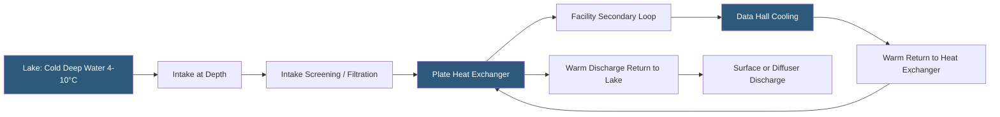

**Category:** Gigawatt Cooling Infrastructure
**Difficulty:** Advanced
**Reading time:** 6 min read

---

Lake water cooling uses a naturally occurring freshwater body as a heat sink, drawing cool deep water and using it to precool or fully cool datacenter chilled water circuits. Several major hyperscalers—including Google's Finnish facilities and Microsoft's various lake-adjacent sites—leverage lake water to achieve sub-1.10 PUE values for large portions of the year, while carefully managing environmental impacts on lake ecology and complying with water withdrawal and thermal discharge permits.

- **Thermal Stratification** — the layering of lake water into warm surface layers and cold deep water (hypolimnion); cool deep water is drawn for cooling
- **Hypolimnion** — the cold, deep layer below the thermocline in a stratified lake; temperatures typically 4–8°C year-round in deep lakes
- **Thermocline** — the transitional layer between warm surface and cold deep water in a lake; typically at 10–30 meter depth
- **Water Withdrawal Permit** — a regulatory authorization specifying the maximum volume of water that can be withdrawn from the lake daily or annually
- **Thermal Discharge Permit** — authorization for returning warm water to the lake, with limits on temperature elevation and mixing zone
- **Mixing Zone** — the area around the discharge point where mixing with ambient lake water is expected; thermal limits apply at the mixing zone boundary
- **Closed-loop System** — a lake water cooling system where withdrawn water is returned after heat exchange, consuming no net water
- **Limnologist** — a scientist specializing in freshwater lake ecology; essential consultant for environmental impact assessment

Lakes suitable for cooling systems must have sufficient depth (typically >20 meters) to maintain cold hypolimnion temperatures independent of seasonal surface warming. The intake pipe extends to the hypolimnion level, drawing water at 4–8°C year-round. This cold water passes through plate heat exchangers that transfer heat to the facility's freshwater secondary loop without mixing the lake water into the building piping circuits.

The heat-exchanged lake water is returned to the lake at a higher temperature (typically 5–15°C warmer than withdrawal). Environmental permits limit both the temperature rise and the volume of withdrawal to prevent ecological harm. Warm surface water discharge using diffusers distributes the thermal load over a larger area of the lake surface to minimize localized temperature elevation. Detailed thermal dispersion modeling—often using 3D hydrodynamic lake models—is required to demonstrate that thermal standards are met throughout the discharge zone.

Water withdrawal volumes must be balanced against lake water budget. For a 100 MW campus consuming 30 MW of cooling at a 10°C temperature rise, the required flow rate is approximately 12,000 GPM (720,000 gallons/hour). At this rate, a lake volume analysis confirms that net evaporation or withdrawal does not reduce lake levels beyond permit thresholds.

Environmental monitoring programs—required by most permits—include continuous temperature logging at multiple lake depths and locations, dissolved oxygen measurement (warm discharge can reduce DO in the hypolimnion), and periodic ecological surveys. Google's Hamina, Finland facility uses Baltic Sea rather than a lake but employs analogous monitoring. Microsoft's data halls adjacent to Norwegian fjords use similar deep-cold water strategies.

- Temperate and boreal region campuses adjacent to deep natural lakes
- Norwegian fjord-side facilities using deep, cold saltwater with similar approaches
- Canadian Shield campus locations with abundant cold freshwater lakes
- Minnesota, Michigan, or Wisconsin campuses near the Great Lakes watershed
- Any location with permitted access to a thermally stratified freshwater body

| Advantage | Disadvantage |
|-----------|--------------|
| Deep cold water enables near-year-round free cooling in temperate climates | Facility must be located adjacent to a suitable deep lake with permitting access |
| Closed-loop design returns water to lake, minimizing net consumption | Environmental permitting is complex, requires ecological studies, and can take 2–5 years |
| Eliminates cooling tower evaporation losses reducing WUE dramatically | Thermal discharge regulations limit facility cooling capacity to the lake's absorption capacity |
| Consistent deep-water temperature enables reliable free cooling | Biological clogging of intakes by aquatic organisms requires maintenance |

- [Seawater Cooling Systems](seawater-cooling-systems.md)
- [River Water Cooling Infrastructure](river-water-cooling-infrastructure.md)
- [Free Cooling Hours Analysis](free-cooling-hours-analysis.md)

---
*Part of the [Gigawatt Cooling Infrastructure](index.md) category · [Back to Master Index](../../index.md)*
