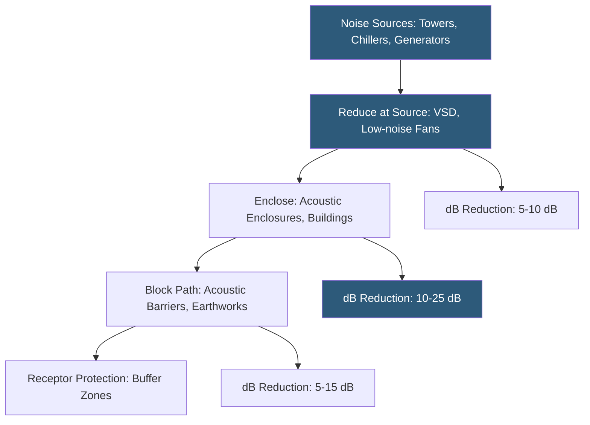

**Category:** Gigawatt Cooling Infrastructure
**Difficulty:** Intermediate
**Reading time:** 6 min read

---

Cooling systems at gigawatt datacenters—cooling towers, chillers, CRAH units, and generator exhaust—are among the loudest industrial facilities operating continuously near residential and commercial areas. Noise mitigation strategies including acoustic barriers, low-noise fan selection, variable speed operation, and building placement reduce sound pressure levels at property boundaries to comply with ordinances and maintain positive community relations.

- **Sound Pressure Level (dB)** — a logarithmic measure of acoustic pressure relative to the threshold of hearing; 0 dB is threshold, 85 dB is typical industrial noise
- **Noise Ordinance** — a local regulation specifying maximum permissible sound levels at property boundaries, often differentiated by time of day
- **A-weighting (dBA)** — a frequency-weighted decibel scale matching human hearing sensitivity; most ordinances use dBA
- **Acoustic Barrier / Wall** — a solid structure between noise source and receptor interrupting the line of sight; reduces sound by 5–20 dB
- **Low-noise Fan** — a cooling tower fan designed for reduced tip speed and blade angle, generating 5–10 dB less noise than standard fans
- **Variable Speed Drive (VSD) for Noise** — reducing fan speed at night reduces both noise and energy consumption
- **Silencer** — an acoustic attenuator with absorptive media installed in ductwork or equipment discharge paths
- **Noise Model** — a computational prediction of sound levels at receptors using source characterizations and barrier geometry

Cooling towers are typically the dominant noise source at large datacenters, generating continuous broadband noise at 60–75 dBA at 10 meters. Each cooling tower cell has multiple large fans that are both the primary noise generators and the primary energy consumers. Fan tip speed is directly related to noise: reducing tip speed by 20% (achievable with low-noise blade designs at reduced pitch) can reduce noise output by 5–7 dB.

Variable speed drives on cooling tower fans serve double duty for noise mitigation. Reducing fan speed from 100% to 70% at night typically reduces sound output by 8–10 dB—a perceived halving of loudness—while also reducing fan power by 65%. Night-time speed reduction programs meet noise ordinances without requiring acoustic barriers, provided adequate cooling capacity remains for the reduced nighttime load.

Acoustic barriers—walls or berms of masonry, concrete, or earth—attenuate noise along the line of sight between source and receptor. An 8-foot wall at 50 feet from the cooling tower provides approximately 8–12 dB of insertion loss at the receptor. Barriers taller than the equipment provide better attenuation; the optimal height is the minimum necessary to break the line of sight plus an additional 3–5 feet to account for diffraction over the wall top. At gigawatt scale, an acoustic barrier wall surrounding the cooling tower yard may extend 2,000–5,000 linear feet and 15–20 feet in height—a substantial civil structure.

Generator testing is a particularly challenging noise source. Monthly load tests of large generator sets run for 30–60 minutes, generating 85–95 dBA at 50 feet from the exhaust stack. Scheduling tests during business hours, using silencers on exhaust stacks (15–25 dB attenuation), and notifying adjacent neighbors in advance manages the community impact.

- Urban datacenter sites where residential or commercial properties are within 500 feet
- Sites subject to local noise ordinances with night-time limits below 50 dBA
- Facilities seeking to reduce generator test noise impact on adjacent businesses
- Environmental impact assessments requiring noise modeling for permits
- Post-occupancy compliance monitoring when complaints are received

| Advantage | Disadvantage |
|-----------|--------------|
| VSD operation reduces both noise and energy costs simultaneously | VSD speed limits at night may constrain cooling capacity during hot summer nights |
| Acoustic barriers are effective and reliable once installed | Long barrier walls are expensive civil structures adding project cost |
| Low-noise fans reduce noise at source without operational constraints | Low-noise fans cost 15–25% more than standard fans with slightly lower airflow efficiency |
| Night-time speed reduction programs satisfy most ordinance requirements | Acoustic modeling has uncertainty; field measurements may differ from predictions |

- [Cooling Tower Arrays](cooling-tower-arrays.md)
- [Cooling Tower Plume Abatement](cooling-tower-plume-abatement.md)
- [Cooling System Monitoring](cooling-system-monitoring.md)

---
*Part of the [Gigawatt Cooling Infrastructure](index.md) category · [Back to Master Index](../../index.md)*
