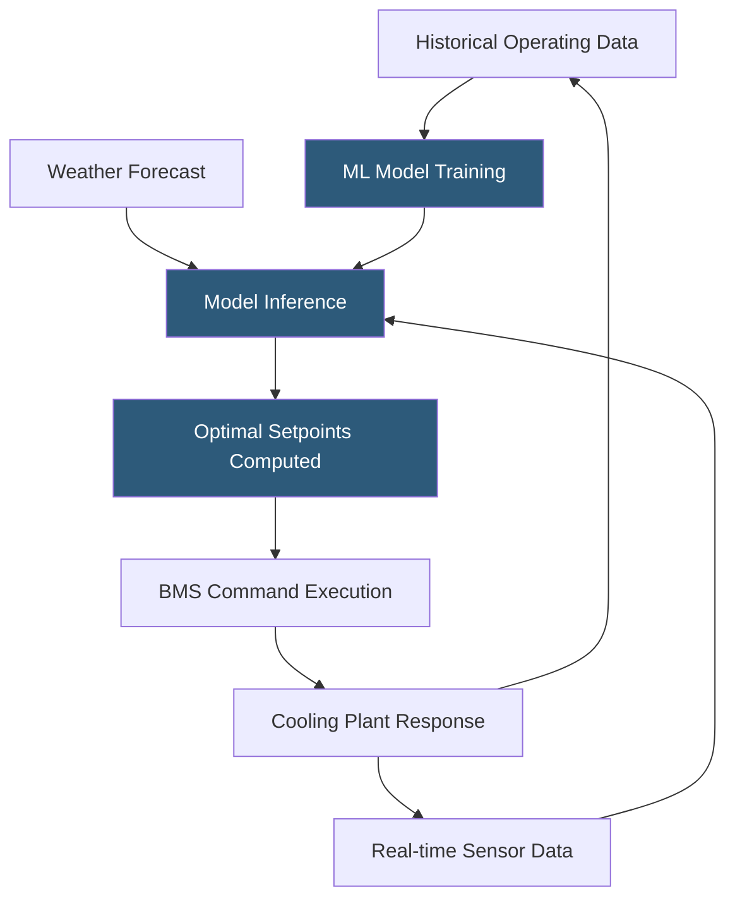

**Category:** Gigawatt Cooling Infrastructure
**Difficulty:** Advanced
**Reading time:** 7 min read

---

Predictive cooling optimization uses machine learning models, weather forecasts, and historical operating data to anticipate future cooling demand and proactively adjust plant setpoints and equipment staging ahead of changes, rather than reacting after conditions shift. At gigawatt scale, Google's deployment of DeepMind AI for datacenter cooling has demonstrated 40% cooling energy reductions, establishing predictive optimization as a transformative efficiency lever.

- **Model Predictive Control (MPC)** — an optimization framework using a physics or learned model to forecast system behavior and select optimal actions over a future time horizon
- **Reinforcement Learning (RL)** — a machine learning approach where an agent learns optimal control policies by receiving rewards for energy-efficient decisions
- **Digital Twin** — a real-time simulation of the cooling plant calibrated against sensor data; used for MPC optimization and operator training
- **Feed-forward Control** — adjusting system parameters based on predicted future conditions rather than reacting to current measurements
- **Weather API Integration** — connecting the BMS to real-time and forecast weather data (temperature, humidity, solar irradiance) for anticipatory control
- **Setpoint Optimization** — continuously computing the optimal chilled water supply temperature, cooling tower setpoint, and fan speed to minimize total plant power
- **Anomaly Detection** — machine learning algorithms identifying sensor readings inconsistent with expected patterns, flagging potential equipment faults
- **Reward Function** — in RL optimization, the mathematical objective function being maximized; typically a combination of cooling energy, thermal comfort, and equipment stress

Google's DeepMind collaboration, published in 2016 and expanded since, trained deep neural networks on 5 years of historical sensor data from production datacenters. The models predicted future data hall temperatures given current and historical sensor inputs. A Model Predictive Control system then searched the space of possible cooling actions (setpoint adjustments, fan speeds, chiller staging) to find the combination minimizing energy consumption while maintaining temperature within safe bounds. The result was a 40% reduction in cooling energy versus the previous rule-based BMS control, representing hundreds of millions of dollars in annual savings across Google's global fleet.

For facilities without the scale to develop proprietary AI systems, commercial predictive optimization platforms (EcoStruxure for AI, Vigilent, SynaptiQ) offer pre-trained models fine-tuned to specific site data. These platforms integrate with existing BMS infrastructure via standard APIs, requiring 4–12 weeks of data collection before the optimization engine activates.

The most accessible predictive optimization is weather-informed feed-forward control. When the weather forecast shows ambient temperature rising 15°F over the next 3 hours, the BMS pre-stages an additional chiller and lowers the chilled water supply temperature setpoint 30 minutes early—ensuring adequate cooling is available when demand peaks rather than chasing the ramp. This simple predictive rule is implementable in any modern BMS without ML and delivers 10–20% peak demand reduction.

Anomaly detection is a separate predictive capability. By learning the normal patterns of 50,000 sensor points—how temperatures rise with load, how chillers respond to setpoint changes, how pump differentials vary with flow—ML algorithms can flag deviations suggesting developing faults weeks before they would cause an alarm or visible degradation.

- Hyperscaler campuses with sufficient historical data to train site-specific ML models
- Facilities deploying commercial AI cooling optimization platforms
- BMS upgrade projects implementing weather-informed feed-forward controls
- Chiller efficiency monitoring programs using anomaly detection for predictive maintenance
- Energy procurement programs requiring accurate cooling power forecasting for demand response bidding

| Advantage | Disadvantage |
|-----------|--------------|
| 20–40% cooling energy reduction represents millions of dollars annually | ML model training requires months of historical data and data science expertise |
| Feed-forward controls reduce peak demand charges through anticipatory action | Advanced optimization introduces control complexity and potential for unexpected behaviors |
| Anomaly detection identifies faults earlier than traditional alarming | Commercial platforms add licensing cost and create vendor dependency |
| Continuous learning improves performance as the facility operating envelope expands | Control system failures in optimization layer require robust fallback to conventional BMS control |

- [Building Management System (BMS) Integration](building-management-system-bms-integration.md)
- [Economizer Mode Optimization](economizer-mode-optimization.md)
- [Computational Fluid Dynamics Modeling](computational-fluid-dynamics-cfd-modeling.md)

---
*Part of the [Gigawatt Cooling Infrastructure](index.md) category · [Back to Master Index](../../index.md)*
