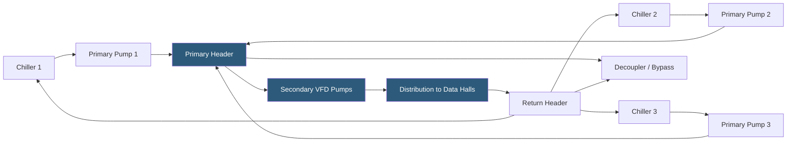

**Category:** Gigawatt Cooling Infrastructure
**Difficulty:** Advanced
**Reading time:** 7 min read

---

Primary-secondary pumping architecture hydraulically decouples the chiller plant from the distribution loop, allowing each to operate at its optimal flow rate independently. This separation enables stable chiller operation across varying building loads, simplified staging of multiple chillers, and the integration of diverse cooling system components—essential at gigawatt scale where dozens of chillers serve hundreds of cooling zones with constantly varying demand.

- **Primary Loop** — the chilled water circuit through which each chiller pumps at a constant flow rate; sized for the chiller's minimum required flow
- **Secondary Loop** — the distribution circuit carrying chilled water to building air handlers and cooling coils; flow varies with building load
- **Decoupler (Bypass)** — a short pipe connecting primary and secondary loops; carries excess or deficit flow between the two circuits
- **Primary Pump** — a dedicated pump for each chiller, ensuring constant flow through the chiller during operation
- **Secondary Pump** — a variable-speed pump serving the distribution loop; speed varies with building demand
- **Hydraulic Stability** — the condition where pressure and flow in both loops are independent, preventing flow starvation or surges
- **Variable Primary Flow (VPF)** — an advanced design eliminating the secondary loop; primary pumps vary speed directly, reducing pump count but requiring careful chiller minimum flow management
- **Pressure Differential (dP) Setpoint** — the minimum pressure difference maintained across the distribution loop to ensure flow to the most remote coil

In a primary-secondary system, each operating chiller is paired with a dedicated constant-speed primary pump that maintains the manufacturer-required minimum flow rate (typically 10% of nominal flow) through the chiller's evaporator at all times. This prevents evaporator freeze-up and maintains stable refrigerant cycle operation regardless of what the building distribution loop is demanding.

The secondary loop is served by separate variable-speed pumps that adjust flow based on a pressure differential setpoint maintained at a representative point in the distribution system. As cooling coils open and demand increases, differential pressure drops, triggering pump speed increases. As demand falls, coil valves close, differential pressure rises, and pumps slow down. At very low loads, pumps may run at minimum speed (typically 30% of nameplate).

The decoupler pipe between primary and secondary headers is the key hydraulic feature. When secondary flow demand is less than the total primary flow (all chillers running), excess chilled water flows through the decoupler from supply to return. When secondary demand exceeds primary supply, some warm return water re-mixes with supply through the decoupler—an indication that additional chillers need to be staged on.

The evolution toward Variable Primary Flow (VPF) eliminates the secondary loop entirely by using variable-speed drives on the primary pumps and allowing chiller flow to vary. VPF systems are more energy-efficient at part load (saving secondary pump energy), but require chillers rated for variable flow operation and sophisticated controls that prevent chiller evaporator freeze-up at low flow conditions. At gigawatt scale, VPF can save 0.3–0.8 MW per 100 MW of cooling plant capacity in pump energy—significant at large scale.

- Large chiller plants with 5+ chillers serving variable cooling loads
- Campus distribution systems serving multiple buildings from a central plant
- Systems requiring independent chiller and distribution loop flow rates
- Installations with diverse cooling users including CRAH units, CDUs, and liquid cooling
- Systems being upgraded to variable primary flow from existing P/S architecture

| Advantage | Disadvantage |
|-----------|--------------|
| Hydraulic decoupling ensures stable chiller operation at all loads | Requires two sets of pumps (primary and secondary) with associated capital and maintenance |
| Variable secondary pumps reduce distribution energy at part load | Decoupler flow must be carefully monitored to detect load-chiller imbalances |
| Flexible staging of chillers without distribution system disruption | More complex controls and piping than single-loop systems |
| Well-proven, widely understood industry standard | VPF upgrades require careful controls engineering to maintain chiller minimum flow |

- [Variable Flow Chilled Water](variable-flow-chilled-water.md)
- [Water-cooled Chiller Installations](water-cooled-chiller-installations.md)
- [Cooling System Commissioning](cooling-system-commissioning.md)

---
*Part of the [Gigawatt Cooling Infrastructure](index.md) category · [Back to Master Index](../../index.md)*
