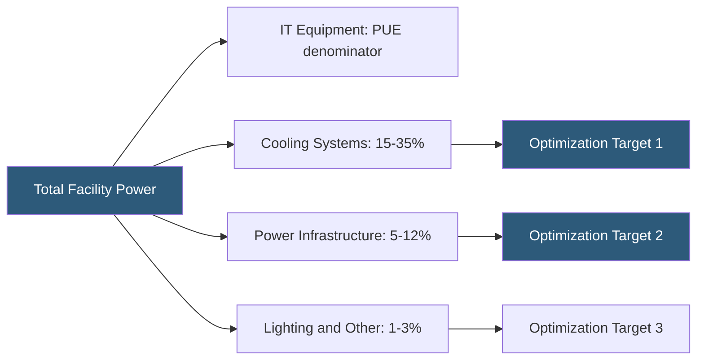

**Category:** Gigawatt Cooling Infrastructure
**Difficulty:** Intermediate
**Reading time:** 6 min read

---

Power Usage Effectiveness (PUE) remains the primary energy efficiency benchmark for gigawatt-scale datacenters, and a 0.1 improvement in PUE at 1 GW IT load saves approximately $10–20M in annual energy cost. Systematic PUE optimization requires addressing all overhead loads — cooling, power conversion, lighting, and infrastructure — in priority order.

- **PUE (Power Usage Effectiveness)** — ratio of total facility power to IT equipment power; ideal = 1.0, world-class hyperscale = 1.05–1.15
- **Partial PUE (pPUE)** — PUE measured for a specific zone or system, used for sub-facility optimization
- **Annualized PUE** — PUE averaged across all seasons and operating conditions; more meaningful than peak or average
- **Cooling Overhead** — fraction of total facility power consumed by cooling systems; typically 20–40% of total
- **Power Conversion Loss** — energy lost in transformers, UPS, and switchgear; typically 5–15% of IT power
- **Lighting and Ancillary** — non-IT, non-cooling loads; typically 1–3% of IT power in well-designed facilities
- **DCIM (Data Center Infrastructure Management)** — software platform monitoring all facility parameters for real-time PUE optimization
- **Dynamic Cooling** — automated cooling adjustment in response to real-time IT load and ambient conditions

PUE optimization begins with accurate measurement. DCIM platforms collect real-time power data from hundreds of branch circuit meters, PDUs, and UPS output meters to calculate PUE at 1-minute intervals. This granularity reveals patterns — PUE peaks at 3 AM when cooling systems cycle inefficiently at low load, or spikes during generator testing when power factor changes — that aggregate monthly bills cannot expose.

Cooling represents the largest optimization opportunity. Waterside economizers eliminate chiller compressor energy during cool weather; raising chilled water supply temperature from 44°F to 55°F can add 1,500+ annual hours of economizer operation in mid-Atlantic climates. Variable-speed drives on all pumps and fans provide proportional energy reduction at part load — chiller pump energy drops by 75% when flow rate is halved at half load.

Power conversion efficiency improvements reduce losses in UPS systems and transformers. Modern transformers achieve 99.5% efficiency vs. 98% for older designs; at 1 GW IT load this difference is 5 MW of heat. Eliminating unnecessary double-conversion UPS stages in low-criticality zones replaces 96% efficient double-conversion with 98–99% efficient on-line or ECO-mode operation.

Hot aisle containment and computational fluid dynamics (CFD) modeling identify bypass airflow — cold air that bypasses IT equipment — which represents wasted cooling capacity. Eliminating bypass through blanking panels, perforated tile right-sizing, and plenum sealing can raise effective CRAH capacity by 20–30%, enabling cooling plant reduction or temperature set-point increases.

- Campus-wide PUE improvement program targeting 1.35 → 1.15 over 24 months
- DCIM deployment enabling real-time automated cooling setpoint optimization
- Chiller plant upgrade from fixed-speed to variable-speed drives
- UPS replacement program transitioning double-conversion to on-line interactive mode
- Annual PUE reporting for CDP (Carbon Disclosure Project) sustainability disclosure

| Advantage | Disadvantage |
|-----------|--------------|
| PUE improvements deliver direct, measurable energy cost reduction | Aggressive PUE targets may conflict with redundancy requirements |
| ECO-mode UPS operation reduces losses but increases transfer time risk | Variable-speed pump optimization requires sophisticated control integration |
| Raising supply temperatures reduces cooling energy but requires IT team coordination | PUE optimization at high load is easier than at part-load conditions |
| DCIM investment pays back through energy savings within 2–3 years | Legacy facilities have limited optimization potential without major infrastructure work |

- [Waterside Economizers](waterside-economizers.md)
- [Hot Aisle Containment at Scale](hot-aisle-containment-at-scale.md)
- [Cooling Efficiency Metrics (WUE, CUE)](cooling-efficiency-metrics-wue-cue.md)

---
*Part of the [Gigawatt Cooling Infrastructure](index.md) category · [Back to Master Index](../../index.md)*
