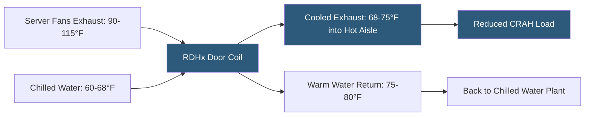

**Category:** Gigawatt Cooling Infrastructure
**Difficulty:** Intermediate
**Reading time:** 6 min read

---

Rear door heat exchangers (RDHx) are water-cooled panels that replace the standard perforated rear door of a server rack, capturing heat from server exhaust air before it enters the hot aisle. RDHx systems are particularly appealing for density upgrades in existing facilities—they fit onto standard 19-inch rack frames without requiring raised floors, in-row units, or room cooling modifications, while reducing room cooling loads by 50–70% per rack.

- **Rear Door Heat Exchanger (RDHx)** — a finned water coil mounted in a door frame that passively or actively cools server exhaust air
- **Passive RDHx** — relies on server fans to push exhaust air through the door coil; no additional fans required
- **Active RDHx** — adds supplemental fans to boost airflow through the coil; used at higher densities above 25 kW/rack
- **Sensible Cooling** — cooling that reduces air temperature without condensation; RDHx removes sensible heat only
- **Leaving Air Temperature** — the temperature of air exiting the RDHx back panel into the hot aisle; target is near room temperature (~68–75°F)
- **Chilled Water Supply Temperature** — must stay above the air dew point to prevent condensation on the coil; typically set at 60–68°F
- **Flow Rate** — chilled water flow through the door coil; regulated by modulating valve based on leaving air temperature sensor
- **Rack-level Monitoring** — RDHx units with embedded sensors providing inlet and outlet air temperature, water supply temperature, and flow data

A passive RDHx door contains a finned copper coil attached to a manifold carrying chilled water, enclosed in an aluminum or steel door frame that mounts directly on standard rack hinge hardware. Server exhaust air at 90–115°F passes through the coil fin array under the existing server fan pressure, shedding 50–70% of its heat into the chilled water and exiting at 68–75°F into the hot aisle. This significantly reduces the temperature difference between hot aisle and cold aisle, lowering the demand on room CRAHs.

The chilled water supply temperature is critical: it must be maintained above the dew point of the exhaust air to prevent condensation on the coil. Since server exhaust air is warm and dry (server inlets bring in dry cold air, and servers add heat), exhaust dew points are typically 55–60°F. Most RDHx systems are supplied at 60–68°F—within the range of waterside economizer operation in many climates, further improving energy efficiency.

Modulating control valves on each RDHx adjust water flow to maintain a leaving air temperature setpoint. When IT load increases (more exhaust heat), the valve opens more; at low load, the valve throttles to avoid overcooling below the dew point. This rack-level control integrates with the building BMS, providing granular visibility into cooling utilization per rack.

Active RDHx systems add 1–4 fans to the door assembly to overcome the additional pressure drop of the coil at higher densities. Active units can handle 30–50 kW per rack but add electrical connections, fan maintenance, and failure modes that passive units avoid.

RDHx is particularly attractive as a retrofit because it requires no raised floor work, no structural modifications, and minimal water piping: a single flexible hose drop from an overhead supply manifold connects each door. A 100-rack deployment can be completed in 2–3 days by a small crew.

- Density upgrades in existing data halls where structural or raised-floor limitations prevent other liquid cooling approaches
- Mixed-density colocation where specific tenant racks require cooling beyond room CRAH capacity
- Facilities seeking to reduce hot aisle temperatures below 95°F to protect cable and PDU equipment
- Network equipment rooms with high-density switches generating concentrated heat
- Cost-effective intermediate liquid cooling step before transitioning to full cold-plate deployment

| Advantage | Disadvantage |
|-----------|--------------|
| Retrofit-friendly; no raised floor or major infrastructure changes required | Passive RDHx limited to approximately 20–25 kW/rack; active required for higher densities |
| Uses elevated chilled water temperatures compatible with economizer operation | Water connections at rack level require leak detection systems to prevent equipment damage |
| Reduces room CRAH load by 50–70%, improving existing plant efficiency | Not suitable for highest-density GPU deployments above 50 kW/rack |
| Rack-level monitoring provides granular operational data | Door weight and hinge loads require rack structural assessment before installation |

- [In-row Cooling Deployment](in-row-cooling-deployment.md)
- [Direct Liquid Cooling Infrastructure](direct-liquid-cooling-infrastructure.md)
- [Cold Plate Deployment at Scale](cold-plate-deployment-at-scale.md)

---
*Part of the [Gigawatt Cooling Infrastructure](index.md) category · [Back to Master Index](../../index.md)*
