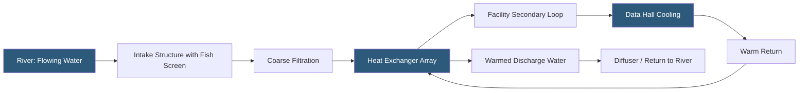

**Category:** Gigawatt Cooling Infrastructure
**Difficulty:** Advanced
**Reading time:** 6 min read

---

River water cooling systems withdraw flowing river water as a heat rejection medium, offering continuous flow volume but variable seasonal temperatures and complex environmental permitting challenges. At gigawatt scale, river water provides an attractive cooling resource near major waterways, subject to minimum flow conditions, thermal discharge limits, fish protection regulations, and multi-agency permit processes that can take 3–7 years and determine the viable cooling capacity of the facility.

- **Riparian Rights** — water use rights associated with ownership of land adjacent to a waterway; vary significantly by state and country
- **Minimum Flow** — the legally mandated minimum streamflow below which water withdrawal is prohibited; protects aquatic ecosystems
- **Section 404 Permit** — US Army Corps of Engineers authorization for any work in or near navigable waters
- **FERC License** — Federal Energy Regulatory Commission authorization for significant water diversions on navigable rivers
- **Once-through Cooling** — drawing river water, cooling equipment, then discharging; requires Clean Water Act thermal discharge compliance
- **Cooling Water Intake Structure (CWIS)** — a regulated structure under EPA's Section 316(b) rules; must demonstrate minimized fish impingement and entrainment
- **Fish Screen** — a velocity-cap or bypass screen preventing fish from being drawn into intake pipes
- **Temperature Delta (ΔT)** — the allowable temperature increase in discharged water; typically limited to 5°F above ambient for river discharge

Rivers provide cooling potential defined by their flow rate and temperature. For a river with a minimum flow of 1,000 cubic feet per second (CFS) and a 5°F allowable temperature rise, the maximum cooling capacity extractable is approximately 150 MW of heat—sufficient for a 300 MW data hall at PUE 1.5. However, minimum flow conditions during drought years may reduce this capacity significantly, requiring backup cooling capacity.

River water temperatures vary seasonally. In temperate US rivers, summer temperatures of 65–75°F limit free cooling effectiveness, while winter temperatures of 35–45°F enable full waterside economizer operation. The annual average river temperature therefore determines both cooling system sizing and annual free cooling hours. Rivers fed by snowmelt or groundwater maintain cooler temperatures even in summer.

EPA Section 316(b) regulations require that cooling water intake structures minimize fish impingement (fish held against screens) and entrainment (fish larvae drawn through screens). Compliance options include velocity caps maintaining approach velocities below 0.5 ft/sec, passive intake screens with fish bypass systems, and closed-cycle cooling using cooling towers instead of once-through. For large gigawatt-scale intakes, biological monitoring programs—tracking fish kill events at intake screens—are required throughout operations.

Thermal discharge permits under Clean Water Act Section 316(a) allow higher temperature rises than the default 5°F standard if a "balanced indigenous population" of aquatic life is maintained, supported by detailed mixing zone and biological studies. Negotiating a thermal variance can significantly increase the cooling capacity available from a given river reach, but requires multi-year biological baseline studies before permit applications can be filed.

- Gigawatt campuses sited adjacent to major rivers in the eastern US, Europe, and Asia
- Industrial areas where legacy industrial water rights provide existing river intake infrastructure
- Facilities in regions where groundwater withdrawal is restricted but surface water is available
- Data hall campuses combined with on-site hydroelectric generation using the same water infrastructure
- Northern climate campuses where cold river temperatures enable significant free cooling

| Advantage | Disadvantage |
|-----------|--------------|
| Large rivers provide abundant, consistent cooling capacity | Permitting process under multiple agencies takes 3–7 years |
| River flow provides fresh cooling water continuously without evaporation loss | Summer river temperatures may be too warm for effective free cooling |
| Cold winter river temperatures enable extended economizer operation | Drought conditions reduce minimum flow, curtailing permitted withdrawal |
| Can be combined with hydroelectric or pumped hydro storage | Fish screen maintenance is continuous and requires specialized contractors |

- [Lake Water Cooling](lake-water-cooling.md)
- [Seawater Cooling Systems](seawater-cooling-systems.md)
- [Waterside Economizers](waterside-economizers.md)

---
*Part of the [Gigawatt Cooling Infrastructure](index.md) category · [Back to Master Index](../../index.md)*
