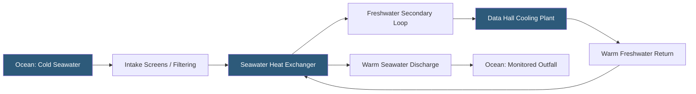

**Category:** Gigawatt Cooling Infrastructure
**Difficulty:** Advanced
**Reading time:** 7 min read

---

Seawater cooling systems use ocean water as a heat sink, either directly in cooling towers or through heat exchangers, to reject heat from datacenter mechanical systems. For coastal gigawatt facilities, seawater provides an abundant, consistently cool heat rejection medium that can dramatically reduce or eliminate freshwater consumption and enable near-year-round free cooling in regions where ocean temperatures remain below 20°C (68°F).

- **Seawater Intake** — the pipe system drawing seawater from the ocean; must be deep enough to access cool water and avoid thermal stratification
- **Intake Screen** — a fine mesh filter preventing marine organisms from entering the cooling circuit
- **Corrosion-resistant Materials** — titanium, duplex stainless steel, or HDPE piping and heat exchanger materials required to resist seawater corrosion
- **Thermal Plume** — warmed discharge water returned to the ocean; subject to environmental regulations limiting temperature rise
- **Deep Water Cooling** — drawing seawater from depths of 100–600 meters where temperatures are 4–10°C year-round
- **Biofouling** — marine organism growth on intake screens and heat exchanger surfaces; requires chemical or physical treatment
- **Once-through Cooling** — drawing seawater, passing it through heat exchangers, then discharging at elevated temperature; simplest but environmentally regulated
- **Ocean Thermal Energy Conversion (OTEC)** — an emerging technology using deep-cold seawater to drive power generation and cooling simultaneously

Seawater cooling provides an effectively unlimited heat sink at temperatures determined by the ocean depth and local geography. Surface ocean temperatures vary seasonally—from 8°C to 22°C in temperate coastal regions, and 26–30°C in tropical shallows. For datacenter free cooling, surface seawater temperatures below 15°C (59°F) enable waterside economizer operation without mechanical chilling, covering substantial portions of the year in northern Europe, Pacific Northwest, and other temperate coastal regions.

The intake system is the most complex and environmentally sensitive component. Marine intake structures require environmental impact assessment to evaluate effects on marine life. Travelling screens with continuous fish return and bypass systems are required to prevent aquatic life entrainment. For large flows (20,000–100,000 GPM), the intake pipe diameter may exceed 6 feet, requiring significant civil and marine engineering.

Heat exchangers coupling seawater to the freshwater secondary loop must use corrosion-resistant materials. Titanium plate-and-frame exchangers are the standard choice: titanium is immune to seawater corrosion even without impressed current protection and provides excellent thermal performance. Duplex stainless steel is an alternative at lower cost with slightly lower corrosion resistance.

Biofouling—barnacle and mussel growth on intake structures and heat exchanger surfaces—is managed through sodium hypochlorite injection at controlled dosing rates (typically 0.5–1.0 mg/L residual). Environmental discharge permits limit total chlorine in the return water, requiring careful monitoring and automatic dosing control.

Norway, Iceland, and Singapore operate large seawater-cooled facilities, and Microsoft's Natick underwater datacenter project demonstrated viability for submerged ocean-cooled operations. Google's Finland facility uses Baltic Sea water for cooling, enabling consistent sub-1.10 PUE values.

- Coastal gigawatt campuses in temperate regions with ocean temperatures below 20°C for most of the year
- Nordic datacenter developments where seawater enables near-100% free cooling
- Island or coastal territory developments where freshwater scarcity makes seawater the only viable cooling source
- Deep water cooling projects in tropical locations where surface temperatures are too warm
- Microsoft/Google-style owned coastal campuses with direct ocean access

| Advantage | Disadvantage |
|-----------|--------------|
| Seawater is abundant, free of charge, and provides large thermal capacity | Marine intake environmental permitting is complex, costly, and time-consuming |
| Ocean temperatures in temperate regions enable extensive free cooling | Corrosion-resistant materials (titanium) significantly increase heat exchanger cost |
| Eliminates freshwater consumption for cooling | Biofouling requires continuous chemical treatment and monitoring |
| Consistent deep-water temperatures provide predictable cooling performance | Once-through systems face strict discharge temperature regulations |

- [Lake Water Cooling](lake-water-cooling.md)
- [District Cooling Integration](district-cooling-integration.md)
- [Waterside Economizers](waterside-economizers.md)

---
*Part of the [Gigawatt Cooling Infrastructure](index.md) category · [Back to Master Index](../../index.md)*
