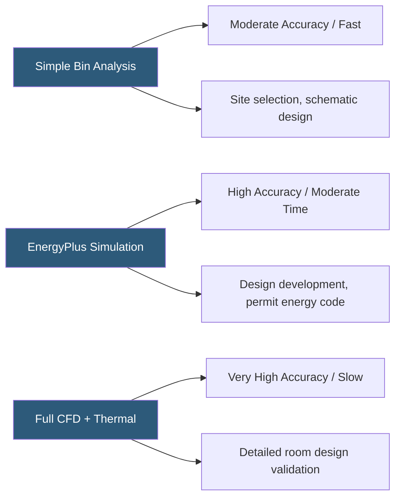

**Category:** Gigawatt Cooling Infrastructure
**Difficulty:** Advanced
**Reading time:** 6 min read

---

Thermal modeling encompasses a range of simulation tools—from simplified spreadsheet energy models to full dynamic building simulations—used to predict cooling system performance, energy consumption, and thermal transient behavior in gigawatt datacenters. Unlike detailed CFD analysis, thermal models operate at higher levels of abstraction, enabling rapid parametric studies of design alternatives and lifecycle energy cost projections essential for investment decisions.

- **Energy Model** — a simulation predicting annual energy consumption and costs using hourly weather data and building/system characteristics
- **Bin Analysis** — a simplified energy calculation grouping annual weather hours by temperature to estimate cooling plant operating modes
- **Dynamic Simulation** — hour-by-hour transient simulation capturing time-varying loads, weather, and system responses
- **EnergyPlus** — US DOE's open-source building energy simulation engine widely used for datacenter energy modeling
- **PUE Prediction** — the ratio of total facility power to IT power predicted by a thermal model, used to evaluate design alternatives
- **Transient Analysis** — simulation of time-varying conditions (cooling failure, load ramp-up) to evaluate thermal margins and equipment response
- **Sensitivity Analysis** — varying input parameters (climate, IT power, setpoints) to understand which variables most strongly influence the result
- **Life Cycle Cost Analysis (LCCA)** — a financial model comparing total ownership costs (CapEx + OpEx) for different design options over the facility life

Thermal modeling for gigawatt facilities follows the project lifecycle with increasing complexity at each phase. In site selection and early schematic design, spreadsheet-based bin analysis uses ASHRAE TMY3 hourly weather data to estimate annual cooling energy for different system configurations in different climates. A 100-MW site in Virginia vs. Oregon can be compared in hours, identifying the lifecycle energy cost difference between locations before any detailed design is performed.

At design development, EnergyPlus or Trane TRACE700 models provide more accurate predictions including part-load chiller curves, cooling tower performance at varying WBT, and pump/fan energy at variable speeds. These models incorporate the actual equipment specifications selected by the engineers and validate against ASHRAE 90.1 baselines for LEED certification.

Dynamic thermal simulation is applied to specific critical questions: How quickly does the cold aisle temperature rise after a CRAH failure? How long does chilled water storage provide adequate cooling during a chiller plant outage? What is the maximum IT load that can be sustained by the economizer without mechanical cooling at 75°F ambient WBT? These transient questions require time-step simulation capturing thermal mass (water volume in piping, slab temperature), system lag, and control response.

Thermal modeling results feed directly into capital decisions. A comparison of air-cooled vs. water-cooled chiller plants over 20 years must include accurate predictions of annual energy cost, water treatment cost, and maintenance cost differences. The model also quantifies the economic value of expanding economizer hours through chilled water setpoint reset, justifying the cost of variable speed drives on chiller compressors.

- Site selection energy cost comparisons across candidate locations
- LEED energy credit calculations requiring certified energy model submission
- Cooling system design option analysis comparing capital and operating cost
- Emergency scenario analysis predicting thermal transient behavior after cooling failure
- Equipment lifecycle optimization modeling refresh timing and replacement strategies

| Advantage | Disadvantage |
|-----------|--------------|
| Enables rapid comparison of multiple design alternatives without construction | Simplified models introduce assumptions that may be inaccurate for specific systems |
| Quantifies lifecycle energy cost differences between options in financial terms | Results are only as accurate as equipment performance curves and weather data inputs |
| Satisfies LEED, building permit, and utility incentive program requirements | Model development requires engineering time and specialized software expertise |
| Transient models identify thermal vulnerabilities before they become operational problems | Dynamic simulation results are difficult to validate without instrumented testing |

- [Computational Fluid Dynamics (CFD) Modeling](computational-fluid-dynamics-cfd-modeling.md)
- [Free Cooling Hours Analysis](free-cooling-hours-analysis.md)
- [PUE Optimization Strategies](pue-optimization-strategies.md)

---
*Part of the [Gigawatt Cooling Infrastructure](index.md) category · [Back to Master Index](../../index.md)*
