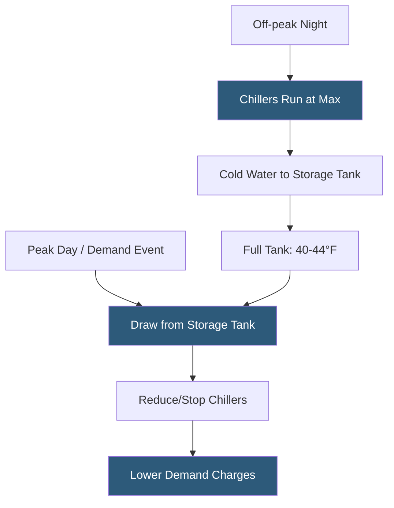

**Category:** Gigawatt Cooling Infrastructure
**Difficulty:** Advanced
**Reading time:** 7 min read

---

Thermal energy storage (TES) systems store cooling capacity during off-peak periods for use during peak cooling demand or utility pricing peaks, decoupling chiller plant operation from instantaneous cooling load. At gigawatt scale, TES enables demand charge management saving millions of dollars annually, provides emergency cooling buffer during brief power failures, and enables load shifting to take advantage of off-peak renewable energy.

- **Chilled Water Storage Tank (CHWST)** — a large insulated tank storing chilled water; most common TES type for large datacenters
- **Stratification** — the layering of cold and warm water in a tank by density; enables efficient use of storage without mixing
- **Thermocline** — the thin interface between cold and warm water layers in a stratified tank; maintained thin by low-velocity diffusers
- **Charge Cycle** — the period when chillers fill the storage tank with cold water; typically overnight during low electricity rates
- **Discharge Cycle** — the period when stored cold water is drawn to serve loads, reducing chiller operation during peak rate hours
- **Displacement Volume** — the usable storage capacity between minimum cold and maximum warm water levels; typically 80–90% of gross tank volume
- **Ice Storage** — storing thermal energy as ice rather than chilled water; higher density but requires lower evaporating temperatures
- **Tank-in-Tank** — a storage configuration with an inner ice coil surrounded by water; used in ice storage systems

A stratified chilled water storage tank operates on the principle that cold water (39–44°F) is denser than warm return water (55–60°F) and sinks to the bottom of the tank. A diffuser at the tank bottom introduces cold water at low velocity (below 0.3 ft/sec) to preserve stratification and prevent mixing with the warmer water above. As the tank charges, the cold layer grows upward; as it discharges, it shrinks.

For a 100 MW campus with a peak IT load of 75 MW and PUE of 1.4, the peak cooling load is 35 MW (approximately 100,000 TR). Reducing peak demand by 20% (20,000 TR) for 4 hours requires 80,000 ton-hours of storage. At a nominal storage density of 60 ton-hours per 1,000 gallons (for a 16°F temperature differential), this requires 1.33 million gallons of tank volume. Tanks of this scale are typically 20–30 foot diameter, 40–50 foot tall cylindrical steel tanks, with a 1 million gallon tank costing $2–4 million installed.

Demand charge management is the primary economic driver. Industrial electric utilities charge demand fees of $10–25 per kW per month based on the 15-minute peak demand recorded each month. Reducing a 50 MW chiller peak by 20 MW avoids $200,000–$500,000 per month in demand charges, potentially $2–6 million annually—justifying significant TES capital investment.

TES also provides brief emergency cooling during generator start-up transients. When utility power fails, chillers lose power simultaneously with IT equipment. The generator start-up delay (10–30 seconds) and re-energization sequence mean no chiller cooling for 2–5 minutes. Stored cold water in the TES and building CHW piping volume provides inertia to prevent cooling coil temperatures from rising during this critical gap.

- Demand charge reduction programs at facilities with time-of-use utility rates
- Peak demand management for facilities on constrained grid connections
- Emergency cooling buffer for critical 100% uptime facilities
- Load shifting to off-peak renewable energy periods (overnight wind production)
- Chiller plant right-sizing where storage provides peak shaving below the design-day peak

| Advantage | Disadvantage |
|-----------|--------------|
| Significant demand charge reduction with payback of 2–5 years | Large tanks require substantial mechanical yard area and civil infrastructure |
| Emergency cooling inertia protects equipment during brief power outages | Standby heat gain in tanks reduces net storage efficiency (typically 2–5% daily loss) |
| Enables overnight renewable energy charging for daytime discharge | Stratification discipline requires low-velocity diffusers and careful control |
| Allows smaller chiller plant sized to average rather than peak load | Tank inspections require drainage and confined space entry procedures |

- [Ice Storage for Peak Demand](ice-storage-for-peak-demand.md)
- [Chilled Water Storage Tanks](chilled-water-storage-tanks.md)
- [Economizer Mode Optimization](economizer-mode-optimization.md)

---
*Part of the [Gigawatt Cooling Infrastructure](index.md) category · [Back to Master Index](../../index.md)*
