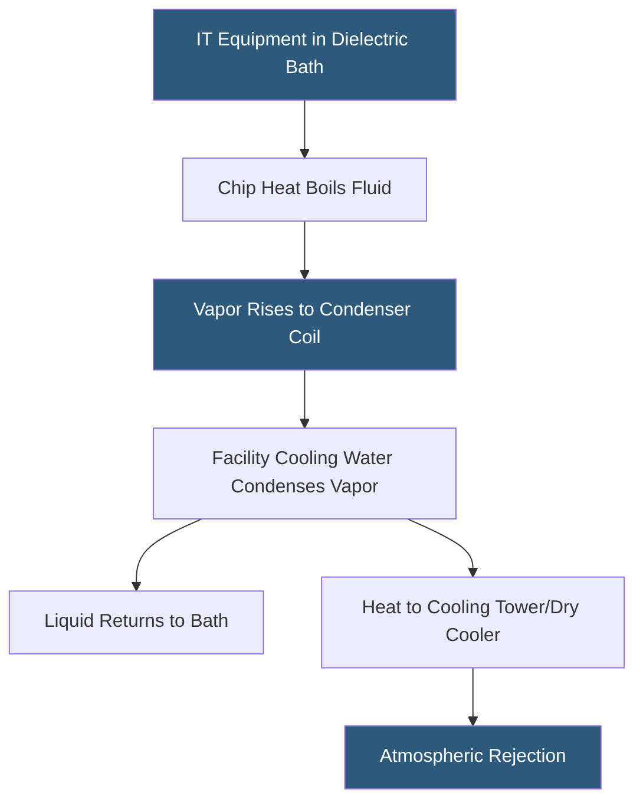

**Category:** Gigawatt Cooling Infrastructure
**Difficulty:** Advanced
**Reading time:** 7 min read

---

Two-phase immersion cooling represents the theoretical ceiling of datacenter cooling performance — servers submerged in low-boiling-point dielectric fluid achieve chip junction temperatures 20–30°C lower than even the best cold-plate systems. Though still a niche technology, two-phase immersion is gaining serious attention for extreme-density AI accelerator deployments where rack densities exceed 200 kW.

- **Dielectric Fluid** — electrically non-conductive liquid safe for direct contact with electronics; e.g., 3M Novec, Engineered Fluids EC-100
- **Saturation Temperature** — boiling point of dielectric fluid at operating pressure; typically 49–60°C
- **Vapor Phase** — fluid that has boiled at chip surface, carrying latent heat upward to condenser
- **Condenser Coil** — water-cooled coil above fluid bath where vapor condenses and returns as liquid
- **Fill Tank** — sealed vessel containing server boards immersed in dielectric fluid
- **GWP (Global Warming Potential)** — key environmental concern for two-phase fluids; regulatory pressure on high-GWP fluorinated compounds
- **Fluid Recovery System** — vapor capture and reclamation system preventing dielectric fluid atmospheric emission
- **Rack Power Density** — two-phase immersion enables 200–500 kW per tank vs 20–40 kW for air cooling

In two-phase immersion, server boards are placed horizontally in sealed tanks filled with a fluorocarbon or hydrofluoroether (HFE) dielectric fluid with boiling points of 49–60°C. When chips generate heat, the fluid in direct contact with chip packages boils, forming vapor bubbles that rise through the bath and carry latent heat — approximately 100 kJ/kg vs. 4 kJ/kg for sensible water heating — to a condenser coil submerged at the top of the vapor space.

The condenser coil carries facility water at 25–45°C, warm enough to be cooled by cooling towers without mechanical refrigeration in nearly any climate. Condensed fluid drips back into the bath, completing the passive thermosiphon cycle. No pumps are required for fluid circulation — the boiling/condensation cycle drives natural circulation. This eliminates a significant failure mode present in single-phase liquid cooling systems.

Chip junction temperatures in two-phase immersion are determined by the fluid's saturation temperature plus the boiling heat transfer resistance, typically achieving Tj 5–10°C above saturation. At 55°C saturation and 10°C rise, Tj is 65°C — well below the 100°C junction limit of most processors. This headroom allows chip TDP to increase without thermal throttling, enabling higher sustained performance than air or even cold-plate cooling.

Facility design for two-phase immersion requires specialized infrastructure. Tank weights (fluid-filled tanks weigh 2,000–8,000 lbs) require slab reinforcement. Vapor management systems prevent fugitive emissions of fluorinated compounds — increasingly regulated under F-Gas frameworks. Server boards require hardware modifications to remove components not compatible with fluid immersion (certain capacitors, thermal paste types, and plastic components).

The fluorinated fluids currently dominating two-phase immersion (HFE-7100, Novec 649) have GWP values of 0–300, far lower than earlier fluorocarbon coolants, but regulatory trajectories in EU and US are pushing toward even lower-GWP alternatives. Facility operators must consider fluid regulatory risk alongside performance benefits.

- Ultra-high-density AI training cluster at 300 kW per tank with 200+ racks
- HPC facility requiring extreme cooling density in space-constrained research building
- Edge deployment needing zero-noise, zero-fan IT infrastructure
- Cryptocurrency mining operation maximizing compute density per square foot
- Research testbed evaluating next-generation immersion fluid chemistries

| Advantage | Disadvantage |
|-----------|--------------|
| Enables 200–500 kW rack densities impossible with any other technology | Dielectric fluid cost ($50–150/gallon) creates high upfront working fluid investment |
| Passive boiling/condensation cycle has no pump failure mode | Server hardware modifications required, limiting equipment options |
| Facility-side loop can be cooled without refrigeration year-round | Fluorinated fluid regulations create long-term compliance risk |
| Near-silent operation with no server fans running in immersion | Tank designs are not yet standardized; vendor lock-in risk is high |

- [Direct Liquid Cooling Infrastructure](direct-liquid-cooling-infrastructure.md)
- [Dielectric Fluid Management](dielectric-fluid-management.md)
- [Cooling Capacity for Gigawatt Loads](cooling-capacity-for-gigawatt-loads.md)

---
*Part of the [Gigawatt Cooling Infrastructure](index.md) category · [Back to Master Index](../../index.md)*
