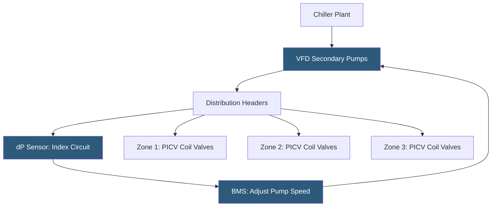

**Category:** Gigawatt Cooling Infrastructure
**Difficulty:** Advanced
**Reading time:** 6 min read

---

Variable flow chilled water systems adjust the volume of chilled water pumped to match actual cooling demand, rather than maintaining constant flow at all times. At gigawatt scale, variable flow reduces pump energy consumption by 30–60% compared to constant volume systems, since pump power varies as the cube of flow rate. Implementing variable flow requires pressure-independent control valves, carefully designed piping networks, and coordinated controls to maintain chiller stability.

- **Variable Frequency Drive (VFD)** — an electronic motor controller varying pump speed proportionally to required flow; enables the pump affinity laws to reduce power
- **Affinity Laws** — physical laws governing pump performance: flow varies linearly with speed, head varies as the square, power varies as the cube
- **Pressure Independent Control Valve (PICV)** — a valve that maintains a constant flow setpoint regardless of system pressure fluctuations; simplifies balancing
- **Differential Pressure (dP) Sensor** — placed at the index circuit (farthest cooling coil); the pump maintains minimum dP to ensure adequate flow to all users
- **Minimum Flow Bypass** — a two-way valve opening to ensure minimum chiller evaporator flow is maintained at very low building loads
- **Hydronic Balancing** — the commissioning process ensuring designed flow rates are achieved at each coil; simplified by PICVs
- **Variable Primary Flow (VPF)** — eliminating secondary loops; primary chiller pumps are variable speed directly serving the distribution system
- **Index Circuit** — the most hydraulically remote or restrictive circuit in the distribution system; determines the required pump head

Pump affinity laws dictate that power consumption varies as the cube of flow rate: if a pump running at full speed consumes 100 kW, slowing it to 50% speed reduces power to 12.5 kW—an 87% reduction. In practice, system curve effects mean real savings are somewhat lower, but reducing average flow from 100% to 70% of design flow reduces pump power by approximately 65%. At a 1 GW campus with 40 MW of pump power, this represents 26 MW of potential savings during part-load operation—enormous economic value.

Implementing effective variable flow requires pressure-independent control valves (PICVs) at each cooling coil. Standard two-way control valves change coil flow in response to coil outlet temperature, but they also change system pressure throughout the network. PICVs maintain a constant flow setpoint regardless of upstream pressure changes, enabling predictable system behavior and eliminating the need for traditional hydronic balancing.

The distribution system's differential pressure sensor is placed at the index circuit—the cooling zone with the highest pressure drop between supply and return headers. The BMS varies pump speed to maintain the setpoint dP at this sensor, ensuring the most remote coil receives adequate flow. All other zones, being hydraulically closer, automatically have sufficient pressure available through their PICVs.

Chiller minimum flow protection is critical in variable flow systems. As building demand drops and system flow decreases, primary pumps may need to maintain minimum chiller flow independently of distribution demand. A minimum flow bypass valve—opened by the BMS when system flow drops below the chiller minimum—ensures the chiller evaporator always receives its required flow, preventing damage from low-flow or freeze conditions.

- Distribution loops serving many individually controlled cooling zones in large buildings
- Gigawatt campus chilled water distribution networks spanning multiple buildings
- Systems with highly variable loads including AI training clusters with intermittent operation
- Energy optimization programs targeting pump energy reduction as a primary metric
- New installations where PICVs are cost-effectively integrated during initial piping design

| Advantage | Disadvantage |
|-----------|--------------|
| 30–60% pump energy reduction at typical part-load operating conditions | VFDs and PICVs add upfront capital cost vs constant-speed systems |
| Eliminates traditional hydronic balancing labor cost with PICVs | Controls complexity increases: pressure setpoints, minimum flow logic, chiller protection |
| Enables chiller staging based on actual flow demand | Pressure-independent valves require calibration and periodic verification |
| Reduces pipe, valve, and insulation sizing requirements at lower design flows | Low-flow conditions can cause poor heat transfer in long pipe runs without careful design |

- [Primary-Secondary Pumping Systems](primary-secondary-pumping-systems.md)
- [Water-cooled Chiller Installations](water-cooled-chiller-installations.md)
- [Building Management System (BMS) Integration](building-management-system-bms-integration.md)

---
*Part of the [Gigawatt Cooling Infrastructure](index.md) category · [Back to Master Index](../../index.md)*
