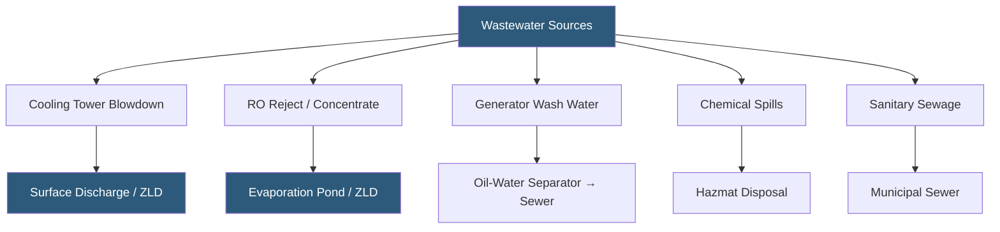

**Category:** Gigawatt Cooling Infrastructure
**Difficulty:** Intermediate
**Reading time:** 6 min read

---

Gigawatt datacenters generate several distinct wastewater streams—cooling tower blowdown, RO concentrate, HVAC condensate, generator wash water, chemical spills, and sanitary sewage—each requiring specific treatment and disposal pathways governed by environmental permits. Effective wastewater management prevents regulatory violations, reduces disposal costs, and supports the facility's water stewardship commitments.

- **Cooling Tower Blowdown** — the intentionally discharged fraction of cooling tower basin water to control dissolved solids concentration
- **Total Dissolved Solids (TDS)** — the measure of inorganic salts and other dissolved substances in water; regulated in discharge permits
- **NPDES Permit** — National Pollutant Discharge Elimination System permit required for discharging to US surface waters
- **Zero Liquid Discharge (ZLD)** — an operational target where all process water is recovered and no liquid waste is discharged
- **Oil-Water Separator** — a device removing free-floating petroleum products from generator wash and fuel spill water
- **Sanitary Sewer Connection** — a permit from the local municipality allowing discharge of sanitary sewage to the public sewer system
- **Industrial Pretreatment** — treatment required before a facility can discharge industrial wastewater to a municipal sewer
- **Spill Containment** — secondary containment berms and liners capturing fluid releases before they reach the storm drain

Cooling tower blowdown is the largest industrial wastewater stream at most gigawatt datacenters. A 100 MW cooling plant at 5 cycles of concentration might generate 100–200 gpm of blowdown. This water contains corrosion inhibitors, biocides, and concentrated dissolved solids from evaporation. If discharged to a surface water body, an NPDES permit is required, and the permit will set limits on temperature, TDS, chemical oxygen demand (COD), and specific pollutant concentrations including chromate, zinc, and phosphorus from chemical treatment programs.

Many jurisdictions near water-scarce or ecologically sensitive areas do not permit surface discharge of cooling tower blowdown. In these cases, facilities must either discharge to the municipal sewer (requiring an industrial pretreatment permit if pollutant limits are exceeded), use the blowdown on-site for irrigation or toilet flushing, or pursue zero liquid discharge (ZLD) using evaporation ponds or mechanical evaporators.

ZLD is increasingly required in arid western US states and is mandated by some large corporate sustainability policies. Mechanical ZLD systems using brine concentrators and crystallizers can recover 95–98% of process water and produce a solid salt cake for landfill disposal. However, ZLD capital cost is $5–15 million per 100 MW system and operating cost is high due to heat energy requirements.

Generator facilities generate petroleum-contaminated wash water when engines and fuel systems are cleaned. Oil-water separators with coalescing plates remove free-floating oil to below 15 mg/L before discharge to sanitary sewer, meeting most municipal pretreatment standards. Secondary containment around generator fuel tanks and day tanks must capture 110% of the largest vessel volume per EPA Spill Prevention, Control, and Countermeasure (SPCC) regulations.

- Environmental permit compliance for cooling tower blowdown discharge
- Zero liquid discharge system design for water-scarce or sensitive sites
- Stormwater pollution prevention plans required on construction and operational sites
- Oil and hazardous material spill response and cleanup procedures
- Municipal pretreatment compliance for sanitary sewer discharge

| Advantage | Disadvantage |
|-----------|--------------|
| ZLD eliminates discharge permits and their compliance burden | ZLD capital and operating costs are very high |
| Municipal sewer discharge simplifies permitting in urban locations | Pretreatment requirements can be stringent and add operating cost |
| Oil-water separators are reliable and low-maintenance | Separator sludge requires periodic disposal as regulated waste |
| On-site irrigation reuse of blowdown has minimal regulatory burden | Irrigation reuse requires land area and is seasonal; not viable in cold climates |

- [Water Recycling and Treatment](water-recycling-and-treatment.md)
- [Water Consumption at GW Scale](water-consumption-at-gw-scale.md)
- [Cooling Tower Arrays](cooling-tower-arrays.md)

---
*Part of the [Gigawatt Cooling Infrastructure](index.md) category · [Back to Master Index](../../index.md)*
