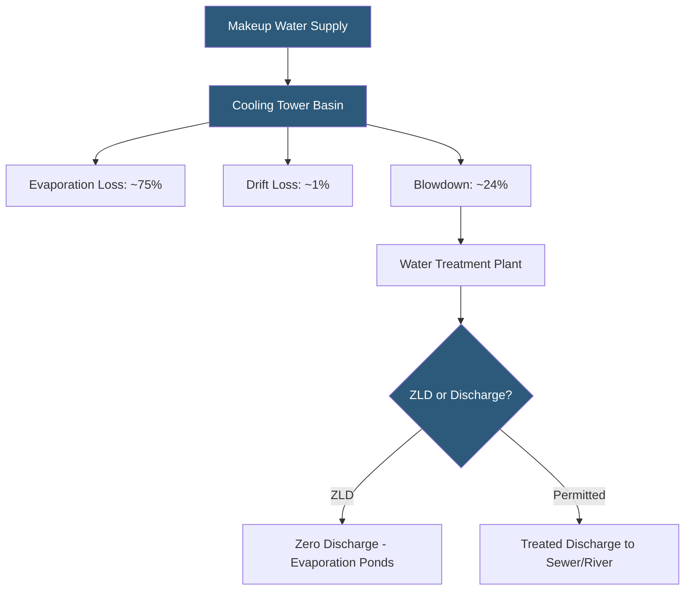

**Category:** Gigawatt Cooling Infrastructure
**Difficulty:** Advanced
**Reading time:** 6 min read

---

Water consumption is an increasingly critical constraint for gigawatt-scale datacenter development, with facilities drawing millions of gallons per day for evaporative cooling. Community opposition, drought risk, and tightening environmental regulations are making water sourcing and efficiency a first-order site selection and design criterion alongside power availability.

- **Water Usage Effectiveness (WUE)** — liters of water consumed per kWh of IT energy; industry average ~1.8 L/kWh, best-in-class < 0.5 L/kWh
- **Makeup Water** — fresh water added to cooling towers to replace evaporative losses
- **Blowdown** — deliberate discharge of concentrated cooling water to control dissolved solids
- **Cycles of Concentration (CoC)** — ratio of dissolved solids in tower basin vs makeup water; higher CoC reduces blowdown
- **Evapotranspiration Loss** — water leaving the system as vapor through cooling tower plumes
- **Zero Liquid Discharge (ZLD)** — treatment system eliminating all wastewater discharge to municipal systems
- **Water Stress Index** — measure of freshwater availability relative to demand in a watershed
- **Closed-Loop Cooling** — system where water is recirculated without evaporative loss, used with dry coolers or heat exchangers

A 1 GW datacenter with a WUE of 1.5 L/kWh consumes approximately 36 million liters (9.5 million gallons) of water per day — comparable to a small city. This water demand arrives in a single location, placing enormous stress on local water infrastructure. In water-stressed regions like the US Southwest, this has triggered community opposition and regulatory restrictions that have blocked or delayed several major facilities.

Evaporative cooling towers account for the vast majority of water consumption: water evaporates as it rejects heat to the atmosphere, with approximately 1 liter of evaporation per 2,400 BTU of heat rejected. At 1 GW of IT power plus mechanical cooling overhead, daily evaporation approaches 25–30 million liters. Makeup water must replace this loss continuously; even a multi-hour supply interruption during a hot weather event can cause thermal runaway if basin storage is insufficient.

Water efficiency strategies operate on multiple fronts. Increasing cycles of concentration from 3 to 6 reduces makeup water requirements by 20–25% by concentrating dissolved minerals before blowdown. Reclaimed water or non-potable sources replace potable water — many facilities now operate with 50–100% reclaimed water, reducing municipal drinking water impact. Air-side economizers and dry coolers eliminate water consumption entirely during cool periods.

The most aggressive strategy is transitioning high-density loads to liquid cooling systems that reject heat at temperatures enabling closed-loop operation without evaporative cooling towers. Heat rejection via dry coolers (air-cooled heat exchangers) consumes no water but requires ambient temperatures below ~40°C to achieve adequate rejection temperatures. In warm climates, this limits dry cooler applicability to cooler periods or specialized high-temperature liquid cooling designs.

- Arizona hyperscale campus required to achieve WUE < 0.5 L/kWh under state permit
- Singapore facility operating on 100% NEWater (reclaimed water) for cooling tower makeup
- Pacific Northwest campus achieving near-zero WUE through air-side economization
- Cooling tower upgrade program increasing cycles of concentration to reduce water use
- ZLD system design for facility in zero-discharge watershed protection area

| Advantage | Disadvantage |
|-----------|--------------|
| Reclaimed water use reduces community water supply impact | Reclaimed water requires additional pre-treatment for cooling tower use |
| High CoC operation reduces makeup water by 20–25% | High CoC increases scaling risk requiring more aggressive chemical treatment |
| Air-side economizers eliminate water consumption in cool climates | Dry coolers require larger footprint and consume more fan energy |
| ZLD systems eliminate wastewater discharge permits | ZLD capital cost is $5–20M and adds significant operational complexity |

- [Cooling Capacity for Gigawatt Loads](cooling-capacity-for-gigawatt-loads.md)
- [Cooling Tower Arrays](cooling-tower-arrays.md)
- [Water Recycling and Treatment](water-recycling-and-treatment.md)

---
*Part of the [Gigawatt Cooling Infrastructure](index.md) category · [Back to Master Index](../../index.md)*
