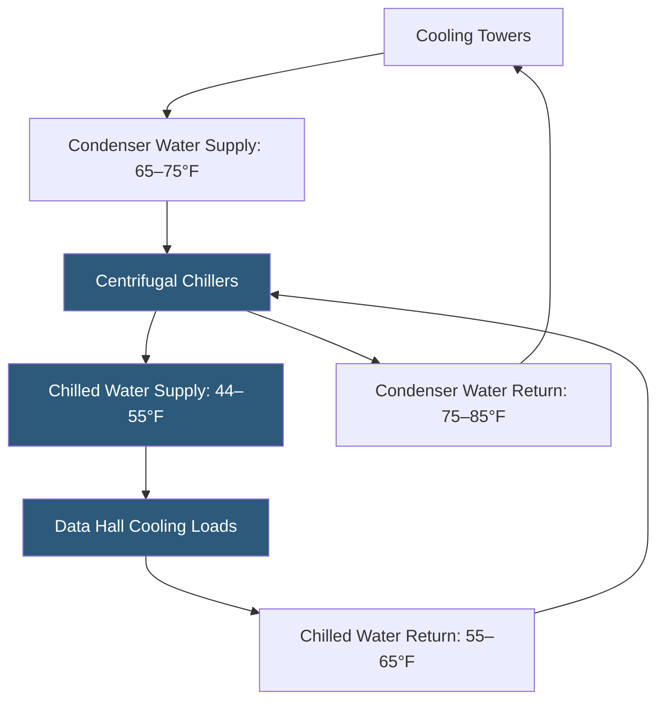

**Category:** Gigawatt Cooling Infrastructure
**Difficulty:** Advanced
**Reading time:** 7 min read

---

Water-cooled chillers are the dominant refrigeration technology for large-scale datacenter cooling, offering the highest efficiency of any mechanical cooling approach. At gigawatt scale, chiller plants are engineered as complex multi-unit systems with redundant refrigerant circuits, variable-flow pumping, and integrated economizer modes. Chiller selection, plant layout, and sequencing logic together determine the energy efficiency and reliability of the entire cooling infrastructure.

- **Centrifugal Chiller** — a large capacity (400–8,000 TR) vapor compression chiller using a centrifugal compressor impeller; most common choice for large data centers
- **Screw Chiller** — a positive displacement chiller (50–1,500 TR) with helical rotors; better part-load efficiency than centrifugal at small sizes
- **COP (Coefficient of Performance)** — cooling output (kW) divided by compressor input power (kW); higher is better; modern centrifugal chillers reach 7–9 COP at full load
- **kW/ton** — power input per ton of refrigeration; inverse relationship with COP; target below 0.15 kW/ton for efficient systems
- **Variable Speed Drive (VSD)** — a chiller compressor speed controller enabling efficient part-load operation
- **Magnetic Bearing Compressor** — a centrifugal compressor with oil-free magnetic levitation bearings; near-zero maintenance and very high efficiency at part load
- **Condenser Water Supply Temperature (CWST)** — the temperature of water entering the chiller from cooling towers; lower CWST improves chiller efficiency
- **Evaporator Leaving Water Temperature (ELWT)** — the temperature of chilled water leaving the chiller; typical value is 44°F for air cooling or 55–65°F for liquid cooling

A gigawatt campus chiller plant may contain 20–100 individual centrifugal chiller units, each capable of providing 1,000–8,000 tons of refrigeration. The largest centrifugal chillers from Carrier, Trane, York, and Daikin now reach 7,500–10,000 TR single-unit capacity, reducing the number of machines and associated maintenance touchpoints.

Chiller efficiency is strongly influenced by condenser water temperature. Every 1°F reduction in condenser water supply temperature (CWST) improves chiller COP by approximately 2–3%. Cooling towers in cold and mild climates can supply condenser water at 55–65°F during winter and shoulder seasons, enabling free cooling bypass through a plate-and-frame heat exchanger (the waterside economizer) without operating the chiller compressor at all.

Variable speed drives on chiller compressors allow efficient part-load operation. At 50% load, a VSD centrifugal chiller can achieve COP values of 12–15, far exceeding full-load performance. This is critical for datacenters, which rarely operate at 100% IT load simultaneously—plant part-load efficiency significantly influences annual energy consumption.

Magnetic bearing chillers (Daikin Turbocor, Smardt, others) eliminate oil management systems and achieve exceptional efficiency at part load due to the absence of friction. These chillers are particularly well-suited to datacenter applications with variable loads and frequent starts and stops.

Chiller sequencing control in the plant BMS determines which units run and at what loading when total demand varies. Optimal sequencing algorithms load chillers to their highest efficiency operating point—typically 70–90% of nominal capacity—staging additional units as needed to avoid inefficient part-load operation on too many machines.

- Primary refrigeration source for large data hall cooling plants
- Chiller plant designs using waterside economizer integrated with cooling tower plant
- High-density liquid cooling installations requiring low supply water temperatures
- Large campus plants with centralized chilled water distribution to multiple buildings
- Facilities targeting sub-1.20 annual average PUE requiring best-in-class chiller efficiency

| Advantage | Disadvantage |
|-----------|--------------|
| Highest efficiency of any cooling technology; COP 7–15 depending on conditions | High capital cost per unit; large centrifugal chillers cost $1–3M each |
| Waterside economizer enables free cooling with same equipment | Refrigerant management and compressor maintenance requires skilled technicians |
| VSD and magnetic bearing options enable excellent part-load efficiency | Cooling tower water system adds water consumption, treatment, and Legionella risk |
| Centralized plant design simplifies monitoring and automation | Chiller failures require redundant units; N+1 configuration adds capital cost |

- [Cooling Tower Arrays](cooling-tower-arrays.md)
- [Waterside Economizers](waterside-economizers.md)
- [Cooling Capacity for Gigawatt Loads](cooling-capacity-for-gigawatt-loads.md)

---
*Part of the [Gigawatt Cooling Infrastructure](index.md) category · [Back to Master Index](../../index.md)*
