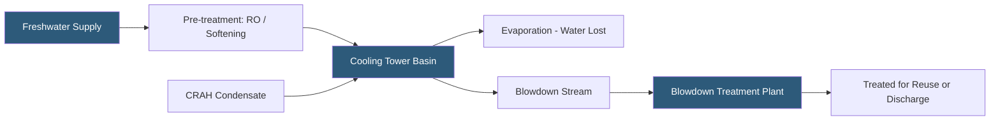

**Category:** Gigawatt Cooling Infrastructure
**Difficulty:** Intermediate
**Reading time:** 6 min read

---

Gigawatt-scale datacenters that use evaporative cooling can withdraw millions of gallons of water per day. Water recycling programs—reclaiming cooling tower blowdown, condensate, and process water—reduce freshwater consumption by 20–40%, decrease wastewater discharge costs, and help facilities meet water stewardship commitments. Treatment systems ensure recycled water meets quality standards that prevent scale, corrosion, and biological growth in cooling circuits.

- **Cycles of Concentration (CoC)** — the ratio of dissolved solids in cooling tower basin water versus makeup water; higher CoC means less blowdown and better water efficiency
- **Blowdown** — water discharged from cooling towers to prevent dissolved solids from concentrating to damaging levels
- **Makeup Water** — freshwater added to cooling towers to replace evaporation and blowdown losses
- **Condensate Recovery** — collecting condensed moisture from CRAH/AHU drain pans for reuse as cooling makeup
- **Reverse Osmosis (RO)** — a membrane process removing dissolved salts and minerals, improving makeup water quality and enabling higher CoC
- **Chemical Treatment** — corrosion inhibitors, scale inhibitors, and biocides added to cooling water to maintain system health
- **Greywater** — non-potable water from sinks, HVAC condensate, and other low-contamination sources suitable for reuse after treatment
- **Water Use Effectiveness (WUE)** — annual water volume used per unit of IT energy consumed; a key sustainability metric

A 100 MW data hall cooling system operating at PUE 1.3 with wet cooling towers might evaporate 500–800 gallons per minute. At 5 cycles of concentration—a typical target for treated systems—blowdown represents 20% of makeup, or 100–160 gpm of discharged water. Raising CoC from 3 to 6 through water treatment can reduce total makeup water by 15–20% and blowdown by 50%, with direct savings on water purchase and disposal cost.

Pre-treatment of makeup water using reverse osmosis removes hardness-causing calcium and magnesium ions that otherwise form scale on heat exchanger surfaces. Scale reduces heat transfer efficiency, increasing chiller lift and energy consumption. RO systems produce a reject stream (concentrate) of 15–25% of inlet flow that must be managed separately. The high-quality RO permeate allows higher CoC with less chemical treatment.

Cooling tower water must be continuously monitored and chemically treated to prevent three types of failure: scale deposition on heat transfer surfaces, corrosion of metal components, and biological growth including Legionella. Automated chemical feed systems inject corrosion inhibitors (typically molybdate or azole compounds), scale inhibitors (phosphonate), and biocides (isothiazoline, bromine, chlorine) based on real-time conductivity, pH, and oxidation-reduction potential (ORP) measurements.

CRAH unit condensate is a significant free water source. In humid climates, a large data hall may generate 50–150 gpm of condensate from CRAH drain pans. This condensate is nearly pure water—RO permeate quality—and can be piped directly to the cooling tower basin as makeup water, reducing freshwater draw from the utility. Condensate reclaim systems require piping, collection tanks, and UV treatment to maintain biological quality before use.

- Water-scarce sites requiring maximum efficiency in freshwater use
- Facilities with high cooling tower water costs or volumetric limitations in water permits
- ESG-driven programs targeting water-positive or WUE improvement goals
- Condensate recovery projects in humid climates with high CRAH moisture removal rates
- Industrial park or campus arrangements where shared treatment infrastructure is feasible

| Advantage | Disadvantage |
|-----------|--------------|
| Higher CoC reduces makeup water volume and disposal cost | Chemical treatment programs add operating cost and chemical management complexity |
| RO pre-treatment enables efficient high-CoC operation | RO systems produce concentrate waste requiring disposal and add capital cost |
| Condensate recovery provides high-quality free makeup water | Condensate recovery piping infrastructure adds first cost |
| Centralized treatment reduces per-unit cost at large scale | Centralized systems require skilled water treatment operators |

- [Water Consumption at GW Scale](water-consumption-at-gw-scale.md)
- [Wastewater Management](wastewater-management.md)
- [Cooling Tower Arrays](cooling-tower-arrays.md)

---
*Part of the [Gigawatt Cooling Infrastructure](index.md) category · [Back to Master Index](../../index.md)*
