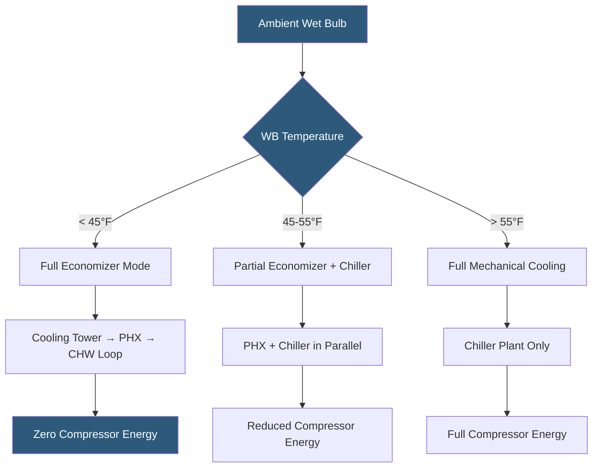

**Category:** Gigawatt Cooling Infrastructure
**Difficulty:** Advanced
**Reading time:** 6 min read

---

Waterside economizers are the single highest-impact energy efficiency measure available to gigawatt-scale datacenters in temperate climates, enabling heat rejection without mechanical refrigeration compressors for hundreds or thousands of hours per year. At GW scale, each additional annual hour of economizer operation saves hundreds of thousands of dollars in energy cost.

- **Waterside Economizer** — plate heat exchanger or cooling tower bypass that transfers cooling tower cold water to chilled water loop without running chillers
- **Free Cooling Hours** — annual hours when ambient wet-bulb temperature is low enough for economizer-only operation
- **Economizer Switchover Point** — wet-bulb temperature at which economizer can no longer meet load; determines free cooling hours
- **Plate-and-Frame Heat Exchanger (PHX)** — stainless steel plate bundle providing thermal isolation between tower and chilled water circuits
- **Chiller Bypass** — piping arrangement allowing cooling tower water to connect directly to the chilled water system in series or parallel with chillers
- **Approach Temperature Loss** — temperature penalty added by heat exchanger between tower loop and chilled water loop
- **Integrated Economizer** — chiller with built-in economizer coil, eliminating need for separate heat exchanger
- **Partial Economizer** — mode where economizer provides a fraction of load while chiller handles the remainder

The waterside economizer concept is straightforward: when outdoor air is cold enough, cooling towers can produce chilled water at temperatures adequate for IT cooling without running vapor-compression chillers. The energy saving is dramatic — compressors consuming 0.4–0.7 kW/TR are replaced by circulation pumps consuming 0.02–0.05 kW/TR.

The threshold for economizer operation depends on chilled water supply temperature and the approach temperatures across both the cooling tower and the plate heat exchanger. A system delivering 55°F chilled water through a 6°F approach PHX needs 49°F tower leaving water, achievable when wet-bulb temperature is below approximately 44°F. Raising chilled water supply temperature from 44°F to 55°F expands free cooling hours dramatically — potentially from 2,000 to 5,000 hours per year in mid-Atlantic US climates.

Modern server and storage equipment tolerates ASHRAE A1 Class inlet temperatures up to 77°F, meaning chilled water supply temperatures of 60–65°F are often adequate when combined with hot-aisle containment. This temperature relaxation is the single most impactful change facilities can make to increase economizer hours, often more valuable than any refrigeration efficiency improvement.

At gigawatt scale, the capital cost of a full economizer system — including PHX bundles, isolation valves, piping, and controls — runs $20–60M for a complete chiller plant retrofit. Payback periods of 2–5 years are common in temperate climates. Climate data analysis (TMY — Typical Meteorological Year) is used to model annual free cooling hours and calculate expected energy savings before committing to the investment.

- 400 MW campus in Virginia achieving 4,500 free cooling hours/year after CHWS temperature raise
- Chiller plant retrofit adding plate heat exchangers to enable economizer mode
- Climate analysis comparing free cooling hours in Dublin vs. Singapore vs. Phoenix
- Partial economizer control strategy maintaining inlet water to chillers as ambient transitions
- Liquid cooling system designed for 40°C return temperature enabling free cooling year-round

| Advantage | Disadvantage |
|-----------|--------------|
| Waterside economizers reduce cooling energy 40–70% in suitable climates | PHX installation cost of $20–60M per GW of cooling capacity |
| No moving parts in economizer heat exchangers; low maintenance | Approach temperature penalty limits economizer hours vs. airside approach |
| Economizer operation completely eliminates compressor refrigerant emissions | Cooling tower must be maintained year-round including winter freeze protection |
| Higher chilled water temperatures compatible with most modern IT equipment | Raising CHWS temperature requires formal ASHRAE compliance verification |

- [Cooling Capacity for Gigawatt Loads](cooling-capacity-for-gigawatt-loads.md)
- [Cooling Tower Arrays](cooling-tower-arrays.md)
- [PUE Optimization Strategies](pue-optimization-strategies.md)

---
*Part of the [Gigawatt Cooling Infrastructure](index.md) category · [Back to Master Index](../../index.md)*
