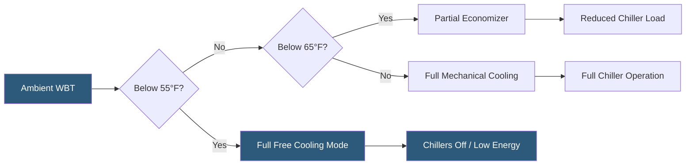

**Category:** Gigawatt Cooling Infrastructure
**Difficulty:** Intermediate
**Reading time:** 6 min read

---

Wet bulb temperature (WBT) is the single most important climate metric for designing and operating cooling systems at gigawatt-scale datacenters. It determines the minimum achievable supply temperature from evaporative cooling equipment and defines the hours each year when free cooling is available—directly affecting capital equipment sizing, water consumption, and energy cost.

- **Wet Bulb Temperature** — the lowest temperature achievable by evaporating water into a moving air stream; always equal to or lower than dry bulb temperature
- **Dry Bulb Temperature** — standard air temperature as measured by a conventional thermometer
- **Design WBT** — the WBT exceeded only 0.4% of annual hours (ASHRAE 99.6th percentile); used for worst-case cooling system sizing
- **Approach Temperature** — the difference between cooling tower leaving water temperature and the ambient WBT; typically 5–8°F for well-designed towers
- **Economizer Hours** — the number of annual hours when outdoor WBT is low enough to provide free or assisted cooling
- **Adiabatic Cooling** — evaporating water into supply air to reduce temperature before it enters the data hall
- **Psychrometric Chart** — a graphical representation of air properties including dry bulb, wet bulb, humidity, and enthalpy
- **Dew Point** — the temperature at which condensation begins; a separate but related metric for humidity control

Cooling tower performance is governed by WBT because the towers reject heat by evaporating water into the ambient air. The closer the ambient WBT is to the tower's target leaving water temperature, the more cooling tower area, airflow, and water evaporation rate are required. At high WBT conditions (above 75°F), large cooling towers must operate at maximum fan speed and water flow, consuming significant power and water.

Site selection for gigawatt facilities strongly favors locations with low design WBT and high annual hours of low WBT. The US Pacific Northwest and Nordic countries can achieve design WBTs below 65°F, enabling near-year-round economizer operation. Desert Southwest locations often have design WBTs of 75–78°F despite low humidity in summer, because the combination of high dry bulb and moderate humidity yields high WBT values.

For a 100 MW data hall in a high-WBT climate, the cooling plant may require 20–30% more chiller capacity than an equivalent facility in a low-WBT climate. This translates to additional capital cost of $5–15 million per 100 MW module plus higher annual energy and water consumption. Over a 20-year facility life, a 1°F increase in design WBT can increase lifecycle cooling cost by $2–4 million per 100 MW.

Operators use site-specific WBT data from ASHRAE Fundamentals to calculate annual economizer hours and set cooling mode transition setpoints in the Building Management System (BMS). At each WBT threshold, the BMS automatically adjusts chiller staging, cooling tower fan speeds, and economizer damper positions to minimize total energy consumption.

- Site selection analysis comparing candidate datacenter locations by cooling efficiency
- Cooling system sizing and chiller plant design requiring ASHRAE design WBT
- Annual energy modeling for PUE prediction and utility rate negotiations
- Water budget calculations for environmental permits and sustainability reporting
- Economizer control logic and setpoint definition in BMS programming

| Advantage | Disadvantage |
|-----------|--------------|
| Low-WBT sites dramatically reduce cooling capital and operating cost | Low-WBT sites may be geographically remote with limited power infrastructure |
| Economizer operation enabled by low WBT reduces chiller energy by 40–80% | Free cooling still consumes significant water through evaporative cooling towers |
| WBT data allows precise equipment sizing avoiding over-investment | Climate change is shifting WBT distributions, adding uncertainty to long-term projections |
| Understanding WBT enables optimal operating mode transitions in BMS | High-humidity low-WBT days can cause condensation risk if airside economizers are used |

- [Cooling Capacity for Gigawatt Loads](cooling-capacity-for-gigawatt-loads.md)
- [Climate Considerations for GW Cooling](climate-considerations-for-gw-cooling.md)
- [Free Cooling Hours Analysis](free-cooling-hours-analysis.md)

---
*Part of the [Gigawatt Cooling Infrastructure](index.md) category · [Back to Master Index](../../index.md)*
